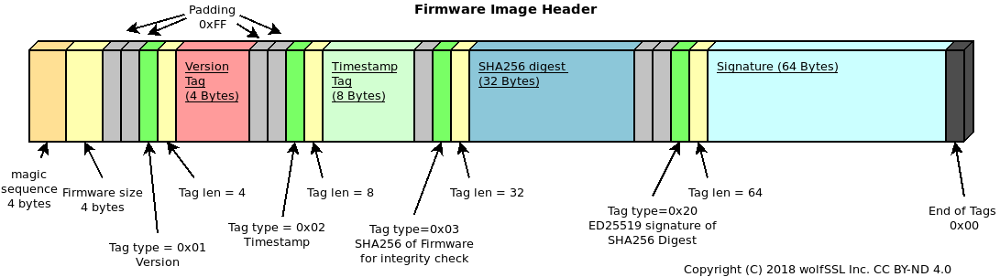
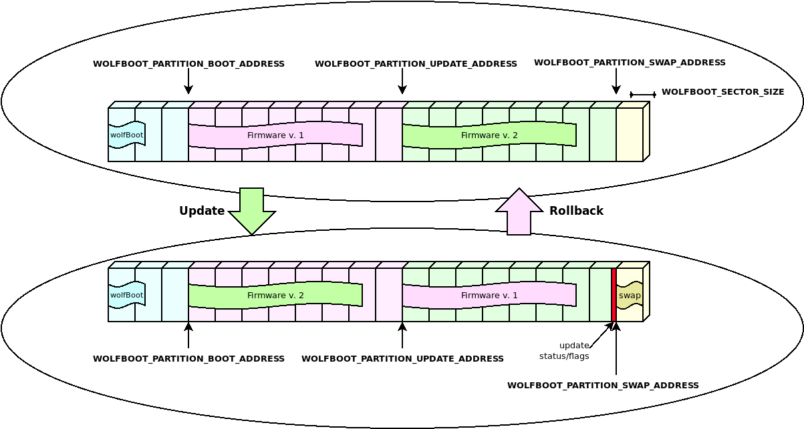
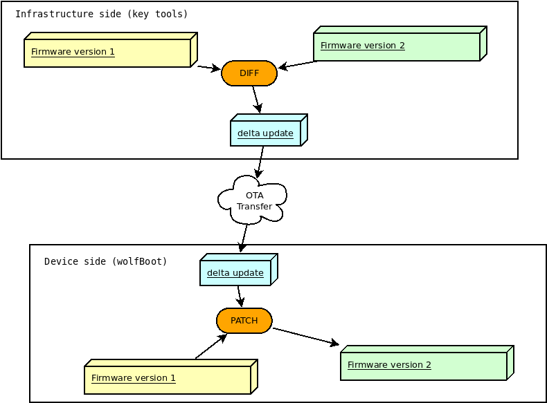
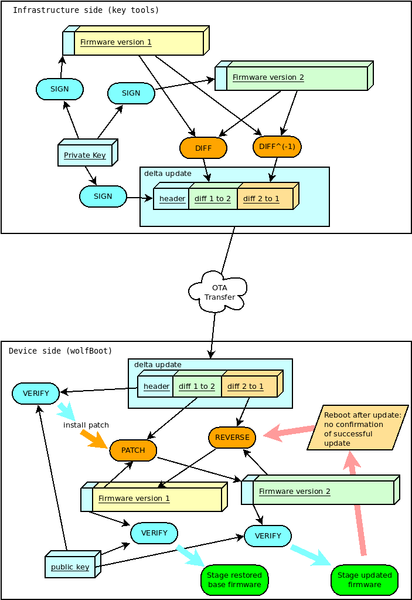

# wolfBoot Features


## Signing


### wolfBoot key tools installation


Instructions for setting up Python, wolfCrypt-py module and wolfBoot for firmware signing and key generation.

Note: There is a pure C version of the key tool available as well. See [C Key Tools](#c-key-tools) below.

### Install Python3

1. Download latest Python 3.x and run installer: https://www.python.org/downloads
2. Check the box that says Add Python 3.x to PATH


### Install wolfCrypt

```
git clone https://github.com/wolfSSL/wolfssl.git
cd wolfssl
./configure --enable-keygen --enable-rsa --enable-ecc --enable-ed25519 --enable-ed448 --enable-des3 CFLAGS="-DWOLFSSL_PUBLIC_MP"
make
sudo make install
```

### Install wolfcrypt-py

```
git clone https://github.com/wolfSSL/wolfcrypt-py.git
cd wolfcrypt-py
sudo USE_LOCAL_WOLFSSL=/usr/local pip3 install .
```

### Install wolfBoot

```
git clone https://github.com/wolfSSL/wolfBoot.git
cd wolfBoot
git submodule update --init
## Setup configuration (or copy template from ./config/examples)
make config
## Build the wolfBoot binary and sign an example test application
make
```

### C Key Tools

A standalone C version of the keygen tools is available in: `./tools/keytools`. 

These can be built in `tools/keytools` using `make` or from the wolfBoot root using `make keytools`. 

If the C version of the key tools exists they will be used by wolfBoot (the default is the Python scripts).

#### Windows Visual Studio

Use the `wolfBootSignTool.vcxproj` Visual Studio project to build the `sign.exe` and `keygen.exe` tools for use on Windows.


### Command Line Usage

#### Keygen tool


Usage: `keygen[.py] [OPTIONS] [-g new-keypair.der] [-i existing-pubkey.der] [...]`

`keygen` is used to populate a keystore with existing and new public keys.
Two options are supported:

- `-g privkey.der` to generate a new keypair, add the public key to the keystore and save the private key in a new file `privkey.der`
- `-i existing.der` to import an existing public key from `existing.der`

Arguments are not exclusive, and can be repeated more than once to populate a keystore with multiple keys.

One option must be specified to select the algorithm enabled in the keystore (e.g. `--ed25519` or `--rsa3072`. See the section "Public key signature options" for the sign tool for the available options.

The files generate by the keygen tool is the following:

- A C file `src/keystore.c`, which is normally linked with the wolfBoot image, when the keys are provisioned through generated C code.
- A binary file `keystore.img` that can be used to provision the public keys through an alternative storage
- The private key, for each `-g` option provided from command line


#### Sign tool


`sign` and `sign.py` produce a signed firmware image by creating a manifest header
in the format supported by wolfBoot.

Usage: `sign[.py] [OPTIONS] IMAGE.BIN KEY.DER VERSION`

`IMAGE.BIN`:  A file containing the binary firmware/software to sign
`KEY.DER`:    Private key file, in DER format, to sign the binary image
`VERSION`:    The version associated with this signed software
`OPTIONS`:    Zero or more options, described below

#### Public key signature options


If none of the following arguments is given, the tool will try to guess the key
size from the format and key length detected in KEY.DER.

  * `--ed25519` Use ED25519 for signing the firmware. Assume that the given KEY.DER
file is in this format.

  * `--ed448` Use ED448 for signing the firmware. Assume that the given KEY.DER
file is in this format.

  * `--ecc256` Use ecc256 for signing the firmware. Assume that the given KEY.DER
file is in this format.

  * `--ecc384` Use ecc384 for signing the firmware. Assume that the given KEY.DER
file is in this format.

  * `--rsa2048` Use rsa2048 for signing the firmware. Assume that the given KEY.DER
file is in this format.

  * `--rsa3072` Use rsa3072 for signing the firmware. Assume that the given KEY.DER
file is in this format.

  * `--rsa4096` Use rsa4096 for signing the firmware. Assume that the given KEY.DER
file is in this format.

  * `--no-sign` Disable secure boot signature verification. No signature
    verification is performed in the bootloader, and the KEY.DER argument is
    ignored.


### Key generation and management


KeyStore is the name of the mechanism used by wolfBoot to store all the public keys used for
authenticating the signature of current firmware and updates.

wolfBoot's key generation tool can be used to generate one or more keys. By default,
when running `make` for the first time, a single key `wolfboot_signing_private_key.der`
is created, and added to the keystore module. This key should be used to sign any firmware
running on the target, as well as firmware update binaries.

Additionally, the `keygen` tool creates additional files with different representations
of the keystore
 - A .c file (src/keystore.c) which can be used to deploy public keys as part
   of the bootloader itself, by linking the keystore in `wolfboot.elf`
 - A .bin file (keystore.bin) which contains the keystore that can be hosted
   on a custom memory support. In order to access the keystore, a small driver is
   required (see section "Interface API" below).

By default, the keystore object in `src/keystore.c` is accessed by wolfboot by including
its symbols in the build.
Once generated, this file contains an array of structures describing each public
key that will be available to wolfBoot on the target system. Additionally, there are a few
functions that connect to the wolfBoot keystore API to access the details and the
content of the public key slots.

The public key is described by the following structure:

```
 struct keystore_slot {
     uint32_t slot_id;
     uint32_t key_type;
     uint32_t part_id_mask;
     uint32_t pubkey_size;
     uint8_t  pubkey[KEYSTORE_PUBKEY_SIZE];
 };

```

- `slot_id` is the incremental identifier for the key slot, starting from 0.

- `key_type` describes the algorithm of the key, e.g. `AUTH_KEY_ECC256` or `AUTH_KEY_RSA3072`

- `mask` describes the permissions for the key. It's a bitmap of the partition ids for which this key can be used for verification

- `pubkey_size` the size of the public key buffer

- `pubkey` the actual buffer containing the public key in its raw format

When booting, wolfBoot will automatically select the public key associated to the signed firmware image, check that it matches the permission mask for the partition id where the verification is running and then attempts to authenticate the signature of the image using the selected public key slot.


#### Creating multiple keys


`keygen` accepts multiple filenames for private keys.

Two arguments:

 - `-g priv.der` generate new keypair, store the private key in priv.der, add the public key to the keystore
 - `-i pub.der` import an existing public key and add it to the keystore

Example of creation of a keystore with two ED25519 keys:

`./tools/keytools/keygen.py --ed25519 -g first.der -g second.der`

will create the following files:

 - `first.der` first private key
 - `second.der` second private key
 - `src/keystore.c` C keystore containing both public keys associated with `first.der`
     and `second.der`.

The `keystore.c` generated should look similar to this:

```
#define NUM_PUBKEYS 2
const struct keystore_slot PubKeys[NUM_PUBKEYS] = {

     /* Key associated to private key 'first.der' */
    {
        .slot_id = 0,
        .key_type = AUTH_KEY_ED25519,
        .part_id_mask = KEY_VERIFY_ALL,
        .pubkey_size = KEYSTORE_PUBKEY_SIZE_ED25519,
        .pubkey = {
            0x21, 0x7B, 0x8E, 0x64, 0x4A, 0xB7, 0xF2, 0x2F,
            0x22, 0x5E, 0x9A, 0xC9, 0x86, 0xDF, 0x42, 0x14,
            0xA0, 0x40, 0x2C, 0x52, 0x32, 0x2C, 0xF8, 0x9C,
            0x6E, 0xB8, 0xC8, 0x74, 0xFA, 0xA5, 0x24, 0x84
        },
    },

     /* Key associated to private key 'second.der' */
    {
        .slot_id = 1,
        .key_type = AUTH_KEY_ED25519,
        .part_id_mask = KEY_VERIFY_ALL,
        .pubkey_size = KEYSTORE_PUBKEY_SIZE_ED25519,
        .pubkey = {
            0x41, 0xC8, 0xB6, 0x6C, 0xB5, 0x4C, 0x8E, 0xA4,
            0xA7, 0x15, 0x40, 0x99, 0x8E, 0x6F, 0xD9, 0xCF,
            0x00, 0xD0, 0x86, 0xB0, 0x0F, 0xF4, 0xA8, 0xAB,
            0xA3, 0x35, 0x40, 0x26, 0xAB, 0xA0, 0x2A, 0xD5
        },
    },


};

```


#### Public keys and permissions


By default, when a new keystore is created, the permissions mask is set
to `KEY_VERIFY_ALL`, which means that the key can be used to verify a firmware
targeting any partition id.

To restrict the permissions for single keys, it would be sufficient to change the value
of their `part_id_mask` attributes.

The `part_id_mask` value is a bitmask, where each bit represent a different partition.
The bit '0' is reserved for wolfBoot self-update, while typically the main firmware partition
is associated to id 1, so it requires a key with the bit '1' set. In other words, signing a
partition with `--id 3` would require turning on bit '3' in the mask, i.e. adding (1U << 3) to it.

Beside `KEY_VERIFY_ALL`, pre-defined mask values can also be used here:

- `KEY_VERIFY_APP_ONLY` only verifies the main application, with partition id 1
- `KEY_VERIFY_SELF_ONLY` this key can only be used to authenticate wolfBoot self-updates (id = 0)
- `KEY_VERIFY_ONLY_ID(N)` macro that can be used to restrict the usage of the key to a specific partition id `N`


### Signing Firmware

1. Load the private key to use for signing into `./wolfboot_signing_private_key.der`
2. Run the signing tool with asymmetric algorithm, hash algorithm, file to sign, key and version.

```sh
./tools/keytools/sign --rsa2048 --sha256 test-app/image.bin wolfboot_signing_private_key.der 1
# OR
python3 ./tools/keytools/sign.py --rsa2048 --sha256 test-app/image.bin wolfboot_signing_private_key.der 1
```

Note: The last argument is the “version” number.

### Signing Firmware with External Private Key (HSM)

Steps for manually signing firmware using an external key source.

```sh
# Create file with Public Key
openssl rsa -inform DER -outform DER -in my_key.der -out rsa2048_pub.der -pubout

# Add the public key to the wolfBoot keystore using `keygen -i`
./tools/keytools/keygen --rsa2048 -i rsa2048_pub.der
# OR
python3 ./tools/keytools/keygen.py --rsa2048 -i rsa4096_pub.der

# Generate Hash to Sign
./tools/keytools/sign            --rsa2048 --sha-only --sha256 test-app/image.bin rsa2048_pub.der 1
# OR
python3 ./tools/keytools/sign.py --rsa2048 --sha-only --sha256 test-app/image.bin rsa4096_pub.der 1

# Sign hash Example (here is where you would use an HSM)
openssl pkeyutl -sign -keyform der -inkey my_key.der -in test-app/image_v1_digest.bin > test-app/image_v1.sig

# Generate final signed binary
./tools/keytools/sign            --rsa2048 --sha256 --manual-sign test-app/image.bin rsa2048_pub.der 1 test-app/image_v1.sig
# OR
python3 ./tools/keytools/sign.py --rsa2048 --sha256 --manual-sign test-app/image.bin rsa4096_pub.der 1 test-app/image_v1.sig

# Combine into factory image (0xc0000 is the WOLFBOOT_PARTITION_BOOT_ADDRESS)
tools/bin-assemble/bin-assemble factory.bin 0x0 wolfboot.bin \
                              0xc0000 test-app/image_v1_signed.bin
```

## Measured Boot using wolfBoot

wolfBoot offers a simplified measured boot implementation, a way to record and track the state of the system boot process using a Trusted Platform Module(TPM).

This record is tamper-proofed by special registers in the TPM called Platform Configuration Register. Then, the firmware application, RTOS or rich OS(Linux), can access that log of information by reading the PCRs of the TPM.

wolfBoot can interact with TPM2.0 chips thanks to its integration with wolfTPM. wolfTPM has native support for Microsoft Windows and Linux, and can be used standalone or together with wolfBoot. The combination of wolfBoot with wolfTPM gives the developer a tamper-proof secure storage for protecting the system during and after boot.

### Concept

Typically, systems use Secure Boot to guarantee that the correct and geniune firmware is booted by verifying its signature. Afterwards, this knowledge is unknown to the sytem. The application does not know if the system started in a good known state. Sometimes, this guarantee is needed by the firmware itself. To provide such mechanism the concept of Measured Boot exist.

Measured Boot can be used to check every start-up component, including settings and user information(user partition). The result of the checks is then stored into special registers called PCR. This process is called PCR Extend and is refered to as a TPM measurement. PCR registers can be reset only on TPM power-on.

Having TPM measurements provide a way for the firmware or Operating System(OS), like Windows or Linux, to know that the software loaded before it gained control over system, is trustworthy and not modified.

In wolfBoot the concept is simplified to measuring a single component, the main firmware image. However, this can easily be extended by using more PCR registers.

### Configuration

To enable measured boot add `MEASURED_BOOT=1` setting in your wolfBoot config.

It is also necessary to select the PCR (index) where the measurement will be stored.

Selection is made using the `MEASURED_BOOT_PCR_A=[index]` setting. Add this setting in your wolfBoot config and replace `[index]` with a number between 0 and 23. Below you will find guidelines for selecting a PCR index.

Any TPM has a minimum of 24 PCR registers. Their typical use is as follows:

| Index   |      Typical use      |  Recommended to use with |
|----------|:-------------:|------:|
| 0 |  Core Root of Trust and/or BIOS measurement | bare-metal, RTOS |
| 1 |  measurement of Platform Configuration Data   | bare-metal, RTOS |
| 2-3 |  Option ROM Code measurement | bare-metal, RTOS |
| 4-5 |  Master Boot Record measurement | bare-metal, RTOS |
| 6 | State Transitions | bare-metal, RTOS |
| 7 | Vendor specific | bare-metal, RTOS |
| 8-9 | Partition measurements | bera-metal, RTOS |
| 10 | measurement of the Boot Manager | bare-metal, RTOS |
| 11 | Typically used by Microsoft Bitlocker | bare-metal, RTOS |
| 12-15 | Available for any use | bare-metal, RTOS, Linux, Windows |
| 16 | DEBUG | Use only for test purposes |
| 17 | DRTM | Trusted Bootloader |
| 18-22 | Trusted OS | Trusted Execution Environment(TEE) |
| 23 | Application | Use only for temporary measurements |

Recommendations for choosing a PCR index:

- During development it is recommended to use PCR16 that is intented for testing.
- In production, if you are running a bare-metal firmware or RTOS, you could use almost all PCRs(PCR0-15), except the one for DRTM and Trusted OS(PCR17-23).
- If you are running Linux or Windows, PCR12-15 can be chosen for production ready firmware, in order to avoid conflict with other software that might be using PCRs from within Linux, like the Linux IMA or Microsoft Bitlocker.

Here is an example part of a wolfBoot .config during development:

```
MEASURED_BOOT?=1
MEASURED_PCR_A?=16
```

#### Code

wolfBoot offers out-of-the-box solution. There is zero need of the developer to touch wolfBoot code in order to use measured boot. If you would want to check the code, then look in `src/image.c` and more specifically the `measure_boot()` function. There you would find several TPM2 native API calls to wolfTPM. For more information about wolfTPM you can check its GitHub repository.

## Firmware image

### Firmware entry point

WolfBoot can only chain-load and execute firmware images from a specific entry point in memory,
which must be specified as the origin of the FLASH memory in the linker script of the embedded
application. This corresponds to the first partition in the flash memory.

Multiple firmware images can be created this way, and stored in two different partitions. The bootloader
will take care of moving the selected firmware to the first (BOOT) partition before chain-loading the image.

Due to the presence of an image header, the entry point of the application has a fixed additional offset
of 256B from the beginning of the flash partition.

### Firmware image header

Each (signed) firmware image is prepended with a fixed-size **image header**, containing useful information about the
firmware. The exact size of the **image header** depends on the size of the image digest and signature, which depend on
the algorithms/key sizes used. Larger key sizes will result in a larger image header. The size of the image header is
determined by the build system and provided to the application code in the `IMAGE_HEADER_SIZE` macro. The size of the generated
image header is also output by the keytools during the signing operation. The **image header** data is padded out to the next
multiple of 256B, in order to guarantee that the entry point of the actual firmware is stored on the flash starting from a
256-Bytes aligned address. This ensures that the bootloader can relocate the vector table before chain-loading the firmware
so interrupts continue to work properly after the boot is complete. When porting wolfBoot to a platform that doesn't use wolfBoot's
Makefile-based build system, extra care should be taken to ensure `IMAGE_HEADER_SIZE` is set to a value that matches the output of
the wolfBoot `sign` key tool.



*The image header is stored at the beginning of the slot and the actual firmware image starts `IMAGE_HEADER_SIZE` Bytes after it*

#### Image header: Tags

The **image header** is prepended with a single 4-byte magic number, followed by a 4-byte field indicating the
firmware image size (excluding the header). All numbers in the header are stored in Little-endian format.

The two fixed fields are followed by one or more tags. Each TAG is structured as follows:

  - 2 bytes indicating the **Type**
  - 2 bytes indicating the **size** of the tag, excluding the type and size bytes
  - ***N*** bytes of tag content

With the following exception:
  - A '0xFF' in the Type field indicate a simple padding byte. The 'padding' byte has no **size** field, and the next byte should be processed as **Type** again.

Each **Type** has a different meaning, and integrate information about the firmware. The following Tags are mandatory for validating the firmware image:
  - A 'version' Tag (type: 0x0001, size: 4 Bytes) indicating the version number for the firmware stored in the image
  - A 'timestamp' Tag (type: 0x0002, size 8 Bytes) indicating the timestamp in unix seconds for the creation of the firmware
  - A 'sha digest' Tag (type: 0x0003, size: digest size (32 Bytes for SHA256)) used for integrity check of the firmware
  - A 'firmware signature' Tag (type: 0x0020, size: 64 Bytes) used to validate the signature stored with the firmware against a known public key
  - A 'firmware type' Tag (type: 0x0030, size: 2 Bytes) used to identify the type of firmware, and the authentication mechanism in use.

A 'public key hint digest' tag is transmitted in the header (type: 0x10, size:32 Bytes). This tag contains the SHA digest of the public key used
by the signing tool. The bootloader may use this field to locate the correct public key in case of multiple keys available.

wolfBoot will, in all cases, refuse to boot an image that cannot be verified and authenticated using the built-in digital signature authentication mechanism.


#### Adding custom fields to the manifest header

It is possible to add custom fields to the manifest header, by using the `--custom-tlv` option in the signing tool.

In order for the fields to be secured (checked by wolfBoot for integrity and authenticity),
their value is placed in the manifest header before the signature is calculated. The signing tool takes care of the alignment and padding of the fields.

The custom fields are identified by a 16-bit tag, and their size is indicated by a 16-bit length field. The tag and length fields are stored in little-endian format.

At runtime, the values stored in the manifest header can be accessed using the `wolfBoot_find_header` function.

The syntax for `--custom-tlv` option is also documented in [docs/Signing.md](@@@need to change here@@@/docs/Signing.md#adding-custom-fields-to-the-manifest-header).

#### Image header: Example

This example adds a custom field when the signing tool is used to sign the firmware image:

```bash
./tools/keytools/sign --ed25519 --custom-tlv 0x34 4 0xAABBCCDD test-app/image.bin wolfboot_signing_private_key.der 4
```

The output image `test-app/image_v4_signed.bin` will contain the custom field with tag `0x34` with length `4` and value `0xAABBCCDD`.

From the bootloader code, we can then retrieve the value of the custom field using the `wolfBoot_find_header` function:

```c
uint32_t value;
uint8_t* ptr = NULL;
uint16_t tlv = 0x34;
uint8_t* imageHdr = (uint8_t*)WOLFBOOT_PARTITION_BOOT_ADDRESS + IMAGE_HEADER_OFFSET;
uint16_t size = wolfBoot_find_header(imageHdr, tlv, &ptr);
if (size > 0 && ptr != NULL) {
  /* Found field and ptr points to value 0xAABBCCDD */
  memcpy(&value, ptr, size);
  printf("TLV 0x%x=0x%x\n", tlv, value);
}
else {
    /* Error: the field is not found */
}
```

### Image signing tool

The image signing tool generates the header with all the required Tags for the compiled image, and add them to the output file that can be then
stored on the primary slot on the device, or transmitted later to the device through a secure channel to initiate an update.


#### Storing firmware image

Firmware images are stored with their full header at the beginning of any of the partitions on the system. wolfBoot can only boot images from the BOOT partition, while keeping a second firmware image in the UPDATE partition.

In order to boot a different image, wolfBoot will have to swap the content of the two images.

For more information on how firmware images are stored and managed within the two partitions, see [Flash partitions](chapter05.md#flash-partitions)

## Firmware update

This section documents the complete firmware update procedure, enabling secure boot for an existing embedded application.


### Updating Microcontroller FLASH

The steps to complete a firmware update with wolfBoot are:
   - Compile the firmware with the correct entry point
   - Sign the firmware
   - Transfer the image using a secure connection, and store it to the secondary firmware slot
   - Trigger the image swap
   - Reboot to let the bootloader begin the image swap

At any given time, an application or OS running on a wolfBoot system can receive an updated version of itself, and store the updated image in the second partition in the FLASH memory.



Applications or OS threads can be linked to the [libwolfboot library](#application-interface-for-interactions-with-the-bootloader), which exports the API to trigger the update at the next reboot, and some helper functions to access the flash partition for erase/write through the target specific [HAL](chapter04.md#hardware-abstraction-layer).

### Update procedure description

Using the [API](#application-interface-for-interactions-with-the-bootloader) provided to the application, wolfBoot offers the possibility to initiate, confirm or rollback an update.

After storing the new firmware image in the UPDATE partition, the application should initiate the update by calling `wolfBoot_update_trigger()`. By doing so, the UPDATE partition is marked for update. Upon the next reboot, wolfBoot will:
  - Validate the new firmware image stored in the UPDATE partition
  - Verify the signature attached against a known public key stored in the bootloader image
  - Swap the content of the BOOT and the UPDATE partitions
  - Mark the new firmware in the BOOT partition as in state `STATE_TESTING`
  - Boot into the newly received firmware

If the system is interrupted during the swap operation and reboots, wolfBoot will pick up where it left off and continue the update procedure.

#### Successful boot

Upon a successful boot, the application should inform the bootloader by calling `wolfBoot_success()`, after verifying that the system is up and running again. This operation confirms the update to a new firmware.

Failing to set the BOOT partition to `STATE_SUCCESS` before the next reboot triggers a roll-back operation. Roll-back is initiated by the bootloader by triggering a new update, this time starting from the backup copy of the original  (pre-update) firmware, which is now stored in the UPDATE partition due to the swap occurring earlier.

#### Building a new firmware image

Firmware images are position-dependent, and can only boot from the origin of the **BOOT** partition in FLASH. This design constraint implies that the chosen firmware is always stored in the **BOOT** partition, and wolfBoot is responsible for pre-validating an update image and copy it to the correct address.

All the firmware images must therefore have their entry point set to the address corresponding to the beginning  of the **BOOT** partition, plus an offset of 256 Bytes to account for the image header.

Once the firmware is compiled and linked, it must be signed using the `sign` tool. The tool produces a signed image that can be transferred to the target using a secure connection, using the same key corresponding to the public key currently used for verification.

The tool also adds all the required Tags to the image header, containing the signatures and the SHA256 hash of  the firmware.

#### Self-update

wolfBoot can update itself if `RAM_CODE` is set. This procedure operates almost the same as firmware update with a few key differences. The header of the update is marked as a bootloader update (use `--wolfboot-update` for the sign tools).

The new signed wolfBoot image is loaded into the UPDATE parition and triggered the same as a firmware update. Instead of performing a swap, after the image is validated and signature verified, the bootloader is erased and the new image is written to flash. This operation is _not_ safe from interruption. Interruption will prevent the device from rebooting.

wolfBoot can be used to deploy new bootloader versions as well as update keys.

#### Incremental updates (aka: 'delta' updates)

wolfBoot supports incremental updates, based on a specific older version. The sign tool can create a small "patch" that only contains the binary difference between the version currently running on the target and the update package. This reduces the size of the image to be transferred to the target, while keeping the same level of security through public key verification, and integrity due to the repeated check (on the patch and the resulting image).

The format of the patch is based on the mechanism suggested by Bentley/McIlroy, which is particularly effective to generate small binary patches. This is useful to minimize time and resources needed to transfer, authenticate and install updates.


##### How it works

As an alternative to transferring the entire firmware image, the key tools create a binary diff between a base version previously uploaded and the new updated image.

The resulting bundle (delta update) contains the information to derive the content of version '2' of the firmware, starting from the base version, that is currently running on the target (version '1' in this example), and the reverse patch to downgrade version '2' back to version '1' if something goes wrong running the new version.



On the device side, wolfboot will recognize and verify the authenticity of the delta update before applying the patch to the current firmware. The new firmware is rebuilt in place, replacing the content of the BOOT partition according to the indication in the (authenticated) 'delta update' bundle.


##### Two-steps verification

Binary patches are created by comparing signed firmware images. wolfBoot verifies that the patch is applied correctly by checking for the integrity and the authenticity of the resulting image after the patch.

The delta update bundle itself, containing the patches, is prefixed with a manifest header describing the details for the patch, and signed like a normal full update bundle.

This means that wolfBoot will apply two levels of authentication: the first one  when the delta bundle is processed (e.g. when an update is triggered), and the second one every time a patch is applied, or reversed, to validate the firmware image before booting.

These steps are performed automatically by the key tools when using the `--delta` option, as described in the example.


##### Confirming the update

From the application perspective, nothing changes from the normal, 'full' update case. Application must still call `wolfBoot_success()` on the first boot with the updated version to ensure that the update is confirmed.

Failing to confirm the success of the update will cause wolfBoot to revert the patch applied during the update. The 'delta update' bundle also contains a reverse patch, which can revert the update and restore the base version of the firmware.

The diagram below shows the authentication steps and the diff/patch process in both directions (update and roll-back for missed confirmation).




##### Incremental update: example

Requirement: wolfBoot is compiled with `DELTA_UPDATES=1`

Version "1" is signed as usual, as a standalone image:

```
tools/keytools/sign --ecc256 --sha256 \
test-app/image.bin wolfboot_signing_private_key.der 1
```

When updating from version 1 to version 2, you can invoke the sign tool as:

`tools/keytools/sign --delta test-app/image_v1_signed.bin --ecc256 --sha256 test-app/image.bin wolfboot_signing_private_key.der 2`

Besides the usual output file `image_v2_signed.bin`, the sign tool creates an additional `image_v2_signed_diff.bin` which should be noticeably smaller in size as long as the two binary files contain overlapping areas.

This is the delta update bundle, a signed package containing the patches for updating version 1 to version 2, and to roll back to version 1 if needed, after the first patch has been applied.

The delta bundle `image_v2_signed_diff.bin` can be now transferred to the update partition on the target like a full update image.

At next reboot, wolfBoot recognizes the incremental update, checks the integrity, the authenticity and the versions of the patch. If all checks succeed, the new version is installed by applying the patch on the current firmware image.

If the update is not confirmed, at the next reboot wolfBoot will restore the original base `image_v1_signed.bin`, using the reverse patch contained in the delta update bundle.


## Remote External flash memory support via UART

wolfBoot can emulate external partitions using UART communication with a neighbor system. This feature is particularly useful in those asynchronous multi-process architectures, where updates can be stored with the assistance of an external processing unit.

### Bootloader setup

The option to activate this feature is `UART_FLASH=1`. This configuration option depends on the external flash API, which means that the option `EXT_FLASH=1` is also mandatory to compile the bootloader.

The HAL of the target system must be expanded to include a simple UART driver, that will be used by the bootloader to access the content of the remote flash using one of the UART controllers on board.

Example UART drivers for a few of the supported platforms can be found in the `hal/uart` directory.

The API exposed by the UART HAL extension for the supported targets is composed by the following functions:

```
int uart_init(uint32_t bitrate, uint8_t data, char parity, uint8_t stop);
int uart_tx(const uint8_t c);
int uart_rx(uint8_t *c);
```

Consider implementing these three functions based on the provided examples if you want to use external flash memory support on your platform, if not officially supported yet.


### Host side: UART flash server

On the remote system hosting the external partition image for the target, a simple protocol can be implemented on top of UART messages to serve flash-access specific calls.

An example uart-flash-server daemon, designed to run on a GNU/Linux host and emulate the external partition with a local file on the filesystem, is available in [tools/uart-flash-server](tools/uart-flash-server).


### External flash update mechanism

wolfBoot treats external UPDATE and SWAP partitions in the same way as when they are mapped on a local SPI flash. Read and write operations are simply translated into remote procedure calls via UART, that can be interpreted by the remote application and provide read and write access to actual storage elements which would only be accessible by the host.

This means that after a successful update, a copy of the previous firmware will be stored in the remote partition to provide exactly the same update mechanism that is available in all the other use cases. The only difference consist in the way of accessing the physical storage area, but all the mechanisms at a higher level stay the same.


## Encrypted external partitions

wolfBoot offers the possibility to encrypt the content of the entire UPDATE partition, by using a pre-shared symmetric key which can be temporarily stored in a safer non-volatile memory area.

SWAP partition is also temporarily encrypted using the same key, so a dump of the external flash won't reveal any content of the firmware update packages.

### Rationale

Encryption of external partition works at the level of the external flash interface.

All write calls to external partitions from the bootloader perform an additional encryption step to hide the actual content of the external non-volatile memory.

Viceversa, all read operations will decrypt the data stored when the feature is enabled.

An extra option is provided to the `sign` tool to encrypt the firmware update after signing it, so
that it can be stored as is in the external memory by the application, and will be decrypted by the bootloader
in order to verify the update and begin the installation.


### Temporary key storage

By default, wolfBoot will store the pre-shared symmetric key used for encryption in a temporary area on the internal flash. This allows read-out protections to be used to hide the temporary key.

Alternatively, more secure mechanisms are available to store the temporary key in a different key storage (e.g. using a hardware security module or a TPM device).

The temporary key can be set at run time by the application, and will be used exactly once by the bootloader to verify and install the next update. The key can be for example received from a back-end during the update process using secure communication, and set by the application, using `libwolfboot` API, to be used by wolfBoot upon next boot.

Aside from setting the temporary key, the update mechanism remains the same for distributing, uploading and installing firmware updates through wolfBoot.

### Libwolfboot API

The API to communicate with the bootloader from the application is expanded when this feature is enabled, to allow setting a temporary key to process the next update.

The functions

```
int wolfBoot_set_encrypt_key(const uint8_t *key, const uint8_t *nonce);
int wolfBoot_erase_encrypt_key(void);
```

can be used to set a temporary encryption key for the external partition, or erase a key previously set, respectively.

Moreover, using `libwolfboot` to access the external flash with wolfboot hal from the application will not use encryption. This way the received update, already encrypted at origin, can be stored in the external memory unchanged, and retrieved in its encrypted format, e.g. to verify that the transfer has been successful before reboot.

### Symmetric encryption algorithms

The default algorithm used to encrypt and decrypt data in external partitions
is Chacha20-256.

 - The `key` provided to `wolfBoot_set_encrypt_key()` must be exactly 32 Bytes long.
 - The `nonce` argument must be a 96-bit (12 Bytes) randomly generated buffer, to be used as IV for encryption and decryption.

AES-128 and AES-256 are also supported. AES is used in counter mode. AES-128 and AES-256 have a key length of 16 and 32 bytes
respectively, and the IV size is 16 bytes long in both cases.

### Example usage

To compile wolfBoot with encryption support, use the option `ENCRYPT=1`.

By default, this also selects `ENCRYPT_WITH_CHACHA=1`. To use AES encryption instead,
select `ENCRYPT_WITH_AES128=1` or `ENCRYPT_WITH_AES256=1`.


### Signing and encrypting the update bundle with ChaCha20-256

The `sign` tool can sign and encrypt the image with a single command.
In case of chacha20, the encryption secret is provided in a binary file that should contain a concatenation of
a 32B ChaCha-256 key and a 12B nonce.

In the examples provided, the test application uses the following parameters:

```
key = "0123456789abcdef0123456789abcdef"
nonce = "0123456789ab"
```

So it is easy to prepare the encryption secret in the test scripts or from the command line using:

```
echo -n "0123456789abcdef0123456789abcdef0123456789ab" > enc_key.der
```

The `sign` tool can now be invoked to produce a signed+encrypted image, by using the extra argument `--encrypt` followed by the
secret file:

```
./tools/keytools/sign.py --encrypt enc_key.der test-app/image.bin wolfboot_signing_private_key.der 24
```

which will produce as output the file `test-app/image_v24_signed_and_encrypted.bin`, that can be transferred to the target's external device.

### Signing and encrypting the update bundle with AES-256

In case of AES-256, the encryption secret is provided in a binary file that should contain a concatenation of
a 32B key and a 16B IV.

In the examples provided, the test application uses the following parameters:

```
key = "0123456789abcdef0123456789abcdef"
iv = "0123456789abcdef"
```

So it is easy to prepare the encryption secret in the test scripts or from the command line using:

```
echo -n "0123456789abcdef0123456789abcdef0123456789abcdef" > enc_key.der
```

The `sign` tool can now be invoked to produce a signed+encrypted image, by using the extra argument `--encrypt` followed by the
secret file. To select AES-256, use the `--aes256` option.

```
./tools/keytools/sign --aes256 --encrypt enc_key.der test-app/image.bin wolfboot_signing_private_key.der 24

```

which will produce as output the file `test-app/image_v24_signed_and_encrypted.bin`, that can be transferred to the target's external device.

### Encryption of incremental (delta) updates

When used in combination with delta updates, encryption works the same way as in full-update mode. The final delta image is encrypted with the selected algorithm.


### Encryption of self-updates

When used in combination with bootloader 'self' updates, the encryption algorithm must be configured to run from RAM.

This is done by changing the linker script for the target. At the moment the feature has been successfully tested
with the ChaCha algorithm.

The `.text` and `.rodata` segments in FLASH must be updated to not include symbols to be loaded in memory, so the following lines in the .text section:

```
        *(.text*)
        *(.rodata*)


```


Must be replaced with:

```
        *(EXCLUDE_FILE(*chacha.o).text*)
        *(EXCLUDE_FILE(*chacha.o).rodata*)
```


Similarly, the .data section loaded in RAM should contain all the .text and .rodata also coming
from the symbols of the encryption algorithm. The .data section should have the following added,
after           `KEEP(*(.ramcode))`:

```
        KEEP(*(.text.wc_Chacha*))
        KEEP(*(.text.rotlFixed*))
        KEEP(*(.rodata.sigma))
        KEEP(*(.rodata.tau))
```

The combination of encryption + self update has been successfully tested on STM32L0.
When using makefile based build, a different linker script `hal/$(TARGET)_chacha_ram.ld` is used
as template. The file `hal/stm32l0_chacha_ram.ld` contains the changes described above to place
all the needed symbols in RAM.


### API usage in the application

When transferring the image, the application can still use the libwolfboot API functions to store the encrypted firmware. When called from the application, the function `ext_flash_write` will store the payload unencrypted.

In order to trigger an update, before calling `wolfBoot_update_trigger` it is necessary to set the temporary key used by the bootloader by calling `wolfBoot_set_encrypt_key`.

An example of encrypted update trigger can be found in the stm32wb test application source code (in `../test-app/app_stm32wb.c`).

## Application interface for interactions with the bootloader

wolfBoot offers a small interface to interact with the images stored in the partition, explicitly initiate an update and confirm the success of a previously scheduled update.

### Compiling and linking with libwolfboot

An application that requires interactions with wolfBoot must include the header file:

`#include <wolfboot/wolfboot.h>`

This exports the API function declarations, and the predefined values for the flags and tags stored together with the firmware images in the two partitions.

For more information about flash partitions, flags and states see [Flash partitions](chapter05.md#flash-partitions).

### API

libwolfboot provides low-level access interface to flash partition states. The state of each partition can be retrieved and altered by the application.

Basic interaction from the application is provided via the following high-level function calls:

`uint32_t wolfBoot_get_image_version(uint8_t part)`

`void wolfBoot_update_trigger(void)`

`void wolfBoot_success(void)`

#### Firmware version

Current (boot) firmware and update firmware versions can be retrieved from the application using:

`uint32_t wolfBoot_get_image_version(uint8_t part)`

Or via the shortcut macros:

`wolfBoot_current_firmware_version()`

and

`wolfBoot_update_firmware_version()`

#### Trigger an update

  - `wolfBoot_update_trigger()` is used to trigger an update upon the next reboot, and it is normally used by an update application that has retrieved a new version of the running firmware, and has stored it in the UPDATE partition on the flash. This function will set the state of the UPDATE partition to `STATE_UPDATING`, instructing the bootloader to perform the update upon the next execution (after reboot).

wolfBoot update process swaps the contents of the UPDATE and the BOOT partitions, using a temporary single-block SWAP space.

#### Confirm current image

- `wolfBoot_success()` indicates a successful boot of a new firmware. This can be called by the application at any time, but it will only be effective to mark the current firmware (in the BOOT partition) with the state `STATE_SUCCESS`, indicating that no roll-back is required. An application should typically call `wolfBoot_success()` only after verifying that the basic system features are up and running, including the possibility to retrieve a new firmware for the next upgrade.

If after an upgrade and reboot wolfBoot detects that the active firmware is still in `STATE_TESTING` state, it means that a successful boot has not been confirmed for the application, and will attempt to revert the update by swapping the two images again.

For more information about the update process, see [Firmware Update](#firmware-update)

For the image format, see [Firmware Image](#firmware-image)
