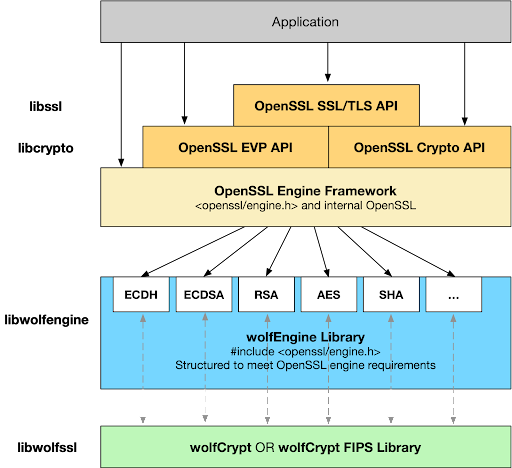

# イントロダクション

wolfCrypt エンジン (wolfEngine) は、wolfCrypt および wolfCrypt FIPS 暗号化ライブラリを OpenSSLエンジンフレームワークに適合させるためのライブラリです。 wolfEngine は、共有または静的ライブラリとして OpenSSL エンジンの実装を提供し、現在 OpenSSL を使用しているアプリケーションが FIPS および非 FIPS ユースケースで wolfCrypt 暗号化ライブラリを活用できるようにします。

wolfEngine は、wolfSSL (libwolfssl) と OpenSSL にリンクする個別のスタンドアロン ライブラリとして構成されています。 wolfEngine は、wolfCrypt ネイティブ API を内部的にラップする **OpenSSL エンジンの実装** を実装および公開します。 wolfEngine の概要図と、それがアプリケーションおよび OpenSSL とどのように関連しているかを下の図 1 に示します。

wolfEngine の設計とアーキテクチャの詳細については、[wolfEngine の設計](chapter09.md) の章を参照してください。

wolfEngine は、デフォルトで **libwolfengine** と呼ばれる共有ライブラリとしてコンパイルされます。これは、アプリケーションまたはコンフィギュレーションファイルを介して OpenSSL によって実行時に動的に登録できます。 wolfEngine は、アプリケーションが静的ビルドでコンパイルされたときにエンジンをロードするためのエントリ ポイントも提供します。

