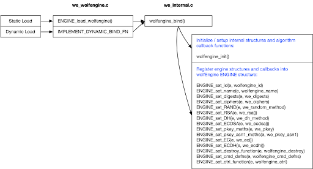

# wolfEngine の設計

wolfEngine は次のソース ファイルで構成され、すべて wolfEngine パッケージの"src"サブディレクトリの下にあります。

| ソースファイル | 詳細 |
| --------------- | ---------------- |
| we_wolfengine.c | ライブラリ エントリ ポイントが含まれます。 OpenSSL エンジン フレームワークを使用してライブラリを動的にロードするために OpenSSL IMPLEMENT_DYNAMIC_BIND_FN を呼び出します。 コンパイルしてスタティック ライブラリとして使用する場合のスタティック エントリ ポイントも含まれます |
| we_internal.c | エンジン アルゴリズム コールバックの登録を処理する wolfengine_bind() 関数が含まれています。 他の wolfengine の内部機能も含まれています。 |
| we_logging.c | wolfEngine ロギング フレームワークと関数の実装 |
| we_openssl_bc.c | wolfEngine OpenSSL バイナリ互換抽象化レイヤー。複数の OpenSSL バージョンで wolfEngine をサポートするために使用されます。 |
| we_aes_block.c | wolfEngine AES-ECB および AES-CBC の実装 |
| we_aes_cbc_hmac.c | wolfEngine AES-CBC-HMAC 実装 |
| we_aes_ccm.c | wolfEngine AES-CCM 実装 |
| we_aes_ctr.c | wolfEngine AES-CTR 実装 |
| we_aes_gcm.c | wolfEngine AES-GCM 実装 |
| we_des3_cbc.c | wolfEngine 3DES-CBC の実装 |
| we_dh.c | wolfEngine DH の実装 |
| we_digest.c | wolfEngine メッセージ ダイジェストの実装 (SHA-1、SHA-2、SHA-3) |
| we_ecc.c | wolfEngine ECDSA および ECDH の実装 |
| we_mac.c | wolfEngine HMAC および CMAC の実装 |
| we_random.c | wolfEngine RAND 実装 |
| we_rsa.c | wolfEngine RSA 実装 |
| we_tls_prf.c | wolfEngine TLS 1.0 PRF 実装 |


一般的な wolfEngine アーキテクチャは次のとおりで、動的エントリ ポイントと静的エントリ ポイントの両方を示しています:



## wolfEngine エントリーポイント

wolfEngine ライブラリへの主なエントリ ポイントは、**wolfengine_bind** () または **ENGINE_load_wolfengine** () のいずれかです。 wolfEngine が動的にロードされている場合、wolfengine_bind() は OpenSSL によって自動的に呼び出されます。 ENGINE_load_wolfengine() は、wolfEngine が動的ではなく静的に構築および使用されている場合に、アプリケーションが呼び出す必要があるエントリ ポイントです。

## wolfEngine アルゴリズム コールバック登録

wolfEngine は、wolfCrypt FIPS でサポートされているすべてのコンポーネントに対して、アルゴリズム構造体とコールバックを OpenSSL エンジン フレームワークに登録します。 この登録は、`we_internal.c` の `wolfengine_bind()` 内で行われます。 `wolfengine_bind()` は、wolfEngine エンジンを表す ENGINE 構造体ポインタを受け取ります。 次に、個々のアルゴリズム/コンポーネントのコールバックまたは構造体が、<openssl/engine.h> の適切な API を使用してその ENGINE 構造体に登録されます。


これらの API 呼び出しには、次のものが含まれます：
```
ENGINE_set_id(e, wolfengine_id)
ENGINE_set_name(e, wolfengine_name)
ENGINE_set_digests(e, we_digests)
ENGINE_set_ciphers(e, we_ciphers)
ENGINE_set_RAND(e, we_random_method)
ENGINE_set_RSA(e, we_rsa())
ENGINE_set_DH(e, we_dh_method)
ENGINE_set_ECDSA(e, we_ecdsa())
ENGINE_set_pkey_meths(e, we_pkey)
ENGINE_set_pkey_asn1_meths(e, we_pkey_asn1)
ENGINE_set_EC(e, we_ec())
ENGINE_set_ECDH(e, we_ecdh())
ENGINE_set_destroy_function(e, wolfengine_destroy)
ENGINE_set_cmd_defns(e, wolfengine_cmd_defns)
ENGINE_set_ctrl_function(e, wolfengine_ctrl)
```

上記の呼び出しで使用される各アルゴリズム/コンポーネントのコールバック関数または構造体 (例: we_digests、we_ciphers など) は、`we_internal.c` またはそれぞれのアルゴリズム ソース ファイルに実装されています。
