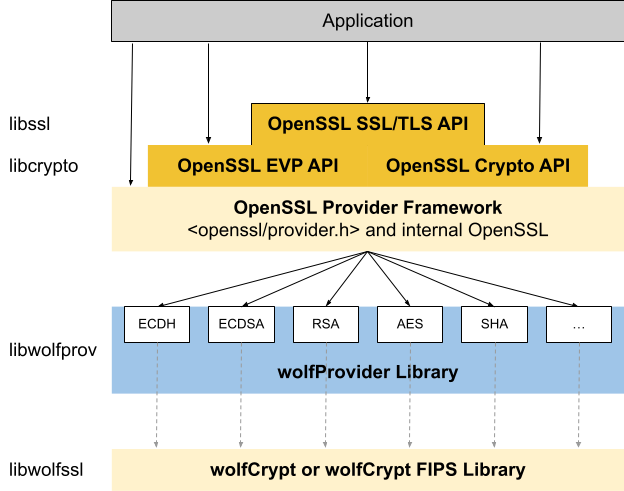

# イントロダクション

wolfCryptエンジン(wolfProvider)は、wolfCryptおよびwolfCrypt FIPS暗号化ライブラリをOpenSSLエンジンフレームワークに適合させるためのライブラリです。 
wolfProviderは、共有または静的ライブラリとしてOpenSSLエンジン互換の実装を提供し、
現在OpenSSLを使用しているアプリケーションがFIPSおよび非FIPSユースケースでwolfCrypt暗号化ライブラリを活用できるようにします。

wolfProviderは、wolfSSL(libwolfssl)とOpenSSLにリンクする個別のスタンドアロンライブラリとして構成されています。
wolfProviderは、wolfCryptネイティブAPIを内部的にラップするOpenSSLエンジンです。 
wolfProviderの概要図、そしてアプリケーションやOpenSSLとどのように関連しているかを下の図1に示します。

wolfProviderの設計とアーキテクチャの詳細については、[wolfProviderの設計](chapter09.md) の章をご覧ください。

wolfProviderは、**libwolfprovider** という名前の共有ライブラリとしてコンパイルされます。
これは、アプリケーションまたはコンフィギュレーションファイルを介してOpenSSLによって実行時に動的に登録できます。
wolfProviderは、アプリケーションが静的ビルドでコンパイルされたときにエンジンをロードするためのエントリポイントも提供します。

