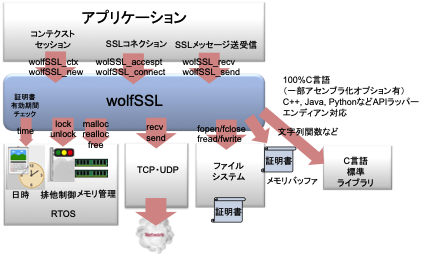

# 1	はじめに

組み込みプラットフォーム上でwolfSSLを実行するには、いくつかのステップが必要です。これらのステップのいくつかは、wolfSSL Manual（非標準環境でのビルド）のセクション2.4で概説されています。

wolfSSLマニュアルの第2章の手順とは別に、特定のプラットフォームに対応するために移植や修正が必要なコードがいくつかあります。 wolfSSLは、これらの分野の多くを抽象化して、wolfSSLを新しいプラットフォームに移植するのはできるだけ簡単にしようとしています。

## 想定する読者

のガイドは、デフォルトでサポートされていない新しいプラットフォームまたは環境に wolfSSL および wolfCrypt を移植する開発者またはエンジニアを対象としています。

## 概要

組み込みプラットフォームで wolfSSL を実行するには、いくつかの手順を繰り返す必要があります。 これらの手順のいくつかは、wolfSSL マニュアルのセクション 2.4 で概説されています。

wolfSSL マニュアルの第 2 章の手順とは別に、特定のプラットフォームに対応するために移植または変更が必要なコードの領域があります。 wolfSSL はこれらの領域の多くを抽象化し、wolfSSL を新しいプラットフォームにできるだけ簡単に移植できるようにします。

./wolfssl/wolfcrypt/settings.h ファイルには、さまざまなオペレーティング システム、TCP/IP スタック、およびチップセット (つまり、MBED、FREESCALE\_MQX、MICROCHIP\_PIC32、MICRIUM、EBSNET など) に固有の定義がいくつかあります。 wolfSSL をコンパイルして新しいプラットフォームに移植するときに \#defines を配置する主な場所は次の 2 つです。

まず、オペレーティング システムまたは TCP/IP スタック ポートの新しい定義は、通常、wolfSSL の新しいポートが完了すると、settings.h ファイルに追加されます。 これにより、機能をオン/オフしたり、そのビルドのデフォルトにする必要があるビルド設定をカスタマイズしたりする簡単な方法が提供されます。 wolfSSL を新しいプラットフォームに移植する際に、このファイルに新しいカスタム定義を追加できます。 ユーザーは、GitHub のマスター オープン ソース コード ブランチに wolfSSL のポートを提供することをお勧めします。 これにより、wolfSSL を最新の状態に保つことができ、wolfSSL プロジェクトが改善され前進するにつれて、さまざまなポートを最新の状態に保つことができます。

自分の変更を wolfSSLproper に戻したくないユーザー、または追加のプリプロセッサー定義で wolfSSL ビルドをカスタマイズしたいユーザーの場合、wolfSSL はカスタムの「user\_settings.h」ヘッダー ファイルの使用を推奨します。 

wolfSSL ソース ファイルのコンパイル時に WOLFSSL\_USER\_SETTINGS が定義されている場合、wolfSSL は「user\_settings.h」と呼ばれるカスタム ヘッダー ファイルを自動的にインクルードします。このヘッダーはユーザーが作成し、インクルードパスに配置する必要があります。 これにより、ユーザーは自分の wolfSSLbuild 用に 1 つのファイルを維持でき、新しいバージョンの wolfSSL への更新がはるかに簡単になります。

wolfSSL は、直接の電子メール (info@wolfssl.com) または GitHub プル リクエストを通じて、パッチとコードの変更を提出することを奨励しています。

図１はwolfSSLライブラリが依存する主なプラットフォームコンポーネントを示しています。ポーティング作業ではこれらの依存コンポーネントについて、ユーザが実際に使用するものと整合をとる必要があります。以下に、主なコンポーネントについて概要をまとめます。詳細については、このユーザガイドの各項を参照してください。

- ネットワーク送受信

wolfSSLライブラリはTCP層のメッセージ送受信のためのAPIを使用します。デフォルトではBSDソケットが使用されます。いくつかの代表的なTCP層APIのためには直接リンクできるためのビルドオプションが用意されています。それ以外のメッセージングAPIを使用する場合はWOLFSSL_USER_IOオプションを指定して、ユーザが用意したメッセージ送受信のコールバック関数を登録します。
なお、TCP接続の確立（TCPのコネクトないしアクセプトまでの処理）は、ユーザプログラムの側で行います。

- ファイルI/O

ファイルI/Oは主に証明書や鍵の読み出し、生成時の書き込みのために使用されます。デフォルトではPOSIX APIが使用されます。それ以外のAPIを使用する場合はファイルオープン、クローズ、リード、ライト、シークなどのAPIをビルドオプションとして定義します。

- スレッド、排他制御

スレッドの生成、削除に関してはユーザプログラムの責任で行います。スレッド間の排他制御についてはライブラリ内で必要な箇所で、MUTEXロック、アンロックが呼ばれます。主要なOS、RTOSではビルド時にオプション指定することで所定のロック、アンロック関数とリンクできます。
非RTOSアプリケーションや本ライブラリを単一のスレッドのみで使用する場合は、シングルスレッド・モードで動作するオプションを指定することができます。

- メモリー管理

デフォルトでは、C言語標準ライブラリのmalloc、free、reallocが使用されます。独自のライブラリを使用する場合は、ビルドオプション、または実行時に登録するユーザ独自の関数を使用することもできます。

- 時計

主に証明書の有効期間チェック、SSLセッションのタイムアウト管理などに使用されます。従って、高い正確性は要求されませんが、相対時間ではなく実時間である必要があります。デフォルトでは1970年からの秒数を返却するtime関数が使用されます。独自の関数を使用する場合はオプションで指定します。

- C言語標準ライブラリ

文字列関数などいくつかのC言語標準関数が使用されます。独自の関数を使用する場合はオプションで指定します。
