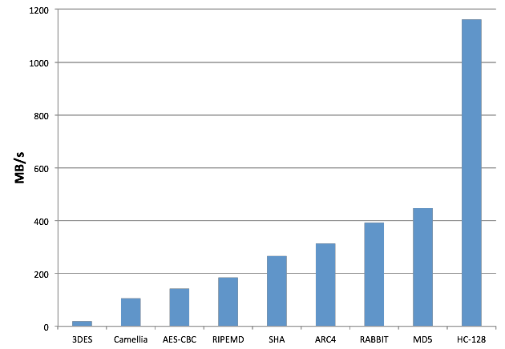

# 入門

## 概要

wolfSSL（旧称CyaSSL）は、[第2章](chapter02.md)に示したコンパイルオプションを使用した場合、yaSSLの約10倍小さく、OpenSSLの20倍小さくなります。
ユーザーによるベンチマークとフィードバックからも、標準的なSSL操作のほとんどにおいて、wolfSSLはOpenSSLと比較して劇的に優れたパフォーマンスを示していると報告されています。

ビルドプロセスの手順については、[第2章](chapter02.md)をご覧ください。

## テストスイート

テストスイートプログラムは、wolfSSLとその暗号化ライブラリであるwolfCryptが、システム上で正常に実行できるかをテストします。

サンプルプログラムとテストや実行する際は、wolfSSLのホームディレクトリからコマンドを投入する必要があります。
これは`./certs`から証明書と鍵を見つけるためです。
テストスイートを実行するには、次のコマンドを実行してください。

```sh
./testsuite/testsuite.test
```

autoconfを使用して、次のように実行することもできます。

```sh
make test
```

*nixまたはWindows環境においては、サンプルプログラムやテストスイートは現在のディレクトリがソースディレクトリかどうかを確認し、そうであれば、wolfSSLホームディレクトリに変更しようとします。
これはほとんどのセットアップケースで動作するはずです。
もしうまく実行できない場合には、上記の最初の方法を使用してフルパスを指定してください。

正常に実行されると、次のような出力が表示されるはずです。
ユニットテストと暗号スイートテストのための追加の出力も含んでいます。

```text
------------------------------------------------------------------------------
 wolfSSL version 4.8.1
------------------------------------------------------------------------------
error    test passed!
MEMORY   test passed!
base64   test passed!
base16   test passed!
asn      test passed!
RANDOM   test passed!
MD5      test passed!
SHA      test passed!
SHA-224  test passed!
SHA-256  test passed!
SHA-384  test passed!
SHA-512  test passed!
SHA-3    test passed!
Hash     test passed!
HMAC-MD5 test passed!
HMAC-SHA test passed!
HMAC-SHA224 test passed!
HMAC-SHA256 test passed!
HMAC-SHA384 test passed!
HMAC-SHA512 test passed!
HMAC-SHA3   test passed!
HMAC-KDF    test passed!
GMAC     test passed!
Chacha   test passed!
POLY1305 test passed!
ChaCha20-Poly1305 AEAD test passed!
AES      test passed!
AES192   test passed!
AES256   test passed!
AES-GCM  test passed!
RSA      test passed!
DH       test passed!
PWDBASED test passed!
OPENSSL  test passed!
OPENSSL (EVP MD) passed!
OPENSSL (PKEY0) passed!
OPENSSL (PKEY1) passed!
OPENSSL (EVP Sign/Verify) passed!
ECC      test passed!
logging  test passed!
mutex    test passed!
memcb    test passed!
Test complete
Alternate cert chain used
 issuer : /C=US/ST=Montana/L=Bozeman/O=Sawtooth/OU=Consulting/CN=www.wolfssl.com/emailAddress=info@wolfssl.com
 subject: /C=US/ST=Montana/L=Bozeman/O=wolfSSL/OU=Support/CN=www.wolfssl.com/emailAddress=info@wolfssl.com
 altname = example.com
Alternate cert chain used
 issuer : /C=US/ST=Montana/L=Bozeman/O=wolfSSL_2048/OU=Programming-2048/CN=www.wolfssl.com/emailAddress=info@wolfssl.com
 subject: /C=US/ST=Montana/L=Bozeman/O=wolfSSL_2048/OU=Programming-2048/CN=www.wolfssl.com/emailAddress=info@wolfssl.com
 altname = example.com
 serial number:01
SSL version is TLSv1.2
SSL cipher suite is TLS_ECDHE_RSA_WITH_AES_256_GCM_SHA384
SSL signature algorithm is RSA-SHA256
SSL curve name is SECP256R1
Session timeout set to 500 seconds
Client Random :  serial number:f1:5c:99:43:66:3d:96:04
SSL version is TLSv1.2
SSL cipher suite is TLS_ECDHE_RSA_WITH_AES_256_GCM_SHA384
SSL signature algorithm is RSA-SHA256
SSL curve name is SECP256R1
1DC16A2C0D3AC49FC221DD5B8346B7B38CB9899B7A402341482183Server Random : 1679E50DBBBB3DB88C90F600C4C578F4F5D3CEAEC9B16BCCA215C276B448
765A1385611D6A
Client message: hello wolfssl!
I hear you fa shizzle!
sending server shutdown command: quit!
client sent quit command: shutting down!
ciphers = TLS13-AES128-GCM-SHA256:TLS13-AES256-GCM-SHA384:TLS13-CHACHA20-POLY1305-SHA256:DHE-RSA-AES128-SHA:DHE-RSA-AES256-SHA:ECDHE-RSA-AES128-SHA:ECDHE-RSA-AES256-SHA:ECDHE-ECDSA-AES128-SHA:ECDHE-ECDSA-AES256-SHA:DHE-RSA-AES128-SHA256:DHE-RSA-AES256-SHA256:DHE-RSA-AES128-GCM-SHA256:DHE-RSA-AES256-GCM-SHA384:ECDHE-RSA-AES128-GCM-SHA256:ECDHE-RSA-AES256-GCM-SHA384:ECDHE-ECDSA-AES128-GCM-SHA256:ECDHE-ECDSA-AES256-GCM-SHA384:ECDHE-RSA-AES128-SHA256:ECDHE-ECDSA-AES128-SHA256:ECDHE-RSA-AES256-SHA384:ECDHE-ECDSA-AES256-SHA384:ECDHE-RSA-CHACHA20-POLY1305:ECDHE-ECDSA-CHACHA20-POLY1305:DHE-RSA-CHACHA20-POLY1305:ECDHE-RSA-CHACHA20-POLY1305-OLD:ECDHE-ECDSA-CHACHA20-POLY1305-OLD:DHE-RSA-CHACHA20-POLY1305-OLD
33bc1a4570f4f1abccd5c48aace529b01a42ab51293954a297796e90d20970f0  input
33bc1a4570f4f1abccd5c48aace529b01a42ab51293954a297796e90d20970f0  /tmp/output-gNQWZL

All tests passed!
```

これは、すべてが正しく構成およびビルドされていることを示しています。
いずれかのテストに失敗した場合は、ビルドシステムが正しく設定されていることをご確認ください。
エンディアンが間違っていたり、64ビットタイプが適切に設定されていなかったりする可能性があります。
デフォルトの構成からオプションを変更している場合は、それらを削除してwolfSSLを再ビルドし、改めてテストを実行してください。

## クライアントサンプルプログラム

`examples/client`にあるクライアントのサンプルプログラムを使用して、任意のSSL/TLSサーバーに対してwolfSSLをテストできます。
利用可能なコマンドラインオプションのリストを表示するには、`--help`を付けてクライアントを実行します。

```sh
./examples/client/client --help
```

出力例

```text
wolfSSL client 4.8.1 NOTE: All files relative to wolfSSL home dir
Max RSA key size in bits for build is set at : 4096
-? <num>    Help, print this usage
            0: English, 1: Japanese
--help      Help, in English
-h <host>   Host to connect to, default 127.0.0.1
-p <num>    Port to connect on, not 0, default 11111
-v <num>    SSL version [0-4], SSLv3(0) - TLS1.3(4)), default 3
-V          Prints valid ssl version numbers, SSLv3(0) - TLS1.3(4)
-l <str>    Cipher suite list (: delimited)
-c <file>   Certificate file,           default ./certs/client-cert.pem
-k <file>   Key file,                   default ./certs/client-key.pem
-A <file>   Certificate Authority file, default ./certs/ca-cert.pem
-Z <num>    Minimum DH key bits,        default 1024
-b <num>    Benchmark <num> connections and print stats
-B <num>    Benchmark throughput using <num> bytes and print stats
-d          Disable peer checks
-D          Override Date Errors example
-e          List Every cipher suite available,
-g          Send server HTTP GET
-u          Use UDP DTLS, add -v 2 for DTLSv1, -v 3 for DTLSv1.2 (default)
-m          Match domain name in cert
-N          Use Non-blocking sockets
-r          Resume session
-w          Wait for bidirectional shutdown
-M <prot>   Use STARTTLS, using <prot> protocol (smtp)
-f          Fewer packet/group messages
-x          Disable client cert/key loading
-X          Driven by eXternal test case
-j          Use verify callback override
-n          Disable Extended Master Secret
-H <arg>    Internal tests [defCipherList, exitWithRet, verifyFail, useSupCurve,
                            loadSSL, disallowETM]
-J          Use HelloRetryRequest to choose group for KE
-K          Key Exchange for PSK not using (EC)DHE
-I          Update keys and IVs before sending data
-y          Key Share with FFDHE named groups only
-Y          Key Share with ECC named groups only
-1 <num>    Display a result by specified language.
            0: English, 1: Japanese
-2          Disable DH Prime check
-6          Simulate WANT_WRITE errors on every other IO send
-7          Set minimum downgrade protocol version [0-4]  SSLv3(0) - TLS1.3(4)
```

example.com:443に対してテストするには、次のようにします。
ここでは、ビルドオプション`--enable-opensslextra`と`--enable-supportedcurves`を使用してコンパイルしたwolfSSLを使用しています。

```sh
./examples/client/client -h example.com -p 443 -d -g
```

出力例

```text
Alternate cert chain used
 issuer : /C=US/O=DigiCert Inc/CN=DigiCert TLS RSA SHA256 2020 CA1
 subject: /C=US/ST=California/L=Los Angeles/O=Internet Corporation for Assigned Names and Numbers/CN=www.example.org
 altname = www.example.net
 altname = www.example.edu
 altname = www.example.com
 altname = example.org
 altname = example.net
 altname = example.edu
 altname = example.com
 altname = www.example.org
 serial number:0f:be:08:b0:85:4d:05:73:8a:b0:cc:e1:c9:af:ee:c9
SSL version is TLSv1.2
SSL cipher suite is TLS_ECDHE_RSA_WITH_AES_128_GCM_SHA256
SSL curve name is SECP256R1
Session timeout set to 500 seconds
Client Random : 20640B8131D8E542646D395B362354F9308057B1624C2442C0B5FCDD064BFE29
SSL connect ok, sending GET...
HTTP/1.0 200 OK
Accept-Ranges: bytes
Content-Type: text/html
Date: Thu, 14 Oct 2021 16:50:28 GMT
Last-Modified: Thu, 14 Oct 2021 16:45:10 GMT
Server: ECS (nyb/1D10)
Content-Length: 94
Connection: close
```

これにより、クライアントはexample.com(`-h`)のHTTPSポート443(`-p`)に接続し、一般的なGETリクエスト(`-g`)を送信するように指示します。
(`-d`)オプションにより、クライアントにサーバー証明書の検証をスキップするよう指示しています。
このオプションを付加している理由については、以下の`-188`エラーに関する説明をご覧ください。
残りは読み取りバッファに収められたサーバーからの初期出力です。

コマンドライン引数が指定されていない場合、クライアントはlocalhost上のwolfSSLデフォルトポート11111に接続を試みます。
また、サーバーがクライアント認証を実行したい場合を想定しクライアント証明書も読み込みます。

クライアントは引数`-b <整数>`を使用して接続のベンチマークを実行できます。
このオプションを使用すると、クライアントは引数として渡された回数の接続を試行し、`SSL_connect()`の実行にかかった平均時間をミリ秒単位で表示します。

例えば、以下のように実行します。

```sh
/examples/client/client -b 100 -h example.com -p 443 -d
```

出力例

```text
wolfSSL_connect avg took:  296.417 milliseconds
```

`/wolfssl/test.h`を編集することで、デフォルトのホストやポートをlocalhost・11111から任意の値に変更できます。
変数wolfSSLIP / wolfSSLPortを編集してください。
なお、これらの設定を変更した場合は、testsuiteを含むすべてのサンプルプログラムを再ビルドする必要があります。
そうしないと、テストプログラムは互いに接続できません。

デフォルトでは、クライアントサンプルプログラムはTLS 1.2を使用して指定されたサーバーに接続しようとします。
ユーザーは`-v`コマンドラインオプションを使用して、クライアントが使用するSSL/TLSバージョンを変更できます。
このオプションでは、以下の値を指定できます。

* `-v 0` - SSL 3.0（デフォルトでは無効）
* `-v 1` - TLS 1.0
* `-v 2` - TLS 1.1
* `-v 3` - TLS 1.2（デフォルトで選択）
* `-v 4` - TLS 1.3

クライアントサンプルプログラムを実行する際、次のように`error -188`が出力される場合があります。

```text
wolfSSL_connect error -188, ASN no signer error to confirm failure
wolfSSL error: wolfSSL_connect failed
```

これは通常、wolfSSLクライアントが接続先のサーバー証明書を検証できないことが原因です。
デフォルトでは、wolfSSLクライアントは「yaSSLテストCA証明書」を信頼されたルート証明書として使用します。
これはテスト用のCA証明書であり、外部のCAによって署名されたサーバー証明書を検証することはできません。
そのため、この問題を解決するには、ユーザーは`-d`オプションを使用してサーバーの検証をオフにするか、

```sh
./examples/client/client -h myhost.com -p 443 -d
```

`-A`コマンドラインオプションを使用して、正しいCA証明書をwolfSSLクライアントに読み込ませる必要があります。

```sh
./examples/client/client -h myhost.com -p 443 -A serverCA.pem
```

## サーバーサンプルプログラム

サーバーサンプルプログラムは、クライアント認証も実行可能なシンプルなSSL/TLSサーバーです。
1つのクライアント接続のみが受け入れられ、その後サーバーは終了します。

コマンドライン引数なしのクライアントサンプルプログラムは、サーバーサンプルプログラムに対して問題なく接続できます。
しかし、クライアントサンプルプログラムにコマンドライン引数を指定すると、クライアント証明書が読み込まれず、`wolfSSL_connect()`が失敗します。
このとき、サーバーは`error -245, peer didn't send cert`を出力します。
これを回避するためには、`-d`オプションを使用してクライアント証明書チェックを無効にしてください。

サンプルプログラムのクライアントと同様に、サーバーもいくつかのコマンドライン引数で使用できます。

```sh
./examples/server/server --help
```

出力例

```text
server 4.8.1 NOTE: All files relative to wolfSSL home dir
-? <num>    Help, print this usage
            0: English, 1: Japanese
--help      Help, in English
-p <num>    Port to listen on, not 0, default 11111
-v <num>    SSL version [0-4], SSLv3(0) - TLS1.3(4)), default 3
-l <str>    Cipher suite list (: delimited)
-c <file>   Certificate file,           default ./certs/server-cert.pem
-k <file>   Key file,                   default ./certs/server-key.pem
-A <file>   Certificate Authority file, default ./certs/client-cert.pem
-R <file>   Create Ready file for external monitor default none
-D <file>   Diffie-Hellman Params file, default ./certs/dh2048.pem
-Z <num>    Minimum DH key bits,        default 1024
-d          Disable client cert check
-b          Bind to any interface instead of localhost only
-s          Use pre Shared keys
-u          Use UDP DTLS, add -v 2 for DTLSv1, -v 3 for DTLSv1.2 (default)
-f          Fewer packet/group messages
-r          Allow one client Resumption
-N          Use Non-blocking sockets
-S <str>    Use Host Name Indication
-w          Wait for bidirectional shutdown
-x          Print server errors but do not close connection
-i          Loop indefinitely (allow repeated connections)
-e          Echo data mode (return raw bytes received)
-B <num>    Benchmark throughput using <num> bytes and print stats
-g          Return basic HTML web page
-C <num>    The number of connections to accept, default: 1
-H <arg>    Internal tests [defCipherList, exitWithRet, verifyFail, useSupCurve,
                            loadSSL, disallowETM]
-U          Update keys and IVs before sending
-K          Key Exchange for PSK not using (EC)DHE
-y          Pre-generate Key Share using FFDHE_2048 only
-Y          Pre-generate Key Share using P-256 only
-F          Send alert if no mutual authentication
-2          Disable DH Prime check
-1 <num>    Display a result by specified language.
            0: English, 1: Japanese
-6          Simulate WANT_WRITE errors on every other IO send
-7          Set minimum downgrade protocol version [0-4]  SSLv3(0) - TLS1.3(4)
```

## エコーサーバーのサンプルプログラム

エコーサーバーのサンプルプログラムは、無限ループで無制限のクライアント接続を待ち続けます。
そしてクライアントが送信したものをすべてエコーバックします。

クライアント認証は実行されません。
したがって、クライアントサンプルプログラムはすべてのモードでエコーサーバーに接続できます。

なお、以下に示す4つの特別なコマンドはエコーバックされず、エコーサーバーに異なる処理を実行するよう指示します。

1. `quit` - エコーサーバーが文字列「quit」を受信すると、シャットダウンします。
2. `break` - エコーサーバーが文字列「break」を受信すると、現在のセッションを停止しますが、リクエストの処理は継続します。これはDTLSテストに特に役立ちます。
3. `printstats` - エコーサーバーが文字列「printstats」を受信すると、セッションキャッシュの統計情報を出力します。
4. `GET` - エコーサーバーが文字列「GET」を受信すると、HTTPのGETとして処理し、「greeting from wolfSSL」というメッセージを含む簡単なページを送り返します。これにより、Safari、IE、Firefox、GnuTLSといったさまざまなTLS/SSLクライアントのテストが可能になります。

`NO_MAIN_DRIVER`が定義されていない限り、エコーサーバーの出力は標準出力にエコーされます。
シェルを通して、または1番目のコマンドライン引数を使用して出力をリダイレクトすることもできます。
エコーサーバーからの出力を`output.txt`という名前のファイルに保存したい場合には、次のように実行します。

```sh
./examples/echoserver/echoserver output.txt
```

## エコークライアントのサンプルプログラム

エコークライアントのサンプルプログラムは、インタラクティブモードまたはファイルによるバッチモードで実行できます。

インタラクティブモードで実行し、3つの文字列「hello」、「wolfssl」、および「quit」を書き込むと、結果は以下のようになります。

```text
./examples/echoclient/echoclient
hello
hello
wolfssl
wolfssl
quit
sending server shutdown command: quit!
```

ファイル入力を使用するには、コマンドライン上で最初の引数としてファイル名を指定します。
ファイル`input.txt`の内容をエコーするには、以下のように実行します。

```sh
./examples/echoclient/echoclient input.txt
```

結果をファイルに書き出したい場合は、追加のコマンドライン引数として出力ファイル名を指定できます。
ファイル`input.txt`の内容をエコーし、サーバーからの結果を`output.txt`に書き込むには、次のように実行します。

```sh
./examples/echoclient/echoclient input.txt output.txt
```

テストスイートプログラムではこの動作を行いますが、クライアントとサーバーが期待される結果を正しく送信/受信できていることを確認するため、入力・出力ファイルをハッシュ化しています。

## ベンチマーク

組み込み向けSSL/TLSライブラリwolfSSLが、使用を検討しているハードウェアデバイスや特定の環境で、果たしてどれほどのパフォーマンスを発揮できるのかは非常に気になるものです。
しかし、今日の組み込み / エンタープライズ / クラウド環境では、非常に多数のプラットフォーム・コンパイラが使用されています。
これらの全てに対応できる、一般的なパフォーマンス指標の算出式を提供することは非常に困難です。

そこで、ユーザーがwolfSSL / wolfCryptのパフォーマンスを容易に判断できるように、ベンチマークアプリケーションをバンドルしています。
wolfSSLは、SSL/TLSの基盤であるすべての暗号操作にwolfCrypt暗号ライブラリを使用します。
したがって、ベンチマークアプリケーションはwolfCryptのパフォーマンステストを実行します。

wolfcrypt/benchmark（`./wolfcrypt/benchmark/benchmark`）にあるベンチマークユーティリティを使用して、wolfCryptの暗号処理のベンチマークを実行できます。

```sh
./wolfcrypt/benchmark/benchmark
```

以下のような出力がなされます。
なお、ここでは、ECC、SHA-256、SHA-512、AES-GCM、AES-CCM、およびCamelliaを含むいくつかのオプションのアルゴリズム/暗号が有効になっています。

```text
------------------------------------------------------------------------------
 wolfSSL version 4.8.1
------------------------------------------------------------------------------
wolfCrypt Benchmark (block bytes 1048576, min 1.0 sec each)
RNG                105 MB took 1.004 seconds,  104.576 MB/s Cycles per byte =  20.94
AES-128-CBC-enc    310 MB took 1.008 seconds,  307.434 MB/s Cycles per byte =   7.12
AES-128-CBC-dec    290 MB took 1.002 seconds,  289.461 MB/s Cycles per byte =   7.56
AES-192-CBC-enc    265 MB took 1.010 seconds,  262.272 MB/s Cycles per byte =   8.35
AES-192-CBC-dec    240 MB took 1.013 seconds,  236.844 MB/s Cycles per byte =   9.24
AES-256-CBC-enc    240 MB took 1.011 seconds,  237.340 MB/s Cycles per byte =   9.22
AES-256-CBC-dec    235 MB took 1.018 seconds,  230.864 MB/s Cycles per byte =   9.48
AES-128-GCM-enc    160 MB took 1.011 seconds,  158.253 MB/s Cycles per byte =  13.83
AES-128-GCM-dec    160 MB took 1.016 seconds,  157.508 MB/s Cycles per byte =  13.90
AES-192-GCM-enc    150 MB took 1.022 seconds,  146.815 MB/s Cycles per byte =  14.91
AES-192-GCM-dec    150 MB took 1.039 seconds,  144.419 MB/s Cycles per byte =  15.16
AES-256-GCM-enc    130 MB took 1.017 seconds,  127.889 MB/s Cycles per byte =  17.12
AES-256-GCM-dec    140 MB took 1.030 seconds,  135.943 MB/s Cycles per byte =  16.10
GMAC Table 4-bit   321 MB took 1.002 seconds,  320.457 MB/s Cycles per byte =   6.83
CHACHA             420 MB took 1.002 seconds,  419.252 MB/s Cycles per byte =   5.22
CHA-POLY           330 MB took 1.013 seconds,  325.735 MB/s Cycles per byte =   6.72
MD5                655 MB took 1.007 seconds,  650.701 MB/s Cycles per byte =   3.36
POLY1305          1490 MB took 1.002 seconds, 1486.840 MB/s Cycles per byte =   1.47
SHA                560 MB took 1.004 seconds,  557.620 MB/s Cycles per byte =   3.93
SHA-224            240 MB took 1.011 seconds,  237.474 MB/s Cycles per byte =   9.22
SHA-256            250 MB took 1.020 seconds,  245.081 MB/s Cycles per byte =   8.93
SHA-384            380 MB took 1.005 seconds,  377.963 MB/s Cycles per byte =   5.79
SHA-512            380 MB took 1.007 seconds,  377.260 MB/s Cycles per byte =   5.80
SHA3-224           385 MB took 1.009 seconds,  381.679 MB/s Cycles per byte =   5.74
SHA3-256           360 MB took 1.004 seconds,  358.583 MB/s Cycles per byte =   6.11
SHA3-384           270 MB took 1.020 seconds,  264.606 MB/s Cycles per byte =   8.27
SHA3-512           185 MB took 1.019 seconds,  181.573 MB/s Cycles per byte =  12.06
HMAC-MD5           665 MB took 1.004 seconds,  662.154 MB/s Cycles per byte =   3.31
HMAC-SHA           590 MB took 1.004 seconds,  587.535 MB/s Cycles per byte =   3.73
HMAC-SHA224        240 MB took 1.018 seconds,  235.850 MB/s Cycles per byte =   9.28
HMAC-SHA256        245 MB took 1.013 seconds,  241.805 MB/s Cycles per byte =   9.05
HMAC-SHA384        365 MB took 1.006 seconds,  362.678 MB/s Cycles per byte =   6.04
HMAC-SHA512        365 MB took 1.009 seconds,  361.674 MB/s Cycles per byte =   6.05
PBKDF2              30 KB took 1.000 seconds,   29.956 KB/s Cycles per byte = 74838.56
RSA     2048 public      18400 ops took 1.004 sec, avg 0.055 ms, 18335.019 ops/sec
RSA     2048 private       300 ops took 1.215 sec, avg 4.050 ms, 246.891 ops/sec
DH      2048 key gen      1746 ops took 1.000 sec, avg 0.573 ms, 1745.991 ops/sec
DH      2048 agree         900 ops took 1.060 sec, avg 1.178 ms, 849.210 ops/sec
ECC   [      SECP256R1]   256 key gen       901 ops took 1.000 sec, avg 1.110 ms, 900.779 ops/sec
ECDHE [      SECP256R1]   256 agree        1000 ops took 1.105 sec, avg 1.105 ms, 904.767 ops/sec
ECDSA [      SECP256R1]   256 sign          900 ops took 1.022 sec, avg 1.135 ms, 880.674 ops/sec
ECDSA [      SECP256R1]   256 verify       1300 ops took 1.012 sec, avg 0.779 ms, 1284.509 ops/sec
Benchmark complete
```

これは、数学ライブラリを変更する前後で公開鍵演算の速度を比較するのに特に役立ちます。
通常の数学ライブラリ（`./configure`）、fastmathライブラリ（`./configure --enable-fastmath`）、fasthugemathライブラリ（`./configure --enable-fasthugemath`）に対して、それぞれテストを実行できます。

詳細とベンチマーク結果については、wolfSSLベンチマークページを参照してください。

<https://www.wolfssl.com/docs/benchmarks>

### 相対パフォーマンス

個々の暗号やアルゴリズムのパフォーマンスはホストプラットフォームによって異なりますが、wolfCryptの暗号間の相対的なパフォーマンスを以下のグラフに示します。
このテストは、2.2 GHz Intel Core i7を搭載したMacbook Pro（OS X 10.6.8）で実施されました。



暗号のサブセットのみを使用したい場合は、SSL/TLS接続を行う際にwolfSSLが使用する特定の暗号スイートやCipherをカスタマイズできます。
例えば128ビットAESを強制するには、`wolfSSL_CTX_new(SSL_CTX_new)`の呼び出しの後に、次の行を追加します。

```c
wolfSSL_CTX_set_cipher_list(ctx, "AES128-SHA");
```

### ベンチマークに関する補足

1. プロセッサのネイティブレジスタサイズ（32ビット対64ビット）は、1000ビット以上の公開鍵操作を行う際、大きな違いをもたらす可能性があります。
2. **keygen**（`--enable-keygen`）により、ベンチマークユーティリティを実行する際、鍵生成速度もベンチマークすることができます。
3. **fastmath**（`--enable-fastmath`）は動的メモリ使用量を削減し、公開鍵操作を高速化します。32ビットプラットフォームでfastmathを使用してビルドする際に問題がある場合は、PICがレジスタを占有しないように共有ライブラリを無効にしてください。このとき、READMEの注意事項も併せてご参照ください。

    ```sh
    ./configure --enable-fastmath --disable-shared
    make clean
    make
    ```
    
    **注意**：wolfSSLで構成オプションを切り替える際には、`make clean`を実行することを推奨しています。
4. デフォルトでは、fastmathは可能であればアセンブリ最適化を使用しようとします。アセンブリ最適化が機能しない場合でも、wolfSSLをビルドする際に`CFLAGS`に`TFM_NO_ASM`を追加することで、アセンブリ最適化なしでfastmathを使用できます。

   ```sh
   ./configure --enable-fastmath C_EXTRA_FLAGS="-DTFM_NO_ASM"
   ```

5. fasthugemathを使用すると、組み込みプラットフォームで実行していないユーザー向けにfastmathをさらに強化できます。

    ```sh
    ./configure --enable-fasthugemath
    ```
6. デフォルトのwolfSSLビルドでは、メモリ使用量とパフォーマンスのバランスを取るよう努めています。どちらかをより重視する場合は、追加のwolfSSL構成オプションについて[第2章](chapter02.md)「ビルドオプション」節を参照してください。
7. **バルク転送**：wolfSSLはデフォルトで128バイトのI/Oバッファを使用します。SSLトラフィックの約80%がこのサイズに収まり、動的メモリの使用を制限するためです。バルク転送が必要な場合は、16Kバッファ（SSLの最大サイズ）を使用するように構成できます。

### 組み込みシステムでのベンチマーク

組み込みシステム上で容易にベンチマークアプリケーションをビルドできるように、複数のビルドオプションがあります。

#### BENCH_EMBEDDED

この定義を有効にすると、ベンチマークアプリケーションはメモリ使用量をメガバイトからキロバイトに切り替えます。
具体的には、暗号処理と各アルゴリズムは25kBでベンチマークを実行します。
また、一部の組み込みプロセッサでは公開鍵操作に非常に長い時間を要するため、公開鍵アルゴリズムは1回のみベンチマークを実行します。
メモリ使用量や繰り返し回数の値は、`benchmark.c`内の`BENCH_EMBEDDED`定義内にある変数`numBlocks`と`times`を変更することで調整できます。

#### USE_CERT_BUFFERS_1024

この定義を有効にすると、ベンチマークアプリケーションはファイルシステムからテスト鍵と証明書を読み込む代わりに、`<wolfssl_root>/wolfssl/certs_test.h`にある1024ビットの鍵と証明書バッファを使用します。
これは組み込みプラットフォームにファイルシステムがなく（`NO_FILESYSTEM`と併用）、2048ビット公開鍵操作が現実的でないほど遅いプロセッサの場合に役立ちます。

#### USE_CERT_BUFFERS_2048

`USE_CERT_BUFFERS_1024`と似ていますが、1024ビットの代わりに2048ビットの鍵と証明書バッファを使用します。
プロセッサが2048ビット公開鍵操作を行うのに十分な速度を持っているものの、ファイルシステムがなくファイルから鍵と証明書を読み込むことが難しいケースに役立ちます。

## クライアントアプリケーションでwolfSSLを使用する

この節では、wolfSSLネイティブAPIを使用して、クライアントアプリケーションにwolfSSLを追加するための基本的な手順について説明します。
サーバーの説明については、本章の「サーバーアプリケーションでwolfSSLを使用する」節をご参照ください。
より詳しい手順とサンプルコードは[第11章 SSLチュートリアル](chapter11.md)に掲載しています。
OpenSSL互換性レイヤーの詳細については、[第13章](chapter13.md)を参照してください。

1. wolfSSLヘッダーをインクルードします。

    ```c
    #include <wolfssl/ssl.h>
    ```

2. wolfSSLと`WOLFSSL_CTX`を初期化します。最終的に作成する`WOLFSSL`オブジェクトの数に関係なく、1つの`WOLFSSL_CTX`を使用します。基本的には、接続先のサーバーを検証するためにCA証明書を読み込む必要があります。基本的な初期化手順は次のようになります。

    ```c
    wolfSSL_Init();
    WOLFSSL_CTX* ctx;
    if ((ctx = wolfSSL_CTX_new(wolfTLSv1_client_method())) == NULL)
    {
        fprintf(stderr, "wolfSSL_CTX_new error.\n");
        exit(EXIT_FAILURE);
    }
    if (wolfSSL_CTX_load_verify_locations(ctx,"./ca-cert.pem",0) != SSL_SUCCESS) {
        fprintf(stderr, "Error loading ./ca-cert.pem,"
                        " please check the file.\n");
        exit(EXIT_FAILURE);
    }
    ```

3. TCP接続ごとに`WOLFSSL`オブジェクトを作成し、ファイルディスクリプタをセッションに関連付けます。

    ```c
    /*after connecting to socket fd*/
    WOLFSSL* ssl;
    if ((ssl = wolfSSL_new(ctx)) == NULL) {
        fprintf(stderr, "wolfSSL_new error.\n");
        exit(EXIT_FAILURE);
    }
    wolfSSL_set_fd(ssl, fd);
    ```

4. すべての`read()`（または`recv()`）の呼び出しを`wolfSSL_read()`に変更します。例えば以下の場合、

    ```c
    result = read(fd, buffer, bytes);
    ```

    次のように変更します。

    ```c
    result = wolfSSL_read(ssl, buffer, bytes);
    ```

5. すべての`write()`（または`send()`）の呼び出しを`wolfSSL_write()`に変更します。例えば以下の場合、

    ```c
    result = write(fd, buffer, bytes);
    ```

    次のように変更します。

    ```c
    result = wolfSSL_write(ssl, buffer, bytes);
    ```

6. `wolfSSL_connect()`を手動で呼び出すこともできますが、必ずしも必要ではありません。最初の`wolfSSL_read()`または`wolfSSL_write()`の呼び出し時に、必要に応じて`wolfSSL_connect()`を実行します。
7. エラーチェックは以下のように実装します。それぞれの`wolfSSL_read()`と`wolfSSL_write()`呼び出しは、成功時にはバイト数を返し、接続終了時には0を、エラー時には-1を返します。これは`read()`と`write()`と同様です。エラーが発生した場合、次の2つの関数を使用して詳しい情報を入手できます。

    ```c
    char errorString[80];
    int err = wolfSSL_get_error(ssl, 0);
    wolfSSL_ERR_error_string(err, errorString);
    ```

	ノンブロッキングソケットを使用している場合は、errno `EAGAIN`/`EWOULDBLOCK`をテストするか、より正確には`wolfSSL_get_error()`が返す特定のエラーコードが`SSL_ERROR_WANT_READ`または`SSL_ERROR_WANT_WRITE`であるかをテストできます。
8. クリーンアップは次のように実装します。各`WOLFSSL`オブジェクトの使用が終了したら、以下を呼び出して解放してください。

    ```c
    wolfSSL_free(ssl);
    ```

    SSL/TLSの使用が完全に終了したら、以下を呼び出して`WOLFSSL_CTX`オブジェクトを解放してください。

    ```c
    wolfSSL_CTX_free(ctx);
    wolfSSL_Cleanup();
    ```

wolfSSLを使用したクライアントアプリケーションのサンプルプログラムについては、`<wolfssl_root>/examples/client.c`をご参照ください。

## サーバーアプリケーションでwolfSSLを使用する

この節では、wolfSSLネイティブAPIを使用してサーバーアプリケーションにwolfSSLを追加するための基本的な手順について説明します。
クライアントの説明については、本章の「クライアントアプリケーションでwolfSSLを使用する」節を参照してください。
より詳しい手順とサンプルコードは[第11章 SSLチュートリアル](chapter11.md#ssl-tutorial)に掲載しています。

1. 概ね上記のクライアントの手順と同様です。ただし、ステップ5のクライアントメソッド呼び出しをサーバーのものに変更します。例えば以下の行を、

    ```c
    wolfSSL_CTX_new(wolfTLSv1_client_method());
    ```

    次のように変更します。

    ```c
    wolfSSL_CTX_new(wolfTLSv1_server_method());
    ```

    SSLv3やTLSv1を使用するクライアントの接続も受け付ける場合には、以下のようにします。

    ```c
    wolfSSL_CTX_new(wolfSSLv23_server_method());
    ```
	
2. 上記のステップ5の初期化に、サーバーの証明書と鍵ファイルを追加します。

    ```c
    if (wolfSSL_CTX_use_certificate_file(ctx,"./server-cert.pem", SSL_FILETYPE_PEM) != SSL_SUCCESS) {
        fprintf(stderr, "Error loading ./server-cert.pem,"
                        " please check the file.\n");
        exit(EXIT_FAILURE);
    }
    if (wolfSSL_CTX_use_PrivateKey_file(ctx,"./server-key.pem", SSL_FILETYPE_PEM) != SSL_SUCCESS) {
        fprintf(stderr, "Error loading ./server-key.pem,"
                        " please check the file.\n");
        exit(EXIT_FAILURE);
    }
    ```

ファイルシステムが利用できない場合は、バッファから証明書と鍵を読み込むこともできます。
詳しい情報は`wolfSSL_CTX_use_certificate_buffer()`と`wolfSSL_CTX_use_PrivateKey_buffer()`のAPIドキュメントをご参照ください。

wolfSSLを使用したサーバーアプリケーションのサンプルプログラムは、`<wolfssl_root>/examples/server.c`ファイルを参照してください。
