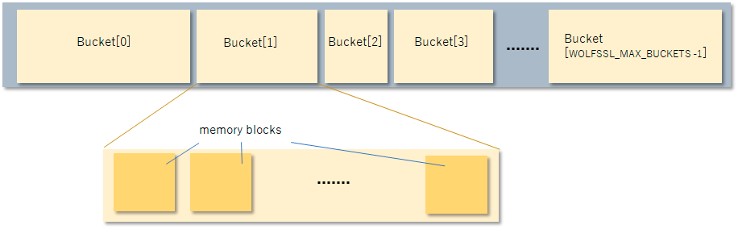

# 機能


wolfSSL (以前の CyaSSL) は、主要なインターフェースとして C プログラミング言語をサポートしていますが、Java、PHP、Perl、Python など、他のいくつかのホスト言語もサポートしています ([SWIG](http://swig.org/) インターフェースを介して)。 現在サポートされていない別のプログラミング言語で wolfSSL をホストすることに関心がある場合は、お問い合わせください。


この章では、ストリーム暗号、AES-NI、IPv6サポート、SSL検査(SNIFFER)サポートなど、wolfSSLのいくつかの機能について、より詳しく説明しています。


## 機能の概要


wolfSSL機能の概要については、wolfSSL製品Webページを参照してください：[https://www.wolfssl.com/products/wolfssl](https://www.wolfssl.com/products/wolfssl)


## プロトコルサポート


wolfsslは** SSL 3.0 **、** tls **(** 1.0 **、** 1.1 **、** 1.2、1.3 **)、および** dtls **(** 1.0 **および**1.2 **)。以下の機能のいずれかを使用して、使用するプロトコルを簡単に選択できます(クライアントまたはサーバーのいずれかに示すように)。wolfSSLは、SSL 2.0をサポートしていません。OpenSSL互換性レイヤーを使用すると場合、クライアントとサーバーの機能はわずかに異なります。OpenSSL互換機能については、[OpenSSL互換性](chapter13.md#openssl-compatibility)を参照してください。


### サーバー機能


* [`wolfDTLSv1_server_method()`](group__Setup.md#function-wolfdtlsv1_server_method) -DTLS 1.0


* [`wolfDTLSv1_2_server_method()`](group__Setup.md#function-wolfdtlsv1_2_server_method) -DTLS 1.2


* [`wolfSSLv3_server_method()`](group__Setup.md#function-wolfsslv3_server_method) -SSL 3.0


* [`wolfTLSv1_server_method()`](group__Setup.md#function-wolftlsv1_server_method)  -  TLS 1.0


* [`wolfTLSv1_1_server_method()`](group__Setup.md#function-wolftlsv1_1_server_method) -TLS 1.1


* [`wolfTLSv1_2_server_method()`](group__Setup.md#function-wolftlsv1_2_server_method)  -  TLS 1.2


* [`wolfTLSv1_3_server_method()`](group__Setup.md#function-wolftlsv1_3_server_method) -TLS 1.3


* [`wolfSSLv23_server_method()`](group__Setup.md#function-wolfsslv23_server_method)  -  SSLv3  -  TLS 1.2から最高のバージョンを使用する


wolfSSLは、[`wolfSSLv23_server_method()`](group__Setup.md#function-wolfsslv23_server_method)関数で堅牢なサーバーダウングレードをサポートしています。詳細については、[堅牢なクライアントとサーバーのダウングレード](#robust-client-and-server-downgrade)を参照してください。


### クライアント機能


* [`wolfDTLSv1_client_method()`](group__Setup.md#function-v1_client_method) -DTLS 1.0


* [`wolfDTLSv1_2_client_method_ex()`](ssl_8h.md#function-wolfdtlsv1_2_client_method_ex) -DTLS 1.2


* [`wolfSSLv3_client_method()`](group__Setup.md#function-wolfsslv3_client_method) -SSL 3.0


* [`wolfTLSv1_client_method()`](group__Setup.md#function-wolftlsv1_client_method)  -  TLS 1.0


* [`wolfTLSv1_1_client_method()`](group__Setup.md#function-wolftlsv1_1_client_method) -TLS 1.1


* [`wolfTLSv1_2_client_method()`](group__Setup.md#function-wolftlsv1_2_client_method)  -  TLS 1.2


* [`wolfTLSv1_3_client_method()`](group__Setup.md#function-wolftlsv1_3_client_method) -TLS 1.3


* [`wolfSSLv23_client_method()`](group__Setup.md#function-wolfsslv23_client_method)  -  SSLv3  -  TLS 1.2から最高のバージョンを使用する


wolfSSLは、[`wolfSSLv23_client_method()`](group__Setup.md#function-wolfsslv23_client_method)関数でロバストクライアントのダウングレードをサポートしています。詳細については、[堅牢なクライアントとサーバーのダウングレード](#robust-client-and-server-downgrade)を参照してください。


これらの機能の使用方法の詳細については、[入門](chapter03.md#getting-started)の章を参照してください。SSL 3.0、TLS 1.0、1.1、1.2、およびDTLSの比較については、付録Aを参照してください。


### 堅牢なクライアントとサーバーのダウングレード


wolfSSLクライアントとサーバーの両方に、堅牢なバージョンのダウングレード機能があります。どちらの側で特定のプロトコルバージョンメソッドが使用されている場合、そのバージョンのみがネゴシエートされるか、エラーが返されます。たとえば、TLS 1.0を使用してSSL 3.0のみのサーバーに接続しようとするクライアントは、接続が失敗し、同様にTLS 1.1に接続すると同様に失敗します。


この問題を解決するために、[`wolfSSLv23_client_method()`](group__Setup.md#function-wolfsslv23_client_method)関数を使用するクライアントは、必要に応じてダウングレードすることによりサーバーがサポートする最高のプロトコルバージョンをサポートします。この場合、クライアントはTLS 1.0 -TLS 1.3を実行しているサーバーに接続できます(または、wolfSSLで構成されているプロトコルバージョンに応じてSSL 3.0を含むサブセットまたはスーパーセット)。接続できない唯一のバージョンは、長年にわたって不安定であるSSL 2.0と、デフォルトで無効になっているSSL 3.0です。


同様に、[`wolfSSLv23_server_method()`](group__Setup.md#function-wolfsslv23_server_method)関数を使用するサーバーは、TLS 1.0 -TLS 1.2のプロトコルバージョンをサポートするクライアントを処理できます。wolfSSLサーバーは、セキュリティが提供されていないため、SSLV2からの接続を受け入れることができません。


### IPv6サポート


IPv6 を採用していて、組み込み SSL 実装を使用したい場合、wolfSSL が IPv6 をサポートしているかどうか疑問に思っているかもしれません。答えはイエスです。IPv6の上で実行されているwolfSSLをサポートしています。


wolfSSLはIP ニュートラルとして設計されており、IPv4とIPv6の両方で動作しますが、現在のテストアプリケーションはIPv4にデフォルトになります(より広い範囲のシステムに適用されます)。テストアプリケーションをIPv6に変更するには、wolfSSLのコンフィグれションに** --enable-IPv6 **オプションを使用します。


IPv6に関する詳細情報はここにあります。


[https://en.wikipedia.org/wiki/IPv6](https://en.wikipedia.org/wiki/IPv6)。


### DTLS


wolfSSLは、クライアントとサーバーの両方のDTLS( "データグラム" TLS)をサポートしています。現在のサポートされているバージョンはDTLS 1.0です。


TLSプロトコルは、**信頼性の高い**媒体(TCPなど)に安全なトランスポートチャネルを提供するように設計されています。アプリケーション層プロトコルが UDP トランスポート (SIP やさまざまな電子ゲーム プロトコルなど) を使用して開発され始めたため、遅延に敏感なアプリケーションに通信セキュリティを提供する方法が必要になりました。この必要性は、DTLSプロトコルの作成につながります。


多くの人々がTLSとDTLSの違いがTCPとUDPと同じであると考えています。これは正しくありません。UDP には、(TCP と比較して) 何かが失われた場合に、ハンドシェイク、ティアダウン、および途中での遅延がないという利点があります。一方、DTLSは、拡張SSLハンドシェイクと引き裂きを持ち、ハンドシェイクのTCPのような動作を実装する必要があります。本質的に、DTLSは安全な接続と引き換えにUDPによって提供される利点を逆にします。


DTLは、[`--enable-dtls`](chapter02.md#--enable-dtls)ビルドオプションを使用してwolfSSLをビルドするときに有効にできます。


### LWIP(軽量インターネットプロトコル)


wolfSSLは、軽量のインターネットプロトコルの実装をすぐに使えるようにサポートしています。このプロトコルを使用するには、DEFINE `WOLFSSL_LWIP`、または`settings.h`ファイルに移動して以下の行のコメントアウトを外してください。


```c
/*#define WOLFSSL_LWIP*/
```


LWIPの焦点は、完全なTCPスタックを提供しながら、RAMの使用量を減らすことです。その焦点は、wolfSSLがSSL/TLSニーズに理想的なマッチであるエリアであるEmbedded Systemsでの使用に最適です。


### TLSエクステンション


wolfSSLによってサポートされているTLS拡張機能のリストと、指定された拡張子に対してRFCを参照することができます。

|RFC |拡張|wolfsslタイプ|
| --- | --------- | ------------ |
|[6066](https://datatracker.ietf.org/doc/html/rfc6066) |サーバー名表示|`TLSX_SERVER_NAME` |
|[6066](https://datatracker.ietf.org/doc/html/rfc6066) |最大フラグメント長ネゴシエーション|`TLSX_MAX_FRAGMENT_LENGTH` |
|[6066](https://datatracker.ietf.org/doc/html/rfc6066) |切り捨てられたhmac |`TLSX_TRUNCATED_HMAC` |
|[6066](https://datatracker.ietf.org/doc/html/rfc6066) |ステータスリクエスト|`TLSX_STATUS_REQUEST` |
|[7919](https://datatracker.ietf.org/doc/html/rfc7919) |サポートされているグループ|`TLSX_SUPPORTED_GROUPS` |
|[5246](https://datatracker.ietf.org/doc/html/rfc5246) |署名アルゴリズム|`TLSX_SIGNATURE_ALGORITHMS` |
|[7301](https://datatracker.ietf.org/doc/html/rfc7301) |アプリケーション層プロトコルネゴシエーション|`TLSX_APPLICATION_LAYER_PROTOCOL` |
|[6961](https://datatracker.ietf.org/doc/html/rfc6961) |証明書ステータスリクエスト|`TLSX_STATUS_REQUEST_V2` |
|[5077](https://datatracker.ietf.org/doc/html/rfc5077) |セッションチケット|`TLSX_SESSION_TICKET` |
|[5746](https://datatracker.ietf.org/doc/html/rfc5746) |再ネゴシエーションの提示|`TLSX_RENEGOTIATION_INFO` |
|[8446](https://datatracker.ietf.org/doc/html/rfc8446) |鍵共有|`TLSX_KEY_SHARE` |
|[8446](https://datatracker.ietf.org/doc/html/rfc8446) |事前共有鍵|`TLSX_PRE_SHARED_KEY` |
|[8446](https://datatracker.ietf.org/doc/html/rfc8446) |PSK交換モード|`TLSX_PSK_KEY_EXCHANGE_MODES` |
|[8446](https://datatracker.ietf.org/doc/html/rfc8446) |アーリーデータ|`TLSX_EARLY_DATA` |
|[8446](https://datatracker.ietf.org/doc/html/rfc8446) |クッキー|`TLSX_COOKIE` |
|[8446](https://datatracker.ietf.org/doc/html/rfc8446) |サポートバージョン|`TLSX_SUPPORTED_VERSIONS` |
|[8446](https://datatracker.ietf.org/doc/html/rfc8446) |ハンドシェーク承認|`TLSX_POST_HANDSHAKE_AUTH` |


## 暗号サポート


### 暗号スイート強度と適切な鍵サイズの選択


どの暗号が現在使用されているかを確認するには、メソッドを呼び出すことができます.[`wolfSSL_get_ciphers()`](group__IO.md#function-wolfssl_get_ciphers)。


この関数は、現在有効な暗号スイートを返します。


暗号スイートにはさまざまな強みがあります。それらはいくつかの異なるタイプのアルゴリズム(認証、暗号化、およびメッセージ認証コード(MAC))で構成されているため、それぞれの強度は選択された鍵サイズによって異なります。


暗号スイートの強度を評価する多くの方法があります。使用される特定の方法は、プロジェクトや企業によって異なると思われ、対称および公開鍵アルゴリズムの鍵サイズ、アルゴリズムの種類、パフォーマンス、既知の弱点などを含めることができます。


** nist **(米国立標準技術研究所)は、それぞれのさまざまな鍵サイズに同等のアルゴリズム強度を提供することにより、許容可能な暗号スイートを選択することを推奨します。暗号化アルゴリズムの強度は、アルゴリズムと使用される鍵サイズに依存します。NIST Special Publication、[SP800-57](https://csrc.nist.gov/publications/detail/sp/800-57-part-1/rev-5/final)は、2つのアルゴリズムが次のように同等の強度であると見なされると述べています。


> 2つのアルゴリズムは、「アルゴリズムを壊す」または鍵を決定するか(与えられた鍵サイズで)鍵を使用してほぼ同じである場合、2つのアルゴリズムが与えられた鍵サイズ(xとy)に対して匹敵する強さと考えられています。資源。特定の鍵サイズのアルゴリズムのセキュリティ強度は、ショートカット攻撃を有していない「X」の鍵サイズを持つすべての鍵を試してみるのにかかる作業量に関して説明しています(すなわち、最も効率的なもの)。攻撃はすべての可能な鍵を試すことです)。


次の2つの表は、[NIST SP 800-57](https://csrc.nist.gov/publications/detail/sp/800-57-part-1/rev-5/final)の表2(pg。56)と表4(pg。59)の両方に基づいており、アルゴリズム間の同等のセキュリティ強度と強度測定(NIST が推奨するアルゴリズムのセキュリティ ライフタイムに基づいており、セキュリティの一部を使用しています)。


**注**：次の表「L」は有限フィールド暗号化(FFC)の公開鍵のサイズであり、「n」はFFCの秘密鍵のサイズで、「K」は重要なサイズと見なされます。整数因数分解暗号化(IFC)、および「F」は、楕円曲線暗号の重要なサイズと見なされます。

|セキュリティのビット|対称鍵アルゴリズム|**FFC**鍵サイズ(DSA、DHなど)|**ifc**鍵サイズ(RSAなど)|**ECC**鍵サイズ(ECDSAなど)|説明|
| ---------------- | ------------------------ | -------------------------------- | ---------------------------- | ------------------------------ | ----------- |
|80 |2tdeaなど|L=1024、n=160 |K=1024 |F=160-223 |セキュリティは2010年まで有効|
|128 |AES-128など|L=3072、n=256 |K=3072 |F=256-383 |セキュリティは2030年まで有効|
|192 |AES-192など|L=7680、n=384 |K=7680 |f=384-511 |長期保護|
|256 |AES-256など|L=15360、n=512 |K=15360 |f=512+ |予見可能な将来のために安全|


このテーブルをガイドとして使用して、暗号スイートを分類し始めるために、対称暗号化アルゴリズムの強度に基づいて分類します。これを行う際には、セキュリティのビットに基づいて各暗号スイートを分類することを考案することができます(対称鍵サイズを考慮してください)。


* **低**  -  128ビット未満のセキュリティのビット


* **中**  - セキュリティのビット128ビット


* **高**  -  128ビットより大きいセキュリティのビット


対称暗号化アルゴリズムの強度以外では、暗号スイートの強度は、鍵交換および認証アルゴリズム鍵の鍵サイズに大きく依存します。 強度は、暗号スイートの最も弱いリンクと同程度です。


上記の等級付け方法に従って (対称暗号化アルゴリズムの強度のみに基づいて)、wolfSSL 2.0.0 は現在、以下に示すように、低強度の暗号スイート 0 個、中強度の暗号スイート 12 個、高強度の暗号スイート 8 個をサポートしています。以下の強度の分類は、関与する他のアルゴリズムの選択された鍵サイズによって変わる可能性があります。ハッシュ関数セキュリティ強度については、[NIST SP 800-57](https://csrc.nist.gov/publications/detail/sp/800-57-part-1/rev-5/final)の表3(56)を参照のこと。


場合によっては、"**EXPORT**"の暗号として参照されている暗号が表示されます。これらの暗号は、米国から強い暗号のソフトウェアを輸出することが違法であったときの米国履歴の期間(1992年に遅く)に由来しました。強い暗号は、米国政府によって(核兵器、戦車、弾道ミサイルなど)によって「弾薬」として分類されました。この制限のため、エクスポートされているソフトウェアは「弱められた」暗号(主により小さな鍵サイズ)を含んでいます。現在、この制限は解除されているため、EXPORT 暗号は必須ではなくなりました。


### サポートされている暗号スイート


次の暗号スイートは、wolfSSLによってサポートされています。暗号スイートは、TLSまたはSSLハンドシェイク中に使用される認証、暗号化、およびメッセージ認証コード(MAC)アルゴリズムの組み合わせで、接続のセキュリティ設定をネゴシエートします。


各暗号スイートは、キー交換アルゴリズム、一括暗号化アルゴリズム、およびメッセージ認証コード アルゴリズム (MAC) を定義します。 **キー交換アルゴリズム** (RSA、DSS、DH、EDH) は、ハンドシェイク プロセス中にクライアントとサーバーが認証する方法を決定します。 メッセージ ストリームの暗号化には、ブロック暗号とストリーム暗号を含む **一括暗号化アルゴリズム** (DES、3DES、AES、ARC4) が使用されます。 **メッセージ認証コード (MAC) アルゴリズム** (MD2、MD5、SHA-1、SHA-256、SHA-512、RIPEMD) は、メッセージ ダイジェストの作成に使用されるハッシュ関数です。


以下の表は、`<wolfssl_root>/wolfssl/internal.h`(約706行から始まる)にある暗号スイート(およびカテゴリ)と一致しています。次のリストにない暗号スイートをお探しの場合は、wolfSSLに追加することについてお問い合わせください。


ECC暗号スイート：


* `TLS_DHE_RSA_WITH_3DES_EDE_CBC_SHA`


* `TLS_DHE_RSA_WITH_AES_256_CBC_SHA`


* `TLS_DHE_RSA_WITH_AES_128_CBC_SHA`


* `TLS_DH_anon_WITH_AES_128_CBC_SHA`


* `TLS_RSA_WITH_AES_256_CBC_SHA`


* `TLS_RSA_WITH_AES_128_CBC_SHA`


* `TLS_RSA_WITH_NULL_SHA`


* `TLS_PSK_WITH_AES_256_CBC_SHA`


* `TLS_PSK_WITH_AES_128_CBC_SHA256`


* `TLS_PSK_WITH_AES_256_CBC_SHA384`


* `TLS_PSK_WITH_AES_128_CBC_SHA`


* `TLS_PSK_WITH_NULL_SHA256`


* `TLS_PSK_WITH_NULL_SHA384`


* `TLS_PSK_WITH_NULL_SHA`


* `SSL_RSA_WITH_RC4_128_SHA`


* `SSL_RSA_WITH_RC4_128_MD5`


* `SSL_RSA_WITH_3DES_EDE_CBC_SHA`


* `TLS_ECDHE_RSA_WITH_AES_256_CBC_SHA`


* `TLS_ECDHE_RSA_WITH_AES_128_CBC_SHA`


* `TLS_ECDHE_ECDSA_WITH_AES_256_CBC_SHA`


* `TLS_ECDHE_ECDSA_WITH_AES_128_CBC_SHA`


* `TLS_ECDHE_RSA_WITH_RC4_128_SHA`


* `TLS_ECDHE_ECDSA_WITH_RC4_128_SHA`


* `TLS_ECDHE_RSA_WITH_3DES_EDE_CBC_SHA`


* `TLS_ECDHE_ECDSA_WITH_3DES_EDE_CBC_SHA`


* `TLS_ECDHE_RSA_WITH_AES_128_CBC_SHA256`


* `TLS_ECDHE_ECDSA_WITH_AES_128_CBC_SHA256`


* `TLS_ECDHE_RSA_WITH_AES_256_CBC_SHA384`


* `TLS_ECDHE_ECDSA_WITH_AES_256_CBC_SHA384`


* `TLS_ECDHE_PSK_WITH_NULL_SHA256`


* `TLS_ECDHE_PSK_WITH_AES_128_CBC_SHA256`


* `TLS_ECDHE_ECDSA_WITH_NULL_SHA`


静的ECC暗号スイート：


* `TLS_ECDH_RSA_WITH_AES_256_CBC_SHA`


* `TLS_ECDH_RSA_WITH_AES_128_CBC_SHA`


* `TLS_ECDH_ECDSA_WITH_AES_256_CBC_SHA`


* `TLS_ECDH_ECDSA_WITH_AES_128_CBC_SHA`


* `TLS_ECDH_RSA_WITH_RC4_128_SHA`


* `TLS_ECDH_ECDSA_WITH_RC4_128_SHA`


* `TLS_ECDH_RSA_WITH_3DES_EDE_CBC_SHA`


* `TLS_ECDH_ECDSA_WITH_3DES_EDE_CBC_SHA`


* `TLS_ECDH_RSA_WITH_AES_128_CBC_SHA256`


* `TLS_ECDH_ECDSA_WITH_AES_128_CBC_SHA256`


* `TLS_ECDH_RSA_WITH_AES_256_CBC_SHA384`


* `TLS_ECDH_ECDSA_WITH_AES_256_CBC_SHA384`


blake2b暗号スイート：


* `TLS_RSA_WITH_AES_128_CBC_B2B256`


* `TLS_RSA_WITH_AES_256_CBC_B2B256`


SHA-256暗号スイート：


* `TLS_DHE_RSA_WITH_AES_256_CBC_SHA256`


* `TLS_DHE_RSA_WITH_AES_128_CBC_SHA256`


* `TLS_RSA_WITH_AES_256_CBC_SHA256`


* `TLS_RSA_WITH_AES_128_CBC_SHA256`


* `TLS_RSA_WITH_NULL_SHA256`


* `TLS_DHE_PSK_WITH_AES_128_CBC_SHA256`


* `TLS_DHE_PSK_WITH_NULL_SHA256`


SHA-384暗号スイート：


* `TLS_DHE_PSK_WITH_AES_256_CBC_SHA384`


* `TLS_DHE_PSK_WITH_NULL_SHA384`


AES-GCM暗号スイート：


* `TLS_RSA_WITH_AES_128_GCM_SHA256`


* `TLS_RSA_WITH_AES_256_GCM_SHA384`


* `TLS_DHE_RSA_WITH_AES_128_GCM_SHA256`


* `TLS_DHE_RSA_WITH_AES_256_GCM_SHA384`


* `TLS_PSK_WITH_AES_128_GCM_SHA256`


* `TLS_PSK_WITH_AES_256_GCM_SHA384`


* `TLS_DHE_PSK_WITH_AES_128_GCM_SHA256`


* `TLS_DHE_PSK_WITH_AES_256_GCM_SHA384`


ECC AES-GCM暗号スイート：


* `TLS_ECDHE_ECDSA_WITH_AES_128_GCM_SHA256`


* `TLS_ECDHE_ECDSA_WITH_AES_256_GCM_SHA384`


* `TLS_ECDH_ECDSA_WITH_AES_128_GCM_SHA256`


* `TLS_ECDH_ECDSA_WITH_AES_256_GCM_SHA384`


* `TLS_ECDHE_RSA_WITH_AES_128_GCM_SHA256`


* `TLS_ECDHE_RSA_WITH_AES_256_GCM_SHA384`


* `TLS_ECDH_RSA_WITH_AES_128_GCM_SHA256`


* `TLS_ECDH_RSA_WITH_AES_256_GCM_SHA384`


AES-CCM暗号スイート：


* `TLS_RSA_WITH_AES_128_CCM_8`


* `TLS_RSA_WITH_AES_256_CCM_8`


* `TLS_ECDHE_ECDSA_WITH_AES_128_CCM`


* `TLS_ECDHE_ECDSA_WITH_AES_128_CCM_8`


* `TLS_ECDHE_ECDSA_WITH_AES_256_CCM_8`


* `TLS_PSK_WITH_AES_128_CCM`


* `TLS_PSK_WITH_AES_256_CCM`


* `TLS_PSK_WITH_AES_128_CCM_8`


* `TLS_PSK_WITH_AES_256_CCM_8`


* `TLS_DHE_PSK_WITH_AES_128_CCM`


* `TLS_DHE_PSK_WITH_AES_256_CCM`


Camellia Cipher Suites：


* `TLS_RSA_WITH_CAMELLIA_128_CBC_SHA`


* `TLS_RSA_WITH_CAMELLIA_256_CBC_SHA`


* `TLS_RSA_WITH_CAMELLIA_128_CBC_SHA256`


* `TLS_RSA_WITH_CAMELLIA_256_CBC_SHA256`


* `TLS_DHE_RSA_WITH_CAMELLIA_128_CBC_SHA`


* `TLS_DHE_RSA_WITH_CAMELLIA_256_CBC_SHA`


* `TLS_DHE_RSA_WITH_CAMELLIA_128_CBC_SHA256`


* `TLS_DHE_RSA_WITH_CAMELLIA_256_CBC_SHA256`


ChaCha暗号スイート：


* `TLS_ECDHE_RSA_WITH_CHACHA20_POLY1305_SHA256`


* `TLS_ECDHE_ECDSA_WITH_CHACHA20_POLY1305_SHA256`


* `TLS_DHE_RSA_WITH_CHACHA20_POLY1305_SHA256`


* `TLS_ECDHE_PSK_WITH_CHACHA20_POLY1305_SHA256`


* `TLS_PSK_WITH_CHACHA20_POLY1305_SHA256`


* `TLS_DHE_PSK_WITH_CHACHA20_POLY1305_SHA256`


* `TLS_ECDHE_RSA_WITH_CHACHA20_OLD_POLY1305_SHA256`


* `TLS_ECDHE_ECDSA_WITH_CHACHA20_OLD_POLY1305_SHA256`


* `TLS_DHE_RSA_WITH_CHACHA20_OLD_POLY1305_SHA256`


再ネゴシエーション提示拡張特別スイート：


* `TLS_EMPTY_RENEGOTIATION_INFO_SCSV`


### AEADスイート


wolfSSLは、AES-GCM、AES-CCM、Chacha-Poly1305などのAEADスイーツをサポートしています。これらのAEADスイートと他のスイートの大きな違いは、追加のクリアテキストデータを使用して暗号化されたデータを認証することです。これは、データを改ざんすることになる中間者攻撃を緩和するのに役立ちます。AEADスイートは、キー付きハッシュアルゴリズムによって生成されたタグと組み合わせたブロック暗号(または最近でもストリーム暗号)アルゴリズムの組み合わせを使用します。これらの2つのアルゴリズムを組み合わせることで、これら 2 つのアルゴリズムの組み合わせは、ユーザーにとって簡単な wolfSSL 暗号化および復号化プロセスによって処理されます。特定のAEADスイートを使用するために必要なのは、サポートされているスイートで使用されるアルゴリズムを単純に有効にすることです。


### ブロックとストリーム暗号


wolfSSLは**AES**、**DES**、**3DES**、**Camellia**ブロック暗号と**RC4**、および**Chacha20**ストリーム暗号をサポートしています。AES、DES、3DES、RC4はデフォルトで有効になっています。Camellia、およびChacha20は、([`--enable-camellia`](chapter02.md#--enable-camellia)、および[`--disable-chacha`](chapter02.md#--disable-chacha)ビルドオプションで)wolfSSLをビルドするときに有効にすることができます。AESのデフォルトモードはCBCモードです。AESを使用してGCMまたはCCMモードを有効にするには、[`--enable-aesgcm`](chapter02.md#--enable-aesgcm)と[`--enable-aesccm`](chapter02.md#--enable-aesccm)ビルドオプションを使用します。特定の使用状況については、使用例と[wolfCryptの使用法](chapter10.md#wolfcrypt-usage-reference)の例をご覧ください。


SSLはRC4をデフォルトのストリーム暗号として使用しますが、脆弱性のために廃止されています。最近、wolfSSLはChacha20を追加しました。RC4はChachaよりも約11％パフォーマンスが高いですが、RC4は一般にChachaよりも安全性が低いと考えられています。Chachaは、トレードオフとしてセキュリティを追加することで一時代を作り出すと考えられます。


暗号性能の比較を見るには、ここにあるwolfSSLベンチマークWebページを参照してください。<https：//www.wolfssl.com/docs/benchmarks>。


#### 違いは何ですか？


ブロック暗号は、暗号のブロックサイズであるチャンク単位で暗号化する必要があります。たとえば、AESには16バイトのブロックサイズがあります。そのため、2 バイトまたは 3 バイトの小さなチャンクを何度も暗号化している場合、データの 80% 以上が無駄なパディングであり、暗号化/復号化プロセスの速度が低下し、起動するためにネットワーク帯域幅が不必要に浪費されます。基本的にブロック暗号は、大きなデータのチャンク用に設計されており、パディングを必要とするブロックサイズを有し、固定されていない変換を使用します。


ストリーム暗号は、大量または小さなデータに適しています。ブロックサイズが不要なため、データサイズが小さい場合に適しています。速度が懸念される場合、ストリーム暗号はあなたの答えです。なぜなら、それらは通常、Xorのキーストリームを含むよりシンプルな変換を使用するからです。したがって、メディアをストリーミングする必要がある場合、小さなデータを含むさまざまなデータサイズを暗号化する、または高速暗号が必要な場合は、暗号をストリーミングすることが最善の策です。


### ハッシュ機能


wolfSSLは**MD2,MD4,MD5,SHA-1,SHA2**(SHA-224,SHA-256,SHA-384,SHA-512), **SHA-3**(BLAKE2)、および**RIPEMD-160**などのハッシュ機能をサポートしています。これらの機能の詳細な使用法は、wolfCryptの使用法、[ハッシュ関数](chapter10.md#hash-functions)にあります。


### 公開鍵オプション


wolfSSLは**RSA**、**ECC**、**DSA/DSS**と**DH**公開鍵オプションをサポートしています。これらの機能の詳細な使用法は、wolfCryptの使用法、[公開鍵暗号](chapter10.md#public-key-cryptography)にあります。


### ECCサポート


wolfSSLは、ECDH-ECDSA、ECDHE-ECDSA、ECDH-RSA、ECDHE-PSK、ECDHE-RSAを含むがこれらに限定されない楕円曲線暗号化(ECC)をサポートしています。


wolfSSLのECC実装は、`<wolfssl_root>/wolfssl/wolfcrypt/ecc.h`ヘッダーファイルと`<wolfssl_root>/wolfcrypt/src/ecc.c`ソースファイルにあります。


サポートされている暗号スイートは、上の表に示されています。ECCは、x86_64以外のビルドでデフォルトで無効になりますが、`HAVE_ECC`を使用してwolfSSLをビルドするときまたはautoconfシステムを使用してオンにすることができます。


```sh
./configure --enable-ecc
make
make check
```


`make check`が実行される場合は、wolfSSLがチェックする多数の暗号スイートに注意してください(チェックがCipher Suitesのリストが作成されていない場合、それ自体で`./testsuite/testsuite.test`を実行します)。これらの暗号スイートのいずれかを個別にテストすることができます。たとえば、AES256-SHAでECDH-ECDSAを試すために、wolfSSLサーバーの例は次のように開始できます。


```sh
./examples/server/server -d -l ECDHE-ECDSA-AES256-SHA -c ./certs/server-ecc.pem -k ./certs/ecc-key.pem
```


(`-d`)クライアントの証明書チェックを無効にし、(`-l`)は暗号スイートリストを指定します。(`-c`)は使用する証明書であり、(`-k`)は、使用する対応する秘密鍵です。クライアントを接続するには、次のことを試してください。


```sh
./examples/client/client -A ./certs/server-ecc.pem
```


ここで、(`-A`)は、サーバーの検証に使用するCA証明書です。


### PKCSサポート


PKCS(公開鍵暗号化スタンダード)は、RSA Security、Inc.によって作成および公開された標準のグループを指します。wolfSSLは**PKCS＃1、PKCS＃3、PKCS＃5、PKCS＃7、PKCS＃8、PKCS＃9、PKCS＃10、PKCS＃11**および**PKCS＃12**をサポートしています。


さらに、wolfSSLは、PKCS＃1の一部として標準化されているRSA-Probabilistic Signature Scheme(PSS)のサポートも提供しています。


#### PKCS #5, PBKDF1, PBKDF2, PKCS #12


PKCS＃5は、パスワード、ソルト、および繰り返し回数を合成してパスワードベースのキーを生成するパスワードベースの鍵導出方法です。wolfSSLはPBKDF1とPBKDF2鍵導出機能の両方をサポートしています。鍵導出関数は、基本鍵および他のパラメータ(上述のようにソルトおよび反復回数など)から派生鍵を生成する。PBKDF1は、派生鍵長がハッシュ関数出力の長さによって囲まれている鍵を導出するためにハッシュ関数(MD5、SHA1など)を適用します。PBKDF2では、鍵を導出するために疑似ランダム関数(HMAC-SHA-1など)が適用されます。PBKDF2の場合、派生鍵の長さは無制限です。


wolfSSLは、PBKDF1およびPBKDF2に加えて、PKCS＃12のPBKDF関数もサポートしています。関数プロトタイプは次のようになります：


```c
int PBKDF2(byte* output, const byte* passwd, int pLen,
           const byte* salt,int sLen, int iterations,
           int kLen, int hashType);

int PKCS12_PBKDF(byte* output, const byte* passwd, int pLen,
                 const byte* salt, int sLen, int iterations,
                 int kLen, int hashType, int purpose);
```


`output`には派生鍵が含まれ、`passwd`は長さ`pLen`のユーザーパスワードを保持します`pLen`、`salt`は長さ`sLen`、`iterations`のソルト入力を保持します。md5、sha1、またはsha2にすることができます。


`./configure`を使用してwolfSSLをビルドしている場合、この機能を有効にする方法は、オプション[`--enable-pwdbased`](chapter02.md#--enable-pwdbased)を使用することです


完全な例は`<wolfSSL Root>/wolfcrypt/test.c`にあります。詳細については、次の仕様からPKCS＃5、PBKDF1、およびPBKDF2にあります。


PKCS＃5、PBKDF1、PBKDF2：[https://tools.ietf.org/html/rfc2898](https://tools.ietf.org/html/rfc2898)


#### PKCS #8


PKCS＃8は、秘密鍵情報を格納するために使用されている秘密鍵情報構文標準として設計されています。


PKCS #8 標準には、暗号化された秘密鍵と暗号化されていない鍵の両方を格納するための構文を説明する 2 つのバージョンがあります。wolfSSLは、暗号化されていないPKCS＃8の両方をサポートしています。サポートされている形式には、PKCS＃5バージョン1-バージョン2、およびPKCS＃12が含まれます。利用可能な暗号化の種類には、DES、3DES、RC4、およびAESが含まれます。


PKCS＃8：[https://tools.ietf.org/html/rfc5208](https://tools.ietf.org/html/rfc5208)


#### PKCS #7

PKCS #7 は、エンベロープ証明書であれ、暗号化されていないが署名されたデータ文字列であれ、データのバンドルを転送するように設計されています。 この機能は、有効化オプション ([`--enable-pkcs7`](chapter02.md#--enable-pkcs7)) を使用するか、マクロ `HAVE_PKCS7` を使用してオンにします。 署名者の空のセットを持つ RFC に従って、デフォルトで縮退ケースが許可されることに注意してください。 関数 `wc_PKCS7_AllowDegenerate()` を呼び出して、縮退ケースのオンとオフを切り替えることができます。


サポートされている機能は次のとおりです。


* 縮退した束


* Kari、Kekri、Pwri、Ori、Ktriバンドル


* 切り離された署名


* 圧縮およびファームウェアパッケージバンドル


* カスタムコールバックサポート


* 限られたストリーミング機能


##### PKCS＃7コールバック


ユーザーがPKCS7バンドルが解析された後にユーザーが自分の鍵を選択できるように追加のコールバックおよびサポート機能が追加されました。CEK をアンラップするには、関数 `wc_PKCS7_SetWrapCEKCb()` を呼び出すことができます。この関数によって設定されたコールバックは、KARIとKEKRIバンドルの場合に呼び出されます。キー ID または SKID は、KARI の場合はオリジネータ キーとともに wolfSSL からユーザーに渡されます。ユーザーが自分の KEK で CEK をアンラップした後、使用する復号化されたキーを wolfSSL に戻す必要があります。この例は、ファイル`signedData-EncryptionFirmwareCB.c`のwolfSSL-examplesリポジトリにあります。


PKCS7バンドルの復号のために追加のコールバックが追加されました。復号コールバック関数を設定するには、API `wc_PKCS7_SetDecodeEncryptedCb()`を使用できます。ユーザー定義のコンテキストを設定するには、API `wc_PKCS7_SetDecodeEncryptedCtx()`を使用する必要があります。このコールバックは、`wc_PKCS7_DecodeEncryptedData()`の呼び出しで実行されます。


##### PKCS＃7ストリーミング


PKCS7 デコード用のストリーム指向 API により、入力を一度に渡すのではなく、小さなチャンクで渡すオプションが提供されます。デフォルトでは、PKCS7 によるストリーミング機能はオンになっています。ストリーミングPKCS7 APIのサポートをオフにするには、マクロ`NO_PKCS7_STREAM`を定義できます。Autotoolsでこれを行う例は`./configure --enable-pkcs7 CFLAGS=-DNO_PKCS7_STREAM`です。


バンドルのデコード/検証時のストリーミングでは、次の関数がサポートされています。


1. `wc_PKCS7_DecodeEncryptedData()`


2. [`wc_PKCS7_VerifySignedData()`](group__PKCS7.md#function-wc_pkcs7_verifysigneddata)


3. [`wc_PKCS7_VerifySignedData_ex()`](group__PKCS7.md#function-wc_pkcs7_verifysigneddata_ex)


4. [`wc_PKCS7_DecodeEnvelopedData()`](group__PKCS7.md#function-wc_pkcs7_decodeenvelopeddate)


5. `wc_PKCS7_DecodeAuthEnvelopedData()`


** NOTE **：[`wc_PKCS7_VerifySignedData_ex`](group__PKCS7.md#function-wc_pkcs7_verifysigneddata_ex)を呼び出したとき、引数pkimsgfootがフルバッファであることが予想されます。内部構造は、この場合に`pkiMsgHead`になる1つのバッファのストリーミングのみをサポートします。


### 特定の暗号スイート強制使用


デフォルトでは、wolfSSLは、接続の両側がサポートできる「最高の」(最高のセキュリティ)暗号スイートを選択します。128ビットAESなどの特定の暗号を強制するには、次のようなものを追加します。


```c
wolfSSL_CTX_set_cipher_list(ctx, "AES128-SHA");
```


[`wolfSSL_CTX_new()`](group__Setup.md#function-wolfssl_ctx_new)への呼び出しの後に：


```c
ctx=wolfSSL_CTX_new(method);
wolfSSL_CTX_set_cipher_list(ctx, "AES128-SHA");
```


### OpenQuantumsafeのliboqs統合


詳細については、このドキュメントの「Quantum-Safe Cryptographyの実験」を参照してください。


## ハードウェアを使っての暗号の高速化


wolfSSLは、さまざまなプロセッサやチップの中のいくつかのハードウェアが加速された(または「支援」)暗号機能を利用することができます。次のセクションでは、wolfSSLがどのテクノロジをサポートしているかについて説明します。


### AES-NI


AESは、wolfSSLが常にサポートしてきた世界中の政府が使用する重要な暗号化基準です。Intel は、AES をより高速に実装する新しい命令セットをリリースしました。 wolfSSLは、生産環境向けの新しい命令セットを完全にサポートする最初のSSLライブラリです。


基本的に、IntelとAMDは、AESアルゴリズムの計算集約型部分を実行するCHIPレベルでAES命令を追加し、パフォーマンスを向上させました。現在AES-NIをサポートしているIntelのチップのリストについては、こちらをご覧ください。


[https://ark.intel.com/search/advanced/?s=t&AESTech=true](https://ark.intel.com/search/advanced/?s=t&AESTech=true)


ソフトウェアでアルゴリズムを実行する代わりに、wolfSSLに機能を追加して、チップから命令を直接呼び出すことができます。これは、AES-NIをサポートするチップセットでwolfSSLを実行している場合、AES Cryptoを5〜10倍速く実行できることを意味します。


AES-NIサポートされたチップセットで実行されている場合は、[`--enable-aesni` build option](chapter02.md#--enable-aesni)でAES-NIを有効にします。AES-NIでwolfSSLをビルドするには、GCC 4.4.3以降はアセンブリコードを使用する必要があります。wolfSSLは、同じビルドオプションを使用してAMDプロセッサのASM命令をサポートしています。


AES-NI に関する参考文献と参考資料を、一般的なものから特定のものまで、以下に示します。AES-NIによるパフォーマンス向上の詳細については、Intel Software Networkページへの3番目のリンクを参照してください。


* [AES(Wikipedia)](https://en.wikipedia.org/wiki/Advanced_Encryption_Standard)


* [AES-NI(Wikipedia)](https://en.wikipedia.org/wiki/AES_instruction_set)


* [AES-NI(Intel Software Network page)](https://software.intel.com/en-us/articles/intel-advanced-encryption-standard-instructions-aes-ni/)


AES-NIは、次のAES暗号モードを加速します：AES-CBC、AES-GCM、AES-CCM-8、AES-CCM、およびAES-CTR。AES-GCMは、Ghash認証のためにIntelチップに追加された128ビットの多数関数を使用することにより、さらに加速されます。


### STM32F2


wolfSSLは、STM32F2標準周辺ライブラリを介してSTM32F2ハードウェアベースの暗号化と乱数ジェネレーターを使用できます。


必要な定義については、`WOLFSSL_STM32F2`を`settings.h`に定義してください。`WOLFSSL_STM32F2`定義は、デフォルトでSTM32F2ハードウェアクリプトとRNGサポートを有効にします。これらを個別に有効にするための定義は、`STM32F2_CRYPTO`(ハードウェア暗号サポート用)および`STM32F2_RNG`(ハードウェアRNGサポート用)です。


STM32F2標準周辺ライブラリのドキュメントは、次の文書にあります。<https://www.stech.com/internet/com/technical_resources/technical_literature/user_manual/dm00023896.pdf>


### Cavium Nitrox


wolfSSL は Marvell (以前の Cavium) NITROX (<https://www.marvell.com/products/security-solutions.html>) をサポートしています。 wolfSSL のビルド時に Marvell NITROX サポートを有効にするには、次の構成オプションを使用します。

```sh
./configure --with-cavium=/home/user/cavium/software
```


[`--with-cavium=**`](chapter02.md#--with-cavium)オプションは、ライセンスされたCavium/Softwareディレクトリを指しています。Caviumがライブラリをビルドしないため、wolfSSLは`cavium_common.o`ファイルを引っ張ります。また、githubソースツリーを使用している場合は、キャビウムヘッダーがこの警告に準拠していないため、生成されたメイクファイルから`-Wredundant-decls`警告を削除する必要があります。


現在、wolfSSLはCavium RNG、AES、3DES、RC4、HMAC、およびRSAを暗号層で直接サポートしています。SSLレベルでのサポートは部分的であり、現在、AES、3DES、およびRC4を実行しています。RSAとHMACは、非ブロッキングモードでキャビウムの呼び出しが利用できるまで遅くなります。クライアントのサンプルプログラムは、暗号テストとベンチマークと同様に、Caviumサポートをオンにします。`HAVE_CAVIUM`定義を参照してください。


### ESP32-WROOM-32


wolfSSLは、ESP32-WROOM-32ハードウェアベースの暗号化を使用できます。


必要な定義については、`WOLFSSL_ESPWROOM32`を`settings.h`に定義してください。`WOLFSSL_ESPWROOM32`の定義は、デフォルトでESP32-WROOM-32ハードウェアクリプトとRNGサポートを有効にします。現在、wolfSSLは、Crypt層でRNG、AES、SHA、RSAプリミティブをサポートしています。TLSサーバー/クライアント、WolfCryptテスト、ベンチマークを含むプロジェクトの例は、ファイルを展開した後、ESP-IDFの/Examples/Protocols Directoryで見つけることができます。

### ESP8266

ESP32 とは異なり、ESP8266 で使用できるハードウェアベースの暗号化はありません。 「user_settings.h」の「WOLFSSL_ESP8266」定義を参照してください。
または `./configure CFLAGS="-DWOLFSSL_ESP8266"` を使用して、組み込み ESP8266 ターゲット用にコンパイルします。

### ERF32

wolfSSLはERF32ファミリーのハードウェアベースの暗号化を使用できます。
user_settings.hに`WOLFSSL_SILABS_SE_ACCEL`を定義してください。現在wolfSSLは、RNG、AES-CBC、AES-GCM、AES-CCM、SHA-1、SHA-2、ECDHEとECDSAのハードウェアアクセラレーションをサポートしています。さらに詳細な情報とベンチマーク結果はwolfSSLレポジトリツリーのwolfcrypt/src/port/silabsのREADME.mdを参照してください。

## SSL検査(Sniffer)


wolfSSL 1.5.0のリリースから始めて、wolfSSLには、SSL Sniffer(SSL検査)機能を持つようにビルドできるビルドオプションが含まれています。これは、SSLトラフィックパケットを収集し、正しいキーファイルを使用して、それらを復号化できることを意味します。SSLトラフィックを「検査」する機能は、いくつかの理由で役立ちます。その一部には以下が含まれます。


* ネットワークの問題の分析


* 内部および外部ユーザーによるネットワークの誤用を検出します


* 動きのネットワークの使用とデータの監視


* クライアント/サーバー通信のデバッグ


Snifferサポートを有効にするには、\*nixで[`--enable-sniffer`](chapter02.md#--enable-sniffer)オプションを使用してwolfSSLをビルドするか、Windowsで**vcproj**ファイルを使用します。\*nixまたは**winpcap**に**pcap**をWindowsにインストールする必要があります。`sniffer.h`で見つけることができるメインスニファー機能は、それぞれの簡単な説明とともに以下にリストされています。


* `ssl_SetPrivateKey`  - 特定のサーバーとポートの秘密鍵を設定します。


* `ssl_SetNamedPrivateKey`  - 特定のサーバー、ポート、ドメイン名の秘密鍵を設定します。


* `ssl_DecodePacket`-デコードのためにTCP/IPパケットで通過します。


* `ssl_Trace`  - デバッグトレースをTraceFileに有効/無効にします。


* `ssl_InitSniffer`  - 全体的なスニファーを初期化します。


* `ssl_FreeSniffer`  - 全体的なスニファーを解放します。


* `ssl_EnableRecovery`-失われたパケットの場合、SSLトラフィックのデコードを取得しようとするオプションを有効にします。


* `ssl_GetSessionStats` - スニファセッションのメモリ使用量を取得します。


wolfSSLのSnifferのサポートを確認し、完全な例を参照するには、wolfSSLダウンロードの`sslSniffer/sslSnifferTest`フォルダーの`snifftest`アプリを参照してください。


暗号化キーはSSLハンドシェイクにセットアップされているため、その後のアプリケーションデータをデコードするためには、スニファーによってハンドシェークをデコードする必要があることに注意してください。たとえば、wolfSSLのechoserverとechoclientで「snifftest」を使用している場合、サーバーとクライアントの間でハンドシェークが始まる前にSnifftestアプリケーションを開始する必要があります。


スニファは、AES-CBC、DES3-CBC、ARC4、およびCamellia-CBCで暗号化されたストリームのみをデコードできます。ECDHEまたはDHEキー合意が使用されている場合、ストリームは監視できません。RSAまたはECDH鍵交換のみがサポートされています。


wolfSSL Snifferを使用したCallbacksを`WOLFSSL_SNIFFER_WATCH`でオンにすることができます。SnifferWatch機能をコンパイルした状態で、関数`ssl_SetWatchKeyCallback()`を使用してカスタムコールバックを設定できます。コールバックは、ピアから送信された証明書チェーン、エラー値、および証明書のダイジェストの検査に使用されます。コールバックから非0値が返される場合、ピアの証明書を処理するときにエラー状態が設定されます。ウォッチコールバックの追加のサポート機能は次のとおりです。


* `ssl_SetWatchKeyCtx`：ウォッチコールバックに渡されるカスタムユーザコンテキストを設定します。


* `ssl_SetWatchKey_buffer`：新しいDER形式キーをサーバーセッションにロードします。


* `ssl_SetWatchKey_file`：`ssl_SetWatchKey_buffer`のファイルバージョン。


スニファを収集する統計は、マクロ`WOLFSSL_SNIFFER_STATS`を定義することでコンパイルできます。統計はSSLSTATS構造体に保持され、`ssl_ReadStatistics`への呼び出しによってアプリケーションSSLSTATS構造にコピーされます.Sniffer Statisticsで使用する追加のAPIは`ssl_ResetStatistics`です(統計の収集をリセットします)と`ssl_ReadResetStatistics`(現在の統計値を読み込み、内部状態をリセットします)。以下は、オンになっているときに保存されている現在の統計です。


* `sslStandardConns`


* `sslClientAuthConns`


* `sslResumedConns`


* `sslEphemeralMisses`


* `sslResumeMisses`


* `sslCiphersUnsupported`


* `sslKeysUnmatched`


* `sslKeyFails`


* `sslDecodeFails`


* `sslAlerts`


* `sslDecryptedBytes`


* `sslEncryptedBytes`


* `sslEncryptedPackets`


* `sslDecryptedPackets`


* `sslKeyMatches`


* `sslEncryptedConns`


## 静的バッファ確保オプション

wolfSSLでは**動的**メモリ管理が提供されていることを前提に処理が記述されています。すなわち、malloc/free関数でバッファを確保/解放できることを前提としています。

wolfSSLが内部で使用している暗号化ライブラリwolfCryptでは動的メモリを使用しない設定も可能です。これは動的メモリ管理機能を提供していない環境や、あるいは安全面の制約で動的メモリ管理機能の使用が制限されている環境では好ましいと言えます。

一方、組み込み機器ではOSを使用しない（いわゆるベアメタル）環境で使用する場合、あるいはリアルタイムOSを使用している場合でも動的メモリ管理機能が提供されていない場合があります。このような環境でwolfSSLを使用する方法として**静的バッファ確保オプション**を提供しています。

### 静的バッファ確保の基本動作

先に説明した「動的メモリ管理」はバッファを「指定されたサイズ（可変長）」に動的に切り出して提供する管理方法です。バッファの使用効率は高いですが処理が比較的複雑です。一方、wolfSSLが提供する「静的バッファ確保機能」は、あらかじめ（静的に）用意した何種類かのバッファのなかから、要求したサイズに近いものを検索して提供するメモリ管理機能のことを言います。バッファの要求元には要求サイズ以上の大きさを持ったメモリブロックが割り当てられることがあります（そのため使用効率が低下します）が、バッファの確保と解放はmalloc/freeと同様に行え、割り当て処理は単純ですみます。任意サイズのメモリブロックを動的に確保する動的メモリ確保を模擬した機能となっています。

静的バッファ確保機能の使用はwolfSSLにとっては動的メモリ機能と等価に使用されます。この機能はwolfSSLがメモリの確保/解放をXMALLOC/XFREE関数呼び出しに抽象化してあることで実現できています。一旦、静的バッファ確保機能が設定されると、以降wolfSSLは内部で使用するバッファや他の構造体の確保に静的バッファ確保機能を使用します。この機能はWOLFSSL_CTXに対して設定するので、このオブジェクトの生存期間中は機能が継続します。

WOLFSSL_CTXに設定された静的バッファ確保機能はスレッドセーフとなっています。同一のWOLFSSL_CTXを異なるスレッドで共有しながら使用している場合でも、バッファの確保/解放はwolfSSL内部で排他制御しながら利用します。

また、RTOSで使用されているメモリプールを使ったメモリ機能では未使用のメモリブロックが見つからない場合にはそのスレッド（タスク）は空きブロックが発生するまでサスペンドされますが、wolfSSLの静的バッファ確保機能にはそのような待ち合わせ機能はありません。

### 静的バッファの用途指定

静的バッファ確保機能では、２つの用途別にメモリを分けることが可能です。つまり、一般的な目的用とI/O用に使用するバッファを分けて割り当て/解放を行うことが可能です。I/Oに使用するバッファはTLSでの典型的必要サイズから最大2＾16バイトまでを扱えるように比較的大きく（17KB程度)設定されていて、それ以外の一般的な用途のバッファサイズと異なる点と、I/Oを行うスレッド（タスク）とそれ以外のスレッドでのメモリ獲得/解放に伴う排他制御を排除したいという２つの理由で用途別に分けることを推奨しています。

さらに、バッファを設定した際に、同時に生成できるWOLFSSLオブジェクトの最大数を制限することができます。最大数を制限するとwolfSSL_new()関数を使う度に生成できるWOLFSSLオブジェクトの数がチェックされ、上限を超えるとエラーとなります。

### 静的バッファ確保機能の有効化

wolfSSLのビルド時に静的バッファ確保オプションを有効化します。autoconfツールを使用してビルドするシステムでは次のように”–enable-staticmemory“を指定します。

```
    $./configure --enable-staticmemory
```

あるいはuser_settings.hを使用している場合には次のマクロ定義を追加します：
```
user_settings.h

    #define WOLFSSL_STATIC_MEMORY
```
さらに、静的バッファ確保機能は与えられたバッファから確保するメモリブロックが枯渇した際に、NULLを返さず標準関数のmalloc()を追加で呼び出す実装となっています。もし、環境に動的メモリ管理機能が提供されていない場合にはリンクエラーとなります。したがって、この機能をディセーブルにする為に、**WOLFSSL_NO_MALLOC**マクロも定義しておきます：

```
user_settings.h

    #define WOLFSSL_STATIC_MEMORY
    #define WOLFSSL_NO_MALLOC
```


### 静的バッファ確保機能の利用方法

上記設定でwolfSSLをビルドすることにより、静的バッファ確保機能が有効となります。


#### 静的バッファの設定関数とその引数
さらにこの機能を利用するにあたってはアプリケーションは次の関数を呼び出してヒープとして使用するバッファを指定します：

```
int wolfSSL_CTX_load_static_memory(
        WOLFSSL_CTX** ctx,         /* 生成したWOLFSSL_CTXを受け取る為の変数へのポインタ */
        wolfSSL_Methos_func method,/* メソッド */
        unsigned char* buf,        /* ヒープとして使用するバッファへのポインタ */
        unsigned int sz,           /* ヒープとして使用するバッファのサイズ */
        int flag,                  /* ヒープの使用用途 */
        int max);                  /* 許可する最大平行動作数 */
```


- 引数**ctx**には生成されたWOLFSSL_CTX構造体へのポインタを受け取る変数のアドレスを指定します。<br>
- 引数**method**にはwolfSSLv23_client_method_**ex**()などの"_ex"が付いた関数の戻り値を指定します。<br>
- 引数**buf**,**sz**にはそれぞれヒープに使用するバッファのアドレスとそのサイズを指定します。設定すべきバッファのサイズの決定については「必要バッファのサイズの取得」を参照してください。<br>
- 引数**flag**には一般用途あるいはI/O用を指定する用途と静的バッファの確保状況のトラッキングを行うかどうかのフラグを組み合わせて指定します。一般用途を指定する場合には”0″あるいはWOLFMEM_GENERALを指定します。I/O用としての指定はWOLFMEM_IO_POOあるいはWOLFMEM_IO_POOL_FIXEDを指定します。静的バッファの確保状況のトラッキングを行う場合には用途を指定する値にWOLFMEM_TRACK_STATSをORして指定します。<br>
- 引数**max**は引数flagで指定したバッファの用途に関係します。バッファの用途が一般用の場合には、生成するWOLFSSLオブジェクトの最大同時生成数（同時に存在できるオブジェクト数）を設定することになります。制限を行う必要がなければ０を指定します。0以外の制限値を指定した場合には、その後のwolfSSL_newの呼び出しで生成するWOLFSSLオブジェクトの同時オブジェクト数が設定値を超える際には生成が失敗することになります。

#### 静的バッファの設定関数の呼び出し方

静的バッファ確保機能を利用する際には、この**wolfSSL_CTX_load_static_memory関数を2回呼び出します。最初は一般用途用にバッファを設定し、さらにそのバッファを使ってWOLFSSL_CTX構造体を確保します。2回目の呼び出しでは、I/O用バッファを設定します**:

 ```
 WOLFSSL_CTX* ctx = NULL; /* WOLFSSL_CTXを生成する場合にはNULLを指定 */
 int ret;

 #define MAX_CONCURRENT_TLS  0
 #define MAX_CONCURRENT_IO   0

 unsigned char GEN_MEM[GEN_MEM_SIZE];
 unsigned char IO_MEM[IO_MEM_SIZE];　

    /* 最初の呼び出しで一般用静的バッファを設定してそこからWOLFSSL_CTXを生成する */
    ret = wolfSSL_CTX_load_static_memory(
            &ctx,                          /* ctx変数の内容にはNULLをセットしておく */
            wolfSSLv23_client_method_ex(), /* "_ex"の付いた関数を使う */
            GEN_MEM, GEN_MEM_SIZE,         /* 一般用途のバッファとそのサイズ */
            WOLFMEM_GENERAL,               /* 一般用途で使用 */
            MAX_CONCURRENT_TLS);           /* 最大許容同時接続数 */
 
    /* 次は生成したWOLFSSL_CTXにI/O用静的バッファをセットする */
    ret = wolfSSL_CTX_load_static_memory(
            &ctx,                          /* ctxには生成済み構造体が格納されている */
            NULL,                          /* 今度はctxの生成は行わないのでNULLをセット */
            IO_MEM, IO_MEM_SIZE,           /* I/O用途のバッファとそのサイズ */
            WOLFMEM_IO_FIXED,
            MAX_CONCURRENT_IO);
 
 
 ```
この後、WOLFSSL_CTX構造体の使用を終了した後は、通常のwolfSSL_CTX_free()を使って解放してください。


### 静的バッファ確保機能の調整

wolfSSLで提供しているこの静的バッファ確保機能では指定されたバッファを次の図の様に複数の”バケット（bucket)”という領域に分けて管理します。バケット内には同一サイズの複数のメモリブロックがリンクされています。下図の中にはメモリブロックの管理のための構造は省略していますが、実際にはそれらの管理領域も含めて必要なサイズを持つバッファが与えられなければなりません。



上記構造は一般用、I/O用のいずれのバッファにも適用されますが、I/O用バッファにはBucketは一種類しかありません。

#### 一般用バッファの設定用マクロ定義

各バケットはバケット内に含むメモリブロックの数とそのサイズに応じて大きさが異なります。

使用する各領域のメモリブロックサイズとブロックの個数が/wolfssl/wolfcrypt/memory.hに次のようなマクロで定義してあります：

```
/wolfssl/wolfcrypt/memory.h

    #define WOLFSSL_STATIC_ALIGN 16      /* 適用されるアライメント（デフォルト16バイト）*/
    #define WOLFMEM_MAX_BUCKETS  9　　　　/* バケット数 */
    #define LARGEST_MEM_BUCKET   16128   /* 最大ブロックのサイズ */
    #define WOLFMEM_BUCKETS      64,128,256,512,1024,2432,3456,4544,LARGEST_MEM_BUCKET
    #define WOLFMEM_DIST         49,10,6,14,5,6,9,1,1
```


- **WOLFSSL_STATIC_ALIGN**はバッファのアライメントサイズを指定します。デフォルトで16バイトです。御使用のMCUでのアライメントサイズに合わせて変更する必要があります。
- **WOLFMEM_MAX_BUCKETS**がバケットの数を示しています。9種類のサイズのバケットを使用することを意味しています。
- **WOLFMEM_BUCKETS**が各バケット内のブロックのバイト数を小さいものから順にコンマ区切りで指定しています。この定義は一般用バッファに適用されます。
- **WOLFMEM_DIST**が各バケットに含まれる同一サイズのブロックの数をWOLFMEM_BUCKETSの各ブロックに対応するようにそれらの個数をコンマ区切りで指定しています。この定義は一般用バッファに適用されます。

上記の例でいえば、ブロックサイズ64バイトのバケットが最小のサイズであり、そのバケットには49個のメモリブロックを用意することになります。次に大きいバケットはブロックサイズ128バイトで10個のメモリブロックを用意することを意味します。

上記定義値はデフォルトの値として使用していただけますが、実際の環境での使用時には各バケットのサイズとそこに含まれるメモリブロック数は調整が必要かもしれません。

#### I/O用バッファの設定用マクロ定義

I/O用途のバッファは上記一般用途と管理方法は同じですが、バケット数は”１”、バケット内のメモリブロックは１つだけです。またメモリブロックのサイズは**WOLFMEM_IO_SZ**で定義された値となっています。

このI/OバッファのサイズはTLSハンドシェークで送受信される最大パケットサイズを考慮して設定されていますが、この最大パケットサイズを**wolfSSL_CTX_UseMaxFragment**()を使ってより小さい値に設定することが可能です。この関数を使って最大パケットサイズを小さくした場合には、その値（この例では660バイト）をWOLFMEM_IO_SZとして設定してください。

```
 $ ./configure --enable-staticmemory C_EXTRA_FLAGS="-DWOLFMEM_IO_SZ=660"
```


#### 必要バッファサイズの取得

静的バッファ確保機能に割り当てるバッファサイズ（すなわちwolfSSL_CTX_load_static_memory関数に渡すバッファサイズ）の決定に有用な関数を用意してあります。この章の冒頭でバッファが内部でバケットと管理領域からなる構造に構成されて使用されることを説明しました。実際にバッファのサイズを決定する際には、メモリブロックのサイズと管理領域の占めるサイズとパディングによる余分に必要なサイズも含めて計算する必要があります。この計算を行い、必要なバッファサイズを返してくれる関数を用意してあります。

wolfSSL_StaticBufferSz関数は、直前のセクションで紹介したマクロ定義値を基にに必要なバッファサイズを計算して返します。この関数が0より大きい値を返すまで、第2引数に与えるサイズは1000などの適当な値からスタートし、戻り値が正となるまでサイズを増やして何度も呼び出します。第3引数のflagには一般用バッファサイズを計算する場合には**WOLFMEM_GENERAL**を与え、I/O用バッファサイズを計算する場合には**WOLFMEM_IO_FIXED**あるいは**WOLFMEM_IO_POOL**を指定してください。

```
int wolfSSL_StaticBufferSz(byte* buffer, /* バッファアドレス */
                           word32 sz,    /* バッファサイズ　*/
                           int flag);    /* バッファの用途 */
```

この関数を使って一般用と、I/O用に必要なバッファサイズを取得し、前述のwolfSSL_CTX_load_static_memory関数に渡してください。

一旦バッファサイズが決定したら、上記wolfSSL_StaticBufferSz関数は呼び出す必要はありませんので、製品コードから呼び出し部分をコメントアウトするか削除していただけます。

### 静的バッファ利用状況のトラッキング

静的バッファ確保機能を利用する際に、バッファの確保、解放に関する使用状況を記録させることができます。この使用状況を記録する機能は静的バッファ確保機能にデフォルトで含まれていますからビルド時の有効化として別段のマクロ設定は必要ありません。機能の有効化は実行時に行います。

#### トラッキングの有効化

トラッキング機能の有効化は先に説明したwolfSSL_CTX_load_static_memory関数の第5引数に**WOLFMEM_TRACK_STATS**をORして指定します。wolfSSL内部に**WOLFSSL_MEM_CONN_STATS構造体**が確保されそこにメモリブロックの使用状況が記録されていきます。

```
wolfssl/wolfcrypt/memory.h

struct WOLFSSL_MEM_CONN_STATS {
        word32 peakMem;   /* メモリ使用量最大値（バイト数）  */
        word32 curMem;    /* 現在のメモリ使用量 */
        word32 peakAlloc; /* メモリ確保量最大値 */
        word32 curAlloc;  /* 現在のメモリ確保数 */
        word32 totalAlloc;/* 累計メモリ確保回数 */
        word32 totalFr;   /* 累計メモリ解放回数 */
};
```

#### メモリ使用状況の取得

トラッキングが有効になった時点からメモリブロックの使用状況は記録が有効となります。プログラム実行の任意の時点で次の関数を呼び出して、引数で渡したWOLFSSL_CTXあるいはWOLFSSLオブジェクトに静的バッファ確保機能が使用されているか否かを戻り値で返します。使用されている場合には戻り値として”1″を返します。さらに記録されているメモリの使用状況を取得することができます。

```
int wolfSSL_CTX_is_static_memory(WOLFSSL_CTX* ctx, 
                                 WOLFSSL_MEM_STATS* mem_stats);

int wolfSSL_is_static_memory(WOLFSSL* ssl,
                             WOLFSSL_MEM_STATS* mem_stats);
```
上記関数の引数として渡したWOLFSSL_MEM_STATS構造体は：

```
struct WOLFSSL_MEM_STATS {
        word32 curAlloc;  /* 現在のメモリ確保数 */
        word32 totalAlloc;/* 累計メモリ確保回数 */
        word32 totalFr;   /* 累計メモリ解放回数 */
        word32 totalUse;  /* N/A */
        word32 avaIO;     /* I/O用ブロックの空きブロック数 */
        word32 maxHa;     /* 一般用に設定した最大コネクション数 */
        word32 maxIO;     /* I/O用に設定した最大コネクション数 */
        word32 blockSz[WOLFMEM_MAX_BUCKETS]; /* ブロックサイズの配列 */
        word32 avaBlock[WOLFMEM_MAX_BUCKETS];/* 空きブロック数の配列 */
        word32 usedBlock[WOLFMEM_MAX_BUCKETS];
        int    flag; 　　/* 静的メモリ管理機能に設定したフラグ（バッファ用途等） */
    };
```
この構造体に返却された値が呼び出した時点の静的バッファ管理状態を示します。この機能はメモリーリークの検出や無駄に多く割り当てたメモリブロック数の調査などに利用できます。

### 静的バッファ管理API

ここで紹介する関数はwolfSSL_CTX_load_static_memory関数の第２引数に指定するWOLFSSL_METHOD構造体へのポインタを取得する為に使用する関数です。こららの関数はアプリケーションをTLSあるいはDTLSプロトコルのクライアントあるいはサーバーのいずれとして動作させるのかによって選択すべき関数が異なります。静的バッファ管理機能を使う際には必ず関数名の最後に”_ex”が付加された以下の関数を指定してください。こららの関数は”_ex”がつかない関数と機能は同じで、内部でWOLFSSL_METHOD構造体を有効になった静的バッファ管理機能を使って確保する点だけが異なります。各関数の詳細はwolfSSLマニュアルの”wolfSSL APIリファレンス>wolfSSLコンテクストの設定”を参照してください。

#### WOLFSSL_METHOD構造体を返す関数群

TLSクライアント用関数

- `wolfTLSv1_3_client_method_ex`
- `wolfTLSv1_2_client_method_ex`
- `wolfTLSv1_1_client_method_ex`
- `wolfSSLv23_client_method_ex`

TLSサーバ用関数

- `wolfTLSv1_3_server_method_ex`
- `wolfTLSv1_2_server_method_ex`
- `wolfTLSv1_1_server_method_ex`
- `wolfSSLv23_server_method_ex`

DTLSクライアント用関数

- `wolfDTLSv1_3_client_method_ex`
- `wolfTLSv1_2_client_method_ex`
- `wolfTLSv1_1_client_method_ex`
- `wolfSSLv23_client_method_ex`

DTLSサーバ用関数

- `wolfDTLSv1_3_server_method_ex`
- `wolfTLSv1_2_server_method_ex`
- `wolfTLSv1_1_server_method_ex`
- `wolfSSLv23_server_method_ex`

#### 静的バッファ管理機能 API

APIリファレンス


|関数|機能|
|:---|:---|
|`wolfSSL_CTX_load_static_memory`|WOLFSSL_CTXに静的バッファ管理用のバッファを設定します。|
|`wolfSSL_CTX_is_static_memory`|静的バッファ管理が設定されているかと設定されている場合にはその使用状況を取得します。|
|`wolfSSL_is_static_memory`|静的バッファ管理が設定されているかと設定されている場合にはその使用状況を取得します。|
|[`wolfSSL_StaticBufferSz`](group__Memory.md#function-wolfssl_staticbuffersz)|静的バッファ管理で必要なバッファサイズを計算します。|


## 圧縮


wolfSSLは、**zlib**ライブラリとのデータ圧縮をサポートしています。`./configure`ビルドシステムはこのライブラリの存在を検出しますが、他の方法でビルドしている場合は、定数`HAVE_LIBZ`を定義し、Zlib.hへのパスを含めます。


特定の暗号ではデフォルトで圧縮がオフになっています。オンにするには、SSLが接続または受け入れる前に、関数[`wolfSSL_set_compression()`](group__Setup.md#function-wolfssl_set_compression)を使用します。クライアントとサーバーの両方が、圧縮を使用するために圧縮をオンにする必要があります。


送信する前にデータを圧縮すると、送信されて受信されるメッセージの実際のサイズが減少しますが、圧縮によって保存されたデータの量は通常、最も遅いネットワークを除くすべてのもので生で送信するよりも分析に時間がかかることに注意してください。


## 事前共有鍵


wolfSSLは、静的事前共有キーを使用してこれらの暗号をサポートしています。


* `TLS_PSK_WITH_AES_256_CBC_SHA`


* `TLS_PSK_WITH_AES_128_CBC_SHA256`


* `TLS_PSK_WITH_AES_256_CBC_SHA384`


* `TLS_PSK_WITH_AES_128_CBC_SHA`


* `TLS_PSK_WITH_NULL_SHA256`


* `TLS_PSK_WITH_NULL_SHA384`


* `TLS_PSK_WITH_NULL_SHA`


* `TLS_PSK_WITH_AES_128_GCM_SHA256`


* `TLS_PSK_WITH_AES_256_GCM_SHA384`


* `TLS_PSK_WITH_AES_128_CCM`


* `TLS_PSK_WITH_AES_256_CCM`


* `TLS_PSK_WITH_AES_128_CCM_8`


* `TLS_PSK_WITH_AES_256_CCM_8`


* `TLS_PSK_WITH_CHACHA20_POLY1305`


これらのスイートは、`WOLFSSL_STATIC_PSK`オンのwolfSSLに組み込まれています。すべてのPSKスイートは、一定の`NO_PSK`でビルド時にオフにできます。これらの暗号を実行時にのみ使用するには、[`wolfSSL_CTX_set_cipher_list()`](group__Setup.md#function-wolfssl_ctx_set_cipher_list) を目的の暗号スイートとともに使用します。


wolfSSLは、Ephemeral Key PSKスイートをサポートしています。


* `ECDHE-PSK-AES128-CBC-SHA256`


* `ECDHE-PSK-NULL-SHA256`


* `ECDHE-PSK-CHACHA20-POLY1305`


* `DHE-PSK-CHACHA20-POLY1305`


* `DHE-PSK-AES256-GCM-SHA384`


* `DHE-PSK-AES128-GCM-SHA256`


* `DHE-PSK-AES256-CBC-SHA384`


* `DHE-PSK-AES128-CBC-SHA256`


* `DHE-PSK-AES128-CBC-SHA256`


クライアントでは、関数[`wolfSSL_CTX_set_psk_client_callback()`](ssl_8h.md#function-wolfssl_ctx_set_psk_client_callback)を使用してコールバックをセットアップします。`<wolfSSL_Home>/examples/client/client.c`のクライアントの例は、クライアントのIDとキーをセットアップするための使用例を示していますが、実際のコールバックは`wolfssl/test.h`に実装されています。


サーバー側では、2つの追加のコールが必要です。


* [`wolfSSL_CTX_set_psk_server_callback()`](ssl_8h.md#function-wolfssl_ctx_set_psk_server_callback)


* [`wolfSSL_CTX_use_psk_identity_hint()`](group__CertsKeys.md#function-wolfssl_ctx_use_psk_identity_hint)


サーバーは、「wolfSSL Server」のサーバーの例で、2回目の呼び出しを使用してクライアントを支援するためにIDヒントを格納します。Server PSKコールバックの例は、`wolfssl/test.h`で`my_psk_server_cb()`にあります。


wolfSSL は、最大 128 オクテットの ID とヒント、および最大 64 オクテットの事前共有鍵をサポートします。


## クライアント認証


クライアント認証は、クライアントが接続時に認証のためにサーバーに証明書を送信するように要求することによって、サーバーがクライアントを認証できるようにする機能です。 クライアント認証には、CA からの X.509 クライアント証明書 (または、あなたまたは CA 以外の誰かによって生成された場合は自己署名) が必要です。


デフォルトでは、wolfSSLは受信したすべての証明書を検証します - これにはクライアントとサーバーの両方が含まれます。クライアント認証をセットアップするには、サーバーは、クライアント証明書を次のように確認するために使用される信頼できるCA証明書のリストをロードする必要があります。


```c
wolfSSL_CTX_load_verify_locations(ctx, caCert, 0);
```


クライアントの検証をオンにし、その動作を制御するために、[`wolfSSL_CTX_set_verify()`](group__Setup.md#function-wolfssl_ctx_set_verify)機能が使用されます。次の例では、`SSL_VERIFY_PEER`がサーバーからクライアントへの証明書リクエストをオンにします。`SSL_VERIFY_FAIL_IF_NO_PEER_CERT`は、クライアントがサーバー側で検証する証明書を提示しない場合、サーバーに失敗するように指示します。[`wolfSSL_CTX_set_verify()`](group__Setup.md#function-wolfssl_ctx_set_verify)のその他のオプションには、`SSL_VERIFY_NONE`および`SSL_VERIFY_CLIENT_ONCE`が含まれます。


```c
wolfSSL_CTX_set_verify(ctx,SSL_VERIFY_PEER | ((usePskPlus)?
                       SSL_VERIFY_FAIL_EXCEPT_PSK :
                       SSL_VERIFY_FAIL_IF_NO_PEER_CERT),0);
```


クライアント認証の例は、wolfsslダウンロード(`/examples/server/server.c`)に含まれるサンプルサーバー(`server.c`)にあります。


## サーバー名の提示


SNIは、サーバーが単一の基礎となるネットワークアドレスで複数の「仮想」サーバーをホストする場合に役立ちます。クライアントが連絡しているサーバーの名前を提供することが望ましい場合があります。WolfsSLでSNIを有効にするには、簡単に実行できます。


```sh
./configure --enable-sni
```


クライアント側にSNIを使用するには、追加の関数呼び出しが必要です。これは、次の機能の1つである必要があります。


* [`wolfSSL_CTX_UseSNI()`](ssl_8h.md#function-wolfssl_ctx_usesni)


* [`wolfSSL_UseSNI()`](ssl_8h.md#function-wolfssl_usesni)


クライアントが同じサーバーに複数回連絡すると、[`wolfSSL_CTX_UseSNI()`](ssl_8h.md#function-wolfssl_ctx_usesni)が最も推奨されます。コンテキストレベルでのSNI拡張子を設定すると、呼び出しの瞬間から同じコンテキストから作成されたすべてのSSLオブジェクトのSNI使用法が可能になります。


[`wolfSSL_UseSNI()`](ssl_8h.md#function-wolfssl_usesni)は1つのSSLオブジェクトのみのSNI使用を有効にするため、サーバー名がセッション間で変更されたときにこの関数を使用することをお勧めします。


サーバー側では、同じ関数呼び出しの1つが必要です。wolfSSL Serverは複数の「仮想」サーバーをホストしていないため、SNIの不一致の場合に接続の終了が必要な場合にSNIの使用が役立ちます。このシナリオでは、[`wolfSSL_CTX_UseSNI()`](ssl_8h.md#function-wolfssl_ctx_usesni)がより効率的になります。サーバーは、同じコンテキストからSNIを使用して後続のすべてのSSLオブジェクトを作成するコンテキストごとに1回しか設定しないためです。


## ハンドシェイクの変更


### ハンドシェイクメッセージのグループ化


wolfSSLには、ユーザーが望む場合、ハンドシェイクメッセージをグループ化する機能があります。これは、[`wolfSSL_CTX_set_group_messages(ctx);`](group__Setup.md#function-wolfssl_ct_set_group_messages)のコンテキストレベルで、または[`wolfSSL_set_group_messages(ssl);`](group__Setup.md#function-wolfssl_set_group_messages)のSSLオブジェクトレベルで実行できます。


## 短縮されたHMAC.


現在定義されているTLS暗号スイートは、HMACを使用してレコード層通信を認証します。TLSでは、ハッシュ関数の出力全体がMacタグとして使用されます。ただし、MACタグを形成するときにハッシュ関数の出力を80ビットに切り捨てることにより、帯域幅を節約することは、制約付き環境で望ましい場合があります。wolfSSLで切り捨てられたHMACの使用を可能にするには、簡単にできることを説明できます。


```sh
./configure --enable-truncatedhmac
```


クライアント側に切り捨てられたHMACを使用するには、追加の関数呼び出しが必要です。これは、次の機能の1つである必要があります。


* [`wolfSSL_CTX_UseTruncatedHMAC()`](ssl_8h.md#function-wolfssl_ctx_usetruncatedhmac)


* [`wolfSSL_UseTruncatedHMAC()`](ssl_8h.md#function-wolfssl_usetruncatedhmac)


クライアントがすべてのセッションに対して切り捨てられたHMACを有効にしたい場合に最も推奨されます。コンテキストレベルでの切り捨てられたHMAC拡張子を設定すると、呼び出しの瞬間と同じコンテキストから作成されたすべてのSSLオブジェクトでそれを有効にします。


[`wolfSSL_UseTruncatedHMAC()`](ssl_8h.md#function-wolfssl_usetruncatedhmac)は1つのSSLオブジェクトのみを有効にします。そのため、すべてのセッションでTruncated HMACを必要としない場合はこの機能を使用することをお勧めします。


サーバー側では、通話は不要です。サーバーは、クライアントの切り捨てられたHMACの要求に自動的に注意を払っています。


すべてのTLS拡張機能を有効にすることもできます。


```sh
./configure --enable-tlsx
```


## ユーザー暗号モジュール


ユーザーCryptoモジュールを使用すると、ユーザーがサポートされている操作中に使用したいカスタム暗号をプラグインできます(現在RSA操作がサポートされています)。モジュールの例は、IPPライブラリを使用してディレクトリ`root_wolfssl/wolfcrypt/user-crypto/`にあります。Cryptoモジュールを使用するためにwolfSSLをビルドするときの構成オプションの例は次のとおりです。


```sh
./configure --with-user-crypto
```


また


```sh
./configure --with-user-crypto=/dir/to
```


RSA操作を実行するユーザー暗号モジュールを作成するときは、`user_rsa.h`と呼ばれるRSA用のヘッダーファイルがあることが必須です。すべてのユーザー暗号操作では、ユーザーライブラリが`libusercrypto`と呼ばれます。これらはwolfSSL AutoConfツールの名前です。ユーザー暗号モジュールをリンクして使用するときに探してください。wolfSSLを備えた例では、ヘッダファイル`user_rsa.h`はディレクトリ`wolfcrypt/user-crypto/include/`にあり、作成されたライブラリはディレクトリ`wolfcrypt/user-crypto/lib/`にあります。提供されているヘッダーファイルを参照してください。


例を作成するには、IPPライブラリをインストールした後、ルートwolfSSLディレクトリから次のコマンドを実行する必要があります。


```sh
cd wolfcrypt/user-crypto/
./autogen.sh
./configure
make
sudo make install
```


wolfSSLの添付の例では、プロジェクトをビルドする前にインストールする必要があるIPPの使用が必要です。ただし、例をビルドするためのIPPライブラリを持っていなくても、ファイル名選択とAPIインターフェイスの例をユーザーに提供することを目的としています。ライブラリlibusercryptoとヘッダーファイルの両方を作成してインストールしたら、wolfSSLを使用すると、Cryptoモジュールは追加のステップを必要としません。Configure Flag [`--with-user-crypto`](chapter02.md#--with-user-crypto)を使用するだけで、一般的なwolfSSL暗号からのすべての関数呼び出しをユーザー暗号モジュールにマッピングします。


メモリの割り当ては、wolfSSLのXMALLOCを使用している場合は、`DYNAMIC_TYPE_USER_CRYPTO`でタグ付けする必要があります。モジュールで使用されるメモリ割り当てを分析できます。


ユーザーの暗号モジュールは、wolfsslの設定オプションの速いRSAおよび/またはFIPSと組み合わせて使用することは**できません**。FIPSには、特定の認証コードを使用し、FAST-RSAを使用してRSA操作を実行するために例ユーザー暗号モジュールを使用します。


## Wolfsslのタイミング耐性


wolfSSLは、潜在的にリークタイミング情報を漏らす可能性のある比較操作を行うときに一定の時間を保証する関数"ConstantCompare"を提供します。このAPIは、タイミングベースのサイドチャネル攻撃を阻止するために、wolfSSLのTLSレベルと暗号レベルの両方で使用されます。


wolfSSL ECC実装には、ECCアルゴリズムのタイミング耐性を有効にするために、`ECC_TIMING_RESISTANT`を定義しています。同様に、定義`TFM_TIMING_RESISTANT`は、RSAアルゴリズムのタイミング耐性のFast Mathライブラリに提供されます。関数exptmodは、タイミング耐性のモンゴメリーラダーを使用します。


参照：[`--disable-harden`](chapter02.md#--disable-harden)


処理時間一定化とキャッシュ抵抗は、`--enable-harden`で有効になっています。


* `WOLFSSL_SP_CACHE_RESISTANT`：使用するアドレスをマスクするロジックを有効にします。


* `WC_RSA_BLINDING`：タイミング攻撃を防ぐために、ブラインドモードを有効にします。


* `ECC_TIMING_RESISTANT`：ECC固有の処理時間一定化。


* `TFM_TIMING_RESISTANT`：Fast Math固有の処理時間一定化。


## 固定化されたABI


wolfSSLは、アプリケーションプログラミングインターフェイス(API)のサブセットに固定アプリケーションバイナリインターフェイス(ABI)を提供します。次の機能は、wolfSSL v4.3.0以降、wolfSSLの将来のすべてのリリースにわたって互換性があります。


* [`wolfSSL_Init()`](group__TLS.md#function-wolfssl_init)


* [`wolfTLSv1_2_client_method()`](group__Setup.md#function-wolftlsv1_2_client_method)


* [`wolfTLSv1_3_client_method()`](group__Setup.md#function-wolftlsv1_3_client_method)


* [`wolfSSL_CTX_new()`](group__Setup.md#function-wolfssl_ctx_new)


* [`wolfSSL_CTX_load_verify_locations()`](group__CertsKeys.md#function-wolfssl_ctx_load_verify_locations)


* [`wolfSSL_new()`](group__Setup.md#function-wolfssl_new)


* [`wolfSSL_set_fd()`](group__Setup.md#function-wolfssl_set_fd)


* [`wolfSSL_connect()`](group__IO.md#function-wolfssl_connect)


* [`wolfSSL_read()`](group__IO.md#function-wolfssl_read)


* [`wolfSSL_write()`](group__IO.md#function-wolfssl_write)


* [`wolfSSL_get_error()`](group__Debug.md#function-wolfssl_get_error)


* [`wolfSSL_shutdown()`](group__TLS.md#function-wolfssl_shutdown)


* [`wolfSSL_free()`](group__Setup.md#function-wolfssl_free)


* [`wolfSSL_CTX_free()`](group__Setup.md#function-wolfssl_ctx_free)


* [`wolfSSL_check_domain_name()`](group__Setup.md#function-wolfssl_check_domain_name)


* [`wolfSSL_UseALPN()`](group__Setup.md#function-wolfssl_usealpn)


* [`wolfSSL_CTX_SetMinVersion()`](group__Setup.md#function-wolfssl_ctx_setminversion)


* [`wolfSSL_pending()`](group__IO.md#function-wolfssl_pending)


* [`wolfSSL_set_timeout()`](group__Setup.md#function-wolfssl_set_timeout)


* [`wolfSSL_CTX_set_timeout()`](group__Setup.md#function-wolfssl_ctx_set_timeout)


* [`wolfSSL_get_session()`](group__IO.md#function-wolfssl_get_session)


* [`wolfSSL_set_session()`](group__Setup.md#function-wolfssl_set_session)


* [`wolfSSL_flush_sessions()`](group__IO.md#function-wolfssl_flush_sessions)


* [`wolfSSL_CTX_set_session_cache_mode()`](group__Setup.md#function-wolfssl_ctx_set_session_cache_mode)


* [`wolfSSL_get_sessionID()`](group__openSSL.md#function-wolfssl_get_sessionid)


* [`wolfSSL_UseSNI()`](ssl_8h.md#function-wolfssl_usesni)


* [`wolfSSL_CTX_UseSNI()`](ssl_8h.md#function-wolfssl_ctx_usesni)


* [`wc_ecc_init_ex()`](group__ECC.md#function-wc_ecc_init_ex)


* [`wc_ecc_make_key_ex()`](group__ECC.md#function-wc_ecc_make_key_ex)


* [`wc_ecc_sign_hash()`](group__ECC.md#function-wc_ecc_sign_hash)


* [`wc_ecc_free()`](group__ECC.md#function-wc_ecc_free)


* [`wolfSSL_SetDevId()`](ssl_8h.md#function-wolfssl_setdevid)


* [`wolfSSL_CTX_SetDevId()`](ssl_8h.md#function-wolfssl_ctx_setdevid)


* [`wolfSSL_CTX_SetEccSignCb()`](ssl_8h.md#function-wolfssl_ctx_seteccsigncb)


* [`wolfSSL_CTX_use_certificate_chain_file()`](group__CertsKeys.md#function-wolfssl_ctx_use_certificate_chain_file)


* [`wolfSSL_CTX_use_certificate_file()`](group__CertsKeys.md#function-wolfssl_ctx_use_certificate_file)


* [`wolfSSL_use_certificate_chain_file()`](group__openSSL.md#function-wolfssl_use_certificate_chain_file)


* [`wolfSSL_use_certificate_file()`](group__openSSL.md#function-wolfssl_use_certificate_file)


* [`wolfSSL_CTX_use_PrivateKey_file()`](group__CertsKeys.md#function-wolfssl_ctx_use_privatekey_file)


* [`wolfSSL_use_PrivateKey_file()`](group__openSSL.md#function-wolfssl_use_privatekey_file)


* [`wolfSSL_X509_load_certificate_file()`](group__CertsKeys.md#function-wolfssl_x509_load_certificate_file)


* [`wolfSSL_get_peer_certificate()`](group__CertsKeys.md#function-wolfssl_get_peer_certificate)


* [`wolfSSL_X509_NAME_oneline()`](group__CertsKeys.md#function-wolfssl_x509_name_oneline)


* [`wolfSSL_X509_get_issuer_name()`](group__CertsKeys.md#function-wolfssl_x509_get_issuer_name)


* [`wolfSSL_X509_get_subject_name()`](group__CertsKeys.md#function-wolfssl_x509_get_subject_name)


* [`wolfSSL_X509_get_next_altname()`](group__CertsKeys.md#function-wolfssl_x509_get_next_altname)


* [`wolfSSL_X509_notBefore()`](group__CertsKeys.md#function-wolfssl_x509_notbefore)


* [`wolfSSL_X509_notAfter()`](group__CertsKeys.md#function-wolfssl_x509_notafter)


* [`wc_ecc_key_new()`](group__ECC.md#function-wc_ecc_key_new)


* [`wc_ecc_key_free()`](group__ECC.md#function-wc_ecc_key_free)
