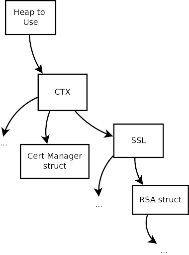

# 機能

wolfSSLは主要なインターフェースとしてC言語をサポートしていますが、[SWIG](http://swig.org/)インターフェースを通じてJava、PHP、Perl、Pythonなどもサポートしています。
現在サポートされていない他のプログラミング言語でwolfSSLをホストすることに興味がある場合は、お問い合わせください。

本章では、ストリーム暗号、AES-NI、IPv6サポート、SSL検査（スニファー）サポートなど、wolfSSLの機能についてより詳しく説明します。

## 機能概要

wolfSSLの機能概要については、製品紹介ページをご覧ください。

<https://wolfssl.jp/products/wolfssl>

## プロトコルサポート

wolfSSLは**SSL 3.0**、**TLS**（**1.0**、**1.1**、**1.2、1.3**）、および**DTLS**（**1.0**と**1.2**）をサポートしています。
以下の関数のいずれかを使用することで、使用するプロトコルを簡単に選択できます。
wolfSSLはSSL 2.0をサポートしていません。
OpenSSL互換性レイヤーを使用する場合、以下の関数はわずかに異なります。
OpenSSL互換関数については、[第13章 OpenSSL互換性](chapter13.md)をご参照ください。

### サーバー関数

* [`wolfDTLSv1_server_method()`](group__Setup.md#function-wolfdtlsv1_server_method) - DTLS 1.0
* [`wolfDTLSv1_2_server_method()`](group__Setup.md#function-wolfdtlsv1_2_server_method) - DTLS 1.2
* [`wolfSSLv3_server_method()`](group__Setup.md#function-wolfsslv3_server_method) - SSL 3.0
* [`wolfTLSv1_server_method()`](group__Setup.md#function-wolftlsv1_server_method) - TLS 1.0
* [`wolfTLSv1_1_server_method()`](group__Setup.md#function-wolftlsv1_1_server_method) - TLS 1.1
* [`wolfTLSv1_2_server_method()`](group__Setup.md#function-wolftlsv1_2_server_method) - TLS 1.2
* [`wolfTLSv1_3_server_method()`](group__Setup.md#function-wolftlsv1_3_server_method) - TLS 1.3
* [`wolfSSLv23_server_method()`](group__Setup.md#function-wolfsslv23_server_method) - SSLv3からTLS 1.2までの可能な限り新しいバージョンを使用

wolfSSLは[`wolfSSLv23_server_method()`](group__Setup.md#function-wolfsslv23_server_method)関数による堅牢なサーバーダウングレードをサポートしています。
詳しくは、本章の「堅牢なクライアントとサーバーのダウングレード」節をご参照ください。

### クライアント関数

* [`wolfDTLSv1_client_method()`](group__Setup.md#function-v1_client_method) - DTLS 1.0
* [`wolfDTLSv1_2_client_method_ex()`](ssl_8h.md#function-wolfdtlsv1_2_client_method_ex) - DTLS 1.2
* [`wolfSSLv3_client_method()`](group__Setup.md#function-wolfsslv3_client_method) - SSL 3.0
* [`wolfTLSv1_client_method()`](group__Setup.md#function-wolftlsv1_client_method) - TLS 1.0
* [`wolfTLSv1_1_client_method()`](group__Setup.md#function-wolftlsv1_1_client_method) - TLS 1.1
* [`wolfTLSv1_2_client_method()`](group__Setup.md#function-wolftlsv1_2_client_method) - TLS 1.2
* [`wolfTLSv1_3_client_method()`](group__Setup.md#function-wolftlsv1_3_client_method) - TLS 1.3
* [`wolfSSLv23_client_method()`](group__Setup.md#function-wolfsslv23_client_method) - SSLv3からTLS 1.2までの可能な限り新しいバージョンを使用

wolfSSLは[`wolfSSLv23_client_method()`](group__Setup.md#function-wolfsslv23_client_method)関数による堅牢なクライアントダウングレードをサポートしています。
詳しくは、本章の「堅牢なクライアントとサーバーのダウングレード」節ご参照ください。

これらの関数の使用方法の詳細については、[第3章 入門](chapter03.md#getting-started)をご参照ください。
SSL 3.0、TLS 1.0、1.1、1.2、およびDTLSの比較については、[付録D SSL/TLSの概要](appendix04.md)をご参照ください。

### 堅牢なクライアントとサーバーのダウングレード

wolfSSLのクライアントとサーバーはどちらも堅牢なバージョンダウングレード機能を持っています。
どちらかの側で特定のプロトコルバージョンメソッドが使用されている場合、そのバージョンによりネゴシエーションされるか、エラーが返されます。
例えば、TLS 1.0を使用するクライアントがSSL 3.0のみのサーバーに接続しようとすると、接続は失敗します。
同様に、TLS 1.1への接続も失敗します。

この問題を解決するには、クライアント側で[`wolfSSLv23_client_method()`](group__Setup.md#function-wolfsslv23_client_method)関数を使用し、必要に応じてダウングレードすることでサーバーがサポートする最高のプロトコルバージョンをサポートします。
この場合、クライアントはTLS 1.0〜TLS 1.3（またはSSL 3.0を含むサブセットまたはスーパーセット、wolfSSLで設定されているプロトコルバージョンによる）を実行しているサーバーに接続できます。
接続できないバージョンは、長年安全でないとされているSSL 2.0と、デフォルトで無効化されているSSL 3.0のみです。

同様に、サーバー側で[`wolfSSLv23_server_method()`](group__Setup.md#function-wolfsslv23_server_method)関数を使用することで、TLS 1.0〜TLS 1.2のプロトコルバージョンをサポートするクライアントを処理できます。
wolfSSLサーバーはセキュリティ上の問題から、SSLv2からの接続を受け入れません。

### IPv6サポート

wolfSSLはIPv6もサポートしています。

wolfSSLはIPニュートラルとして設計しており、IPv4とIPv6の両方で動作します。
ただしより広範なシステムに適用するために、現在のテストアプリケーションはデフォルトでIPv4を使用します。
テストアプリケーションでIPv6を使用するには、wolfSSLのビルド時に `--enable-ipv6` オプションをお使いください。

IPv6に関する一般的な情報はこちらで確認できます。

<https://en.wikipedia.org/wiki/IPv6>

### DTLS

wolfSSLはクライアントとサーバーの両方でDTLS（「データグラム」TLS）をサポートしています。
現在サポートしている最新バージョンはDTLS 1.3です。

TLSプロトコルは**信頼性のある**媒体（TCPなど）を介して安全なトランスポートチャネルを提供するように設計されました。
UDPトランスポートを使用するアプリケーション層プロトコル（SIPやゲームプロトコルなど）が開発され始めるにつれて、遅延に敏感なアプリケーションの通信セキュリティを提供する必要性が生じました。
この必要性がDTLSプロトコルの作成につながりました。

多くの人がTLSとDTLSの違いはTCPとUDPの違いと同じだと考えていますが、これは正しくありません。
UDPはハンドシェイクがなく、切断がなく、何かが失われた場合にTCPと比較して遅延が少ないという利点があります。
一方、DTLSは拡張されたSSLハンドシェイクと切断を持ち、ハンドシェイクにTCPのような動作を実装する必要があります。
本質的に、DTLSは安全な接続と引き換えにUDPが提供する利点を逆転させます。

DTLSはwolfSSLをビルドする際に`--enable-dtls`ビルドオプションを使用することで有効にできます。

### LwIP（軽量インターネットプロトコル）

wolfSSLは、軽量インターネットプロトコル実装をすぐ使えるようサポートしています。
このプロトコルを使用するには、`WOLFSSL_LWIP`を定義するか、`settings.h`ファイルを編集して次の行のコメントアウトを解除してください。

```c
/*#define WOLFSSL_LWIP*/
```

lwIPの焦点は、できるだけ小さなRAM使用量で完全なTCPスタックを提供することです。
これはまさに、wolfSSLの主なユースケースである組み込みシステムでのSSL/TLSニーズとマッチしています。

### TLS拡張機能

wolfSSLがサポートするTLS拡張機能のリストと、参照できる対応するRFCについての注記です。

| RFC | 拡張機能 |wolfSSLタイプ |
| --- | --------- | ------------ |
| [6066](https://tex2e.github.io/rfc-translater/html/rfc6066) | サーバー名表示 | `TLSX_SERVER_NAME` |
| [6066](https://tex2e.github.io/rfc-translater/html/rfc6066) | 最大フラグメント長ネゴシエーション | `TLSX_MAX_FRAGMENT_LENGTH` |
| [6066](https://tex2e.github.io/rfc-translater/html/rfc6066) | 短縮HMAC | `TLSX_TRUNCATED_HMAC` |
| [6066](https://tex2e.github.io/rfc-translater/html/rfc6066) | ステータスリクエスト | `TLSX_STATUS_REQUEST` |
| [7919](https://tex2e.github.io/rfc-translater/html/rfc7919) | サポートされているグループ | `TLSX_SUPPORTED_GROUPS` |
| [5246](https://tex2e.github.io/rfc-translater/html/rfc5246) | 署名アルゴリズム | `TLSX_SIGNATURE_ALGORITHMS` |
| [7301](https://tex2e.github.io/rfc-translater/html/rfc7301) | アプリケーション層プロトコルネゴシエーション | `TLSX_APPLICATION_LAYER_PROTOCOL` |
| [6961](https://tex2e.github.io/rfc-translater/html/rfc6961) | 複数証明書ステータスリクエスト | `TLSX_STATUS_REQUEST_V2` |
| [5077](https://tex2e.github.io/rfc-translater/html/rfc5077) | セッションチケット | `TLSX_SESSION_TICKET` |
| [5746](https://tex2e.github.io/rfc-translater/html/rfc5746) | 再ネゴシエーションの提示 | `TLSX_RENEGOTIATION_INFO` |
| [8446](https://tex2e.github.io/rfc-translater/html/rfc8446) | 鍵共有 | `TLSX_KEY_SHARE` |
| [8446](https://tex2e.github.io/rfc-translater/html/rfc8446) | 事前共有鍵 | `TLSX_PRE_SHARED_KEY` |
| [8446](https://tex2e.github.io/rfc-translater/html/rfc8446) | PSK鍵交換モード | `TLSX_PSK_KEY_EXCHANGE_MODES` |
| [8446](https://tex2e.github.io/rfc-translater/html/rfc8446) | 早期データ | `TLSX_EARLY_DATA` |
| [8446](https://tex2e.github.io/rfc-translater/html/rfc8446) | クッ鍵 | `TLSX_COOKIE` |
| [8446](https://tex2e.github.io/rfc-translater/html/rfc8446) | サポートされているバージョン | `TLSX_SUPPORTED_VERSIONS` |
| [8446](https://tex2e.github.io/rfc-translater/html/rfc8446) | ポストハンドシェイク認証 | `TLSX_POST_HANDSHAKE_AUTH` |

## 暗号サポート

### 暗号スイートの強度と適切な鍵サイズの選択

メソッド[`wolfSSL_get_ciphers()`](group__IO.md#function-wolfssl_get_ciphers)を呼び出すことで、現在有効になっている暗号スイートを確認できます。

暗号スイートはさまざまな強度で提供されています。
それらはいくつかの異なるタイプのアルゴリズム（認証、暗号化、およびメッセージ認証コード（MAC））で構成されているため、各々の強度は選択された鍵サイズによって異なります。

暗号スイートの強度を評価する方法は多数あり、実際に使用される手法はプロジェクトや企業によって異なるようです。
これには、共通鍵および公開鍵アルゴリズムの鍵サイズ、アルゴリズムの種類、性能、既知の弱点などが含まれる場合があります。

**NIST**（米国国立標準技術研究所）は、各鍵サイズに対して比較可能なアルゴリズムの強度を提供することにより、受け入れ可能な暗号スイートを選択するための推奨事項を提供しています。
暗号アルゴリズムの強度は、アルゴリズムと使用される鍵サイズに依存します。
NIST Special Publication [SP800-57](https://csrc.nist.gov/publications/detail/sp/800-57-part-1/rev-5/final)では、どのようにして2つのアルゴリズムが同等の強度であると見なすのか述べられています。

> 2つのアルゴリズムは、与えられた鍵サイズ（XとY）に対して、「アルゴリズムを破る」または鍵を決定するために必要な作業量が、与えられたリソースを使用して概ね同じである場合、同等の強度を持つと見なされます。特定の鍵サイズに対するアルゴリズムのセキュリティ強度は、伝統的に、ショートカット攻撃（つまり、最も効率的な攻撃はすべての可能な鍵を試すこと）がない「X」の鍵サイズを持つ対称アルゴリズムに対してすべての鍵を試すのにかかる作業量の観点から説明されています。

以下の2つの表は、[NIST SP800-57](https://csrc.nist.gov/publications/detail/sp/800-57-part-1/rev-5/final)の表2（56ページ）と表4（59ページ）の両方に基づいており、アルゴリズム間の比較可能なセキュリティ強度と強度測定（NISTが提案するアルゴリズムセキュリティの寿命をセキュリティビット数に基づいて）を示しています。

**注意**：次の表では、「L」は有限体暗号（FFC）の公開鍵のサイズ、「N」はFFCの秘密鍵のサイズ、「k」は整数因数分解暗号（IFC）の鍵サイズ、「f」は楕円曲線暗号（ECC）の鍵サイズを示しています。

| セキュリティビット数 | 対称鍵アルゴリズム | **FFC** 鍵サイズ (DSA, DH, 等) | **IFC** 鍵サイズ (RSA, 等) | **ECC** 鍵サイズ (ECDSA, 等) | 説明 |
| ---------------- | ------------------------ | -------------------------------- | ---------------------------- | ------------------------------ | ----------- |
| 80 | 2TDEA, 等 | L = 1024, N = 160 | k = 1024 | f = 160-223 | セキュリティは2010年まで有効 |
| 128 | AES-128, 等 | L = 3072, N = 256 | k = 3072 | f = 256-383 | セキュリティは2030年まで有効 |
| 192 | AES-192, 等 | L = 7680, N = 384 | k = 7680 | f = 384-511 | 長期的に有効 |
| 256 | AES-256, 等 | L = 15360, N = 512 | k = 15360 | f = 512+ | 予見可能な将来にわたって有効 |

この表をガイドとして使用すると、暗号スイートは対称暗号化アルゴリズムの強度に基づいて分類できます。
これにより、セキュリティビット数に基づいて各暗号スイートを大まかに分類するための等級分類を考案できます（対称鍵サイズのみを考慮しています）。

* **低** - 128ビット未満のセキュリティビット
* **中** - 128ビットのセキュリティビット
* **高** - 128ビットを超えるセキュリティビット

暗号スイートの強度は、対称暗号化アルゴリズムの強度以外にも、鍵交換および認証アルゴリズムの鍵サイズに大きく依存します。
暗号スイートを構成する要素のうち、最も弱い要素の強度により評価されます。

上記の評価方法（および対称暗号化アルゴリズムの強度のみに基づく）に従うと、wolfSSL 2.0.0は現在、以下にリストされているように、合計0の低強度暗号スイート、12の中程度強度暗号スイート、および8の高強度暗号スイートをサポートしています。
この強度分類は、他のアルゴリズムの選択された鍵サイズによって変わる可能性があります。
ハッシュ関数のセキュリティ強度に関する参考として、[NIST SP800-57](https://csrc.nist.gov/publications/detail/sp/800-57-part-1/rev-5/final)の表3（56ページ）をご参照ください。

媒体によっては、「**EXPORT**」暗号として示されていることがあります。
これは1992年まで、米国では強力な暗号処理を含むソフトウェアを輸出することが違法とされていたことに由来しています。
強力な暗号化は米国政府によって「弾薬」（核兵器、戦車、弾道ミサイルと同じカテゴリ）として分類されていました。
この制限のため、輸出されるソフトウェアには「弱められた」暗号（主に小さい鍵サイズ）が含まれていました。
現在ではこの制限は解除されており、EXPORT暗号はもはや必要とされなくなりました。

### サポートしている暗号スイート

以下の暗号スイートはwolfSSLでサポートしています。
暗号スイートとは、SSL/TLSハンドシェイク中にコネクションのセキュリティ設定をネゴシエーションするために使用される、認証、暗号化、メッセージ認証コード（MAC）アルゴリズムの組み合わせです。

各暗号スイートは、鍵交換アルゴリズム、バルク暗号化アルゴリズム、メッセージ認証コードアルゴリズム（MAC）を定義します。

**鍵交換アルゴリズム**（RSA、DSS、DH、EDH）は、ハンドシェイクプロセス中にクライアントとサーバーがどのように認証するかを決定します。

**バルク暗号化アルゴリズム**（DES、3DES、AES、ARC4）（ブロック暗号とストリーム暗号を含む）は、メッセージストリームを暗号化するために使用されます。

**メッセージ認証コード（MAC）アルゴリズム**（MD2、MD5、SHA-1、SHA-256、SHA-512、RIPEMD）は、メッセージダイジェストを作成するために使用されるハッシュ関数です。

以下の表は、`<wolfssl_root>/wolfssl/internal.h`（約1097行目以降に記載）にある暗号スイート（およびカテゴリ）に対応しています。
以下のリストにない暗号スイートをお探しの場合は、お問い合わせください。

#### ECC暗号スイート

* `TLS_DHE_RSA_WITH_3DES_EDE_CBC_SHA`
* `TLS_DHE_RSA_WITH_AES_256_CBC_SHA`
* `TLS_DHE_RSA_WITH_AES_128_CBC_SHA`
* `TLS_DH_anon_WITH_AES_128_CBC_SHA`
* `TLS_RSA_WITH_AES_256_CBC_SHA`
* `TLS_RSA_WITH_AES_128_CBC_SHA`
* `TLS_RSA_WITH_NULL_SHA`
* `TLS_PSK_WITH_AES_256_CBC_SHA`
* `TLS_PSK_WITH_AES_128_CBC_SHA256`
* `TLS_PSK_WITH_AES_256_CBC_SHA384`
* `TLS_PSK_WITH_AES_128_CBC_SHA`
* `TLS_PSK_WITH_NULL_SHA256`
* `TLS_PSK_WITH_NULL_SHA384`
* `TLS_PSK_WITH_NULL_SHA`
* `SSL_RSA_WITH_RC4_128_SHA`
* `SSL_RSA_WITH_RC4_128_MD5`
* `SSL_RSA_WITH_3DES_EDE_CBC_SHA`
* `TLS_ECDHE_RSA_WITH_AES_256_CBC_SHA`
* `TLS_ECDHE_RSA_WITH_AES_128_CBC_SHA`
* `TLS_ECDHE_ECDSA_WITH_AES_256_CBC_SHA`
* `TLS_ECDHE_ECDSA_WITH_AES_128_CBC_SHA`
* `TLS_ECDHE_RSA_WITH_RC4_128_SHA`
* `TLS_ECDHE_ECDSA_WITH_RC4_128_SHA`
* `TLS_ECDHE_RSA_WITH_3DES_EDE_CBC_SHA`
* `TLS_ECDHE_ECDSA_WITH_3DES_EDE_CBC_SHA`
* `TLS_ECDHE_RSA_WITH_AES_128_CBC_SHA256`
* `TLS_ECDHE_ECDSA_WITH_AES_128_CBC_SHA256`
* `TLS_ECDHE_RSA_WITH_AES_256_CBC_SHA384`
* `TLS_ECDHE_ECDSA_WITH_AES_256_CBC_SHA384`
* `TLS_ECDHE_PSK_WITH_NULL_SHA256`
* `TLS_ECDHE_PSK_WITH_AES_128_CBC_SHA256`
* `TLS_ECDHE_ECDSA_WITH_NULL_SHA`

#### 静的ECC暗号スイート

* `TLS_ECDH_RSA_WITH_AES_256_CBC_SHA`
* `TLS_ECDH_RSA_WITH_AES_128_CBC_SHA`
* `TLS_ECDH_ECDSA_WITH_AES_256_CBC_SHA`
* `TLS_ECDH_ECDSA_WITH_AES_128_CBC_SHA`
* `TLS_ECDH_RSA_WITH_RC4_128_SHA`
* `TLS_ECDH_ECDSA_WITH_RC4_128_SHA`
* `TLS_ECDH_RSA_WITH_3DES_EDE_CBC_SHA`
* `TLS_ECDH_ECDSA_WITH_3DES_EDE_CBC_SHA`
* `TLS_ECDH_RSA_WITH_AES_128_CBC_SHA256`
* `TLS_ECDH_ECDSA_WITH_AES_128_CBC_SHA256`
* `TLS_ECDH_RSA_WITH_AES_256_CBC_SHA384`
* `TLS_ECDH_ECDSA_WITH_AES_256_CBC_SHA384`

#### Blake2b暗号スイート

* `TLS_RSA_WITH_AES_128_CBC_B2B256`
* `TLS_RSA_WITH_AES_256_CBC_B2B256`

#### SHA-256暗号スイート

* `TLS_DHE_RSA_WITH_AES_256_CBC_SHA256`
* `TLS_DHE_RSA_WITH_AES_128_CBC_SHA256`
* `TLS_RSA_WITH_AES_256_CBC_SHA256`
* `TLS_RSA_WITH_AES_128_CBC_SHA256`
* `TLS_RSA_WITH_NULL_SHA256`
* `TLS_DHE_PSK_WITH_AES_128_CBC_SHA256`
* `TLS_DHE_PSK_WITH_NULL_SHA256`

#### SHA-384暗号スイート

* `TLS_DHE_PSK_WITH_AES_256_CBC_SHA384`
* `TLS_DHE_PSK_WITH_NULL_SHA384`

#### AES-GCM暗号スイート

* `TLS_RSA_WITH_AES_128_GCM_SHA256`
* `TLS_RSA_WITH_AES_256_GCM_SHA384`
* `TLS_DHE_RSA_WITH_AES_128_GCM_SHA256`
* `TLS_DHE_RSA_WITH_AES_256_GCM_SHA384`
* `TLS_PSK_WITH_AES_128_GCM_SHA256`
* `TLS_PSK_WITH_AES_256_GCM_SHA384`
* `TLS_DHE_PSK_WITH_AES_128_GCM_SHA256`
* `TLS_DHE_PSK_WITH_AES_256_GCM_SHA384`

#### ECC AES-GCM暗号スイート

* `TLS_ECDHE_ECDSA_WITH_AES_128_GCM_SHA256`
* `TLS_ECDHE_ECDSA_WITH_AES_256_GCM_SHA384`
* `TLS_ECDH_ECDSA_WITH_AES_128_GCM_SHA256`
* `TLS_ECDH_ECDSA_WITH_AES_256_GCM_SHA384`
* `TLS_ECDHE_RSA_WITH_AES_128_GCM_SHA256`
* `TLS_ECDHE_RSA_WITH_AES_256_GCM_SHA384`
* `TLS_ECDH_RSA_WITH_AES_128_GCM_SHA256`
* `TLS_ECDH_RSA_WITH_AES_256_GCM_SHA384`

#### AES-CCM暗号スイート

* `TLS_RSA_WITH_AES_128_CCM_8`
* `TLS_RSA_WITH_AES_256_CCM_8`
* `TLS_ECDHE_ECDSA_WITH_AES_128_CCM`
* `TLS_ECDHE_ECDSA_WITH_AES_128_CCM_8`
* `TLS_ECDHE_ECDSA_WITH_AES_256_CCM_8`
* `TLS_PSK_WITH_AES_128_CCM`
* `TLS_PSK_WITH_AES_256_CCM`
* `TLS_PSK_WITH_AES_128_CCM_8`
* `TLS_PSK_WITH_AES_256_CCM_8`
* `TLS_DHE_PSK_WITH_AES_128_CCM`
* `TLS_DHE_PSK_WITH_AES_256_CCM`

#### Camellia暗号スイート

* `TLS_RSA_WITH_CAMELLIA_128_CBC_SHA`
* `TLS_RSA_WITH_CAMELLIA_256_CBC_SHA`
* `TLS_RSA_WITH_CAMELLIA_128_CBC_SHA256`
* `TLS_RSA_WITH_CAMELLIA_256_CBC_SHA256`
* `TLS_DHE_RSA_WITH_CAMELLIA_128_CBC_SHA`
* `TLS_DHE_RSA_WITH_CAMELLIA_256_CBC_SHA`
* `TLS_DHE_RSA_WITH_CAMELLIA_128_CBC_SHA256`
* `TLS_DHE_RSA_WITH_CAMELLIA_256_CBC_SHA256`

#### ChaCha暗号スイート

* `TLS_ECDHE_RSA_WITH_CHACHA20_POLY1305_SHA256`
* `TLS_ECDHE_ECDSA_WITH_CHACHA20_POLY1305_SHA256`
* `TLS_DHE_RSA_WITH_CHACHA20_POLY1305_SHA256`
* `TLS_ECDHE_PSK_WITH_CHACHA20_POLY1305_SHA256`
* `TLS_PSK_WITH_CHACHA20_POLY1305_SHA256`
* `TLS_DHE_PSK_WITH_CHACHA20_POLY1305_SHA256`
* `TLS_ECDHE_RSA_WITH_CHACHA20_OLD_POLY1305_SHA256`
* `TLS_ECDHE_ECDSA_WITH_CHACHA20_OLD_POLY1305_SHA256`
* `TLS_DHE_RSA_WITH_CHACHA20_OLD_POLY1305_SHA256`

#### 再ネゴシエーション表示拡張特別スイート

* `TLS_EMPTY_RENEGOTIATION_INFO_SCSV`

### AEADスイート

wolfSSLは、AES-GCM、AES-CCM、CHACHA-POLY1305などのAEADスイートをサポートしています。
これらのAEADスイートと他のスイートの大きな違いは、追加のクリアテキストデータを使用して暗号化されたデータを認証することです。
これは、データ改ざんを伴う中間者攻撃を軽減するのに役立ちます。
AEADスイートはブロック暗号（または最近ではストリーム暗号）アルゴリズムと、鍵付きハッシュアルゴリズムによって生成されるタグの組み合わせを使用します。
これら2つのアルゴリズムの組み合わせは、wolfSSLの暗号化・復号プロセスによって処理されます。
特定のAEADスイートを使用するために必要なのは、サポートされているスイートで使用されるアルゴリズムを有効にするだけです。

### ブロック暗号とストリーム暗号

wolfSSLは **AES**、**DES**、**3DES**、**Camellia** ブロック暗号と、**RC4** および **CHACHA20** ストリーム暗号をサポートしています。
AES、DES、3DES、RC4はデフォルトで有効です。

CamelliaとChaCha20は、wolfSSLのビルド時に（それぞれ [`--enable-camellia`](chapter02.md#--enable-camellia) および [`--disable-chacha`](chapter02.md#--disable-chacha) ビルドオプションで）有効にできます。

AESのデフォルトモードはCBCモードです。
AESでGCMやCCMモードを有効にするには、ビルドオプション[`--enable-aesgcm`](chapter02.md#--enable-aesgcm) または [`--enable-aesccm`](chapter02.md#--enable-aesccm)をお使いください。
サンプルプログラムや[第10章 wolfCryptの使用法](chapter10.md)に詳しい情報を掲載しています。

SSLではデフォルトのストリーム暗号としてRC4を使用していましたが、セキュリティ上の問題により廃止されました。
最近、wolfSSLはChaCha20を追加しました。
RC4はChaChaよりも約11%高い性能を示しますが、一般的にChaChaよりも安全性が低いと考えられています。
ChaChaはセキュリティ性能とのトレードオフとして、処理時間の短さを提供しています。

暗号性能の比較については、wolfSSLのベンチマークウェブページをご覧ください。

<https://www.wolfssl.com/docs/benchmarks>

#### 違いは何でしょうか

ブロック暗号は、暗号のブロックサイズのチャンク単位で暗号化する必要があります。
例えば、AESのブロックサイズは16バイトです。
したがって、2〜3バイトの小さなチャンクを暗号化する場合、データの80%以上が無駄なパディングとなります。
これにより暗号化/復号処理速度は低下し、ネットワーク帯域幅を無駄に消費します。
基本的に、ブロック暗号は大きなデータチャンク用に設計されており、パディングを必要とするブロックサイズを有し、固定の不変な変換を使用します。

ストリーム暗号は、大小さまざまなデータチャンクに適しています。
ブロックサイズが不要なため、小さいデータサイズにも適しています。
速度が重要な場合、ストリーム暗号が最適です。
これは、一般的にXOR処理された鍵ストリームを含むより単純な変換を使用するためです。
メディアをストリーミングしたり、小さなサイズを含むさまざまなデータサイズを暗号化したり、高速な暗号が必要な場合は、ストリーム暗号が最適な選択です。

### ハッシュ関数

wolfSSLはいくつかの異なるハッシュ関数をサポートしています。
これには、**MD2**、**MD4**、**MD5**、**SHA-1**、**SHA-2**（SHA-224、SHA-256、SHA-384、SHA-512）、**SHA-3**（BLAKE2）、**RIPEMD-160** が含まれます。
これらの関数の詳細な使用方法は、[第10章 wolfCryptの使用法](chapter10.md)の「ハッシュ関数」節で確認できます。

### 公開鍵オプション

wolfSSLは **RSA**、**ECC**、**DSA/DSS**、**DH** の公開鍵オプションに加え、wolfSSLサーバー上での **EDH**（Ephemeral Diffie-Hellman）もサポートしています。
これらの関数の詳細な使用方法は、[第10章 wolfCryptの使用法](chapter10.md)の「公開鍵暗号」節で確認できます。

#### ML-KEM、ML-DSA

ML-KEM (Module Lattice Key Encapsulation Mechanism) は、NISTが標準化した格子ベースの耐量子アルゴリズムです。
Kyberをベースとして標準化されました。
2者間で鍵カプセル化メカニズムを使用して、安全でないチャネル上で共有鍵を確立します。
これにより、従来型および量子コンピュータを用いた攻撃者の両方から保護できます。

ML-DSA (Module Lattice Digital Signature Algorithm) は、同じくNISTが標準化した格子ベースの耐量子デジタル署名方式です。
Kyberをベースとして標準化されました。
これにより、送信者はメッセージの送信元と完全性を証明する検証可能な署名を生成できます。

ML-KEMとML-DSAはどちらも、暗号の復号に特化した量子コンピュータに耐性を持つように設計された公開鍵アルゴリズムです。
これらはNISTの耐量子暗号標準(FIPS 203およびFIPS 204)の一部です。
量子コンピューティング時代に備えるために、ほとんどのケースでハイブリッド形式にてすぐに導入できます。

### ECC サポート

wolfSSLは楕円曲線暗号（ECC）をサポートしています。
これには、ECDH-ECDSA、ECDHE-ECDSA、ECDH-RSA、ECDHE-PSK、ECDHE-RSA などが含まれます。

wolfSSLのECC実装は、`<wolfssl_root>/wolfssl/wolfcrypt/ecc.h` ヘッダーファイルと `<wolfssl_root>/wolfcrypt/src/ecc.c` ソースファイルにあります。

サポートされている暗号スイートは上の表に示されています。
ECCは非x86_64ビルドではデフォルトで無効になっていますが、`HAVE_ECC` 定義を使用するか、autoconfシステムを使用して次のようにwolfSSLをビルドすることで有効にできます。

```sh
./configure --enable-ecc
make
make check
```

`make check`を実行すると、wolfSSLがチェックする多数の暗号スイートを出力します。
もし`make check`が暗号スイートのリストを生成しない場合は、`./testsuite/testsuite.test` を単独で実行してください。
これらの暗号スイートは、それぞれ個別にテストできます。
例えば、ECDH-ECDSAとAES256-SHAを試すには、wolfSSLサーバーを次のように起動します。

```sh
./examples/server/server -d -l ECDHE-ECDSA-AES256-SHA -c ./certs/server-ecc.pem -k ./certs/ecc-key.pem
```

（`-d`）はクライアント証明書チェックを無効にし、（`-l`）は暗号スイートリストを指定します。
（`-c`）は使用する証明書、（`-k`）は対応する秘密鍵です。
クライアントを接続するには次のようにします。

```sh
./examples/client/client -A ./certs/server-ecc.pem
```

ここで（`-A`）はサーバーを検証するための CA 証明書です。

### PKCS サポート

PKCS（Public Key Cryptography Standards）は、RSA Security, Inc. によって作成され公開された標準規格のグループを指します。
wolfSSLは **PKCS #1、PKCS #3、PKCS #5、PKCS #7、PKCS #8、PKCS #9、PKCS #10、PKCS #11、PKCS #12** をサポートしています。

さらに、wolfSSLは PKCS #1 の一部として標準化された RSA-Probabilistic Signature Scheme(PSS)もサポートしています。

#### PKCS #5、PBKDF1、PBKDF2、PKCS #12

PKCS #5 はパスワードベースの鍵導出方法です。
具体的には、パスワード、ソルト、反復回数を組み合わせてパスワードベースの鍵を生成します。
wolfSSLは鍵導出関数として、PBKDF1とPBKDF2の両方をサポートしています。
鍵導出関数は、基本鍵と他のパラメータ（上記で説明したソルトや反復回数など）から派生鍵を生成します。
PBKDF1はハッシュ関数（MD5、SHA1 など）を適用して鍵を導出し、派生鍵の長さはハッシュ関数の出力長によって制限されます。
PBKDF2では、疑似乱数関数（HMAC-SHA-1 など）を適用して鍵を導出します。
PBKDF2の場合、派生鍵の長さに制限はありません。

wolfSSLはPBKDF1とPBKDF2に加えて、PKCS #12からのPBKDF関数もサポートしています。
関数プロトタイプは次の通りです。

```c
int PBKDF2(byte* output, const byte* passwd, int pLen,
           const byte* salt, int sLen, int iterations,
           int kLen, int hashType);

int PKCS12_PBKDF(byte* output, const byte* passwd, int pLen,
                 const byte* salt, int sLen, int iterations,
                 int kLen, int hashType, int purpose);
```

`output` には派生鍵が含まれ、`passwd` は長さ `pLen` のユーザーパスワードを保持します。
`salt` は長さ `sLen` のソルト入力を保持します。
`iterations` は実行する反復回数、`kLen` は希望する派生鍵の長さ、`hashType` は使用するハッシュ（MD5、SHA1、または SHA2）です。

`./configure` を使用してwolfSSLをビルドする場合、`--enable-pwdbased` オプションを使用することでこの機能を有効にできます。

完全な例は `<wolfSSL Root>/wolfcrypt/test.c` にあります。
PKCS #5、PBKDF1、PBKDF2 に関する詳細情報は、以下の仕様書から入手できます。

PKCS#5、PBKDF1、PBKDF2：[RFC 2898](https://tex2e.github.io/rfc-translater/html/rfc2898)

#### PKCS #8

PKCS #8 は、秘密鍵情報構文の標準として設計されました。
公開鍵アルゴリズムの秘密鍵と属性セットを含む秘密鍵情報を保存するために使用されます。

PKCS #8 標準には2つのバージョンがあり、暗号化された秘密鍵と非暗号化鍵の両方を保存する構文について説明しています。
wolfSSLは暗号化と非暗号化の両方の PKCS #8 をサポートしています。
サポートしているフォーマットには、PKCS #5 バージョン 1 - バージョン 2、および PKCS#12 が含まれます。
暗号化の種類として、 DES、3DES、RC4、AES が利用可能です。

PKCS#8：[RFC 5208](https://tex2e.github.io/rfc-translater/html/rfc5208)

#### PKCS #7

PKCS #7 は、暗号化された証明書や暗号化されていないが署名されたデータ文字列などのデータバンドルを転送するように設計されています。
この機能は、ビルドオプション`--enable-pkcs7`を使用するか、マクロ `HAVE_PKCS7` を定義することで有効にできます。
RFCに従って、デフォルトでは署名者の空セットを持つ縮退ケースが許可されています。
縮退ケースの許可/不許可を切り替えるには、関数 `wc_PKCS7_AllowDegenerate()` を使用します。

サポートされている機能は以下の通りです。

* 縮退バンドル
* KARI、KEKRI、PWRI、ORI、KTRI バンドル
* 分離署名
* 圧縮およびファームウェアパッケージバンドル
* カスタムコールバックサポート
* 限定的なストリーミング機能

##### PKCS #7 コールバック

PKCS7バンドルが解析された後、ユーザーが鍵を選択できるようにするための追加のコールバックとサポート関数が追加されました。
CEKをアンラップするには、`wc_PKCS7_SetWrapCEKCb()` を使用します。
このコールバックはKARIおよびKEKRIバンドルの場合に呼び出されます。
keyIDまたはSKIDは、KARIの場合、オリジネータ鍵と共にwolfSSLからユーザーに渡されます。
ユーザーがKEKでCEKをアンラップした後、使用する復号された鍵をwolfSSLに戻す必要があります。
この実装例は、[wolfssl-examples リポジトリ](https://github.com/wolfssl/wolfssl-examples)内の `signedData-EncryptionFirmwareCB.c` で公開しています。

PKCS7 バンドルの復号のための追加のコールバックが追加されました。
復号コールバック関数を設定するには、`wc_PKCS7_SetDecodeEncryptedCb()` を使用します。
ユーザー定義のコンテキストを設定するには、`wc_PKCS7_SetDecodeEncryptedCtx()` を使用する必要があります。
このコールバックは、`wc_PKCS7_DecodeEncryptedData()` の呼び出し時に実行されます。

##### PKCS #7 ストリーミング

PKCS7 デコーディングのためのストリーム指向APIは、すべてを一度に渡すのではなく、より小さなチャンクで入力するオプションを提供します。
デフォルトでは、PKCS7 のストリーミング機能はオンになっています。
PKCS7 APIのストリーミングサポートをオフにするには、マクロ `NO_PKCS7_STREAM` を定義してください。
autoconfで行う場合は、 `./configure --enable-pkcs7 CFLAGS=-DNO_PKCS7_STREAM` とします。

バンドルのデコード/検証のためのストリーミングでは、以下の関数がサポートされています。

1. `wc_PKCS7_DecodeEncryptedData()`
2. [`wc_PKCS7_VerifySignedData()`](group__PKCS7.md#function-wc_pkcs7_verifysigneddata)
3. [`wc_PKCS7_VerifySignedData_ex()`](group__PKCS7.md#function-wc_pkcs7_verifysigneddata_ex)
4. [`wc_PKCS7_DecodeEnvelopedData()`](group__PKCS7.md#function-wc_pkcs7_decodeenvelopeddate)
5. `wc_PKCS7_DecodeAuthEnvelopedData()`

**注意**：[`wc_PKCS7_VerifySignedData_ex`](group__PKCS7.md#function-wc_pkcs7_verifysigneddata_ex) を呼び出す場合、引数`pkiMsgFoot`は完全なバッファであることが想定されています。
内部構造は1つのバッファのストリーミングのみをサポートしており、この場合は`pkiMsgHead`になります。

### 特定の暗号スイートの使用を強制する

デフォルトでは、wolfSSLは接続の両側がサポートしている最良の暗号スイートを選択します。
128ビットAESなどの特定の暗号を強制するには、次のような内容を追加します。

```c
wolfSSL_CTX_set_cipher_list(ctx, "AES128-SHA");
```

[`wolfSSL_CTX_new()`](group__Setup.md#function-wolfssl_ctx_new) の呼び出しの後で、次のように実装してください。

```c
ctx = wolfSSL_CTX_new(method);
wolfSSL_CTX_set_cipher_list(ctx, "AES128-SHA");
```

### OpenQuantumSafeのliboqs 統合

[付録G ポスト量子暗号の実験](appendix07.md)をご覧ください。

## ハードウェアによる支援機構の活用

wolfSSLは、さまざまなプロセッサやチップに搭載されたハードウェアアクセラレーテッド機能をいくつか活用できます。
ここでは、wolfSSLがサポートしているテクノロジーについて説明します。

### AES-NI

AESは世界中の政府によって使用される鍵暗号化標準です。
Intelは、AESをより高速に処理する新しい命令セットをリリースしました。
wolfSSLは、商用環境でこの命令セットを完全にサポートする最初のSSLライブラリです。

基本的に、IntelとAMDはAESアルゴリズムの計算集約的な部分を実行するチップレベルのAES命令を追加し、パフォーマンスを向上させています。
AES-NIをサポートするIntelのチップのリストは、こちらで確認できます。

<https://ark.intel.com/search/advanced/?s=t&AESTech=true>

wolfSSLでは、ソフトウェアでアルゴリズムを実行する代わりにチップから直接命令を呼び出す機能を追加しました。
これにより、AES-NIをサポートするチップセットでwolfSSLを実行すると、AES暗号を5〜10倍高速に実行できるようになりました。

AES-NIをサポートするチップセットで実行している場合は、ビルドオプション`--enable-aesni`を使用します。
AES-NIを使用してwolfSSLをビルドする場合、アセンブリコードを使用するために GCC 4.4.3 以降が必要です。
wolfSSLは、同一のビルドオプションを使用してAMDプロセッサ上のASM命令もサポートしています。

AES-NIに関する文献を、いくつか以下に示します。
AES-NIによるパフォーマンス向上に関する情報については、3つ目のIntel Software Network ページをご参照ください。

* [AES（Wikipedia）](https://en.wikipedia.org/wiki/Advanced_Encryption_Standard)
* [AES-NI（Wikipedia）](https://en.wikipedia.org/wiki/AES_instruction_set)
* [AES-NI（Intel Software Network ）](https://software.intel.com/en-us/articles/intel-advanced-encryption-standard-instructions-aes-ni/)

AES-NIは、AES暗号モード AES-CBC、AES-GCM、AES-CCM-8、AES-CCM、AES-CTRに対応しています。
AES-GCMは、GHASH認証用にIntelチップに追加された128ビット乗算関数を使用することでさらに高速になります。

### STM32F2

wolfSSLは、STM32F2標準周辺機器ライブラリを通じて、STM32F2ハードウェアベースの暗号処理および乱数生成器を使用できます。

使用するには、`settings.h` に `WOLFSSL_STM32F2` を定義してください。
STM32F2ハードウェア暗号とRNGサポートを有効にします。
これらを個別に有効にするには、`STM32F2_CRYPTO`（ハードウェア暗号サポート用）と `STM32F2_RNG`（ハードウェア RNG サポート用）を使用します。

STM32F2標準周辺機器ライブラリの詳細は、次のドキュメントで確認できます。

<https://www.st.com/internet/com/TECHNICAL_RESOURCES/TECHNICAL_LITERATURE/USER_MANUAL/DM00023896.pdf>

### Cavium NITROX

wolfSSLはMarvell（旧称：Cavium）NITROX（<https://www.marvell.com/products/security-solutions.html>）をサポートしています。
Marvell NITROXサポートを有効にするには、wolfSSLをビルドする際に次のオプションを使用します。

```sh
./configure --with-cavium=/home/user/cavium/software
```

[`--with-cavium=**`](chapter02.md#--with-cavium) オプションは、ライセンスされた cavium/software ディレクトリを指しています。
Caviumはライブラリをビルドしないため、wolfSSLは `cavium_common.o` ファイルを取り込み、これによってこの移植性に関するlibtool警告が表示されます。
また、GitHubソースツリーを使用している場合は、Caviumヘッダーがこの警告に準拠していないため、生成されたMakefileから `-Wredundant-decls` 警告を削除する必要があります。

現在、wolfSSLは暗号レイヤーで直接Cavium RNG、AES、3DES、RC4、HMAC、RSAをサポートしています。
SSLレベルでのサポートは部分的であり、現在はAES、3DES、RC4のみです。
Cavium呼び出しを非ブロッキングモードで利用できるようになるまで、RSAとHMACは遅くなります。
クライアントのサンプルプログラムでも、暗号テストとベンチマークと同様にCaviumサポートをオンにできます。
`HAVE_CAVIUM` を定義してください。

### ESP32-WROOM-32

wolfSSLはESP32-WROOM-32ハードウェアベースの暗号化を使用できます。

使用するには、`settings.h`に`WOLFSSL_ESPWROOM32`を定義します。
ESP32-WROOM-32 ハードウェア暗号とRNGサポートが有効になります。
現在、wolfSSLは暗号レイヤーで RNG、AES、SHA、RSAプリミティブをサポートしています。
TLS サーバー/クライアント、wolfCrypt テスト、ベンチマークを含むサンプルプロジェクトは、ファイルをデプロイした後の ESP-IDF の `/examples/protocols` ディレクトリにあります。

### ESP8266

ESP32とは異なり、ESP8266ではハードウェアベースの暗号化は利用できません。
ESP8266用にコンパイルするには、`user_settings.h` に `WOLFSSL_ESP8266` を定義します。
autoconfにより`./configure CFLAGS="-DWOLFSSL_ESP8266"` とすることも可能です。

### EFR32

wolfSSLはEFR32ファミリーのハードウェアベースの暗号化を使用できます。

サポートを有効にするには、`user_settings.h` で `WOLFSSL_SILABS_SE_ACCEL` を定義します。
wolfSSLは現在、EFR32プラットフォーム上で RNG、AES-CBC、AES-GCM、AES-CCM、SHA-1、SHA-2、ECDHE、ECDSA のハードウェアアクセラレーションをサポートしています。

詳細とベンチマークは、wolfSSLリポジトリの`wolfcrypt/src/port/silabs/README.md`をご覧ください。

### MAX32665/MAX32666

wolfSSLは、Analog Devicesの [MAX32666](https://www.analog.com/ja/products/max32666.html)/[MAX32665](https://www.analog.com/ja/products/max32665.html) マイクロコントローラーのサポートモデルに搭載されている Trust Protection Unit（TPU）、Modular Arithmetic Accelerator（MAA）、TRNG の使用をサポートしています。

サポートを有効にするには、`WOLFSSL_MAX3266X` と `WOLFSSL_SP_MATH_ALL` を定義します。
wolfSSLは現在、RNG、AES-CBC、AES-GCM、AES-ECB、SHA-1、SHA-2、RSA 2048、および ECDSA のハードウェアアクセラレーションをサポートしています。

このハードウェアは、ハードウェアとソフトウェア実装の両方を使用できるようにするwolfSSLの暗号コールバック機能の使用もサポートしています。

サポートの詳細は、wolfSSLリポジトリの`wolfcrypt/src/port/maxim/README.md`をご覧ください。

## SSL検査（スニファー）

wolfSSL 1.5.0リリース以降、wolfSSLにはSSLスニファー（SSL検査）機能でビルドできるビルドオプションが含まれています。
これは、SSLトラフィックパケットを収集し、正しい鍵ファイルを使用して復号できることを意味します。
SSLトラフィックを「検査」する機能は、以下のような場面で役立ちます。

* ネットワーク問題の分析
* 内部および外部ユーザーによるネットワーク誤用の検出
* ネットワーク使用状況とデータコピーの監視
* クライアント/サーバー通信のデバッグ

スニファーサポートを有効にするには、\*nix では`--enable-sniffer`オプション、Windows では **vcproj** ファイルを使用してwolfSSLをビルドします。
\*nix では **pcap** を、Windows では **WinPcap** をインストールする必要があります。
`sniffer.h`で見つけることができる主なスニファー関数を、各機能の簡単な説明と共に以下に示します。

* `ssl_SetPrivateKey` - 特定のサーバーとポートの秘密鍵を設定します。
* `ssl_SetNamedPrivateKey` - 特定のサーバー、ポート、ドメイン名の秘密鍵を設定します。
* `ssl_DecodePacket` - 復号のために TCP/IP パケットを渡します。
* `ssl_Trace` - トレースファイルへのデバッグトレースを有効/無効にします。
* `ssl_InitSniffer` - 全体的なスニファーを初期化します。
* `ssl_FreeSniffer` - 全体的なスニファーを解放します。
* `ssl_EnableRecovery` - パケット損失の場合にSSLトラフィックの復号を再開しようとするオプションを有効にします。
* `ssl_GetSessionStats` - スニファーセッションのメモリ使用量を取得します。

wolfSSLのスニファーサポートに関する完全なサンプルとして、wolfSSLの `sslSniffer/sslSnifferTest/snifftest`アプリをご参照ください。

暗号化鍵はSSLハンドシェイクで設定されるため、その後のアプリケーションデータを復号するためにはスニファーによってハンドシェイクを復号する必要があることにご注意ください。
例えば、wolfSSLのサンプルプログラム`echoserver`と`echoclient`で「snifftest」を使用している場合、サーバーとクライアント間のハンドシェイクが始まる前に snifftest アプリケーションを起動する必要があります。

スニファーは、AES-CBC、DES3-CBC、ARC4、Camellia-CBCで暗号化されたストリームのみを復号できます。
ECDHEまたはDHE 鍵合意が使用されている場合、ストリームをスニッフすることはできません。
RSA及びECDH鍵交換のみがサポートされています。

wolfSSLスニファーでのウォッチコールバックは、`WOLFSSL_SNIFFER_WATCH` で有効にできます。
スニファーウォッチ機能がコンパイルされている場合、関数 `ssl_SetWatchKeyCallback()` を使用してカスタムコールバックを設定できます。
このコールバックは、証明書チェーン、エラー値、ピアから送信された証明書のダイジェストを検査するために使用されます。
コールバックからゼロ以外の値が返された場合、ピアの証明書を処理する際にエラー状態が設定されます。
ウォッチコールバックをサポートする追加関数は次のとおりです。

* `ssl_SetWatchKeyCtx`：ウォッチコールバックに渡されるカスタムユーザーコンテキストを設定します。
* `ssl_SetWatchKey_buffer`：新しいDER形式の鍵をサーバーセッションにロードします。
* `ssl_SetWatchKey_file`：`ssl_SetWatchKey_buffer` のファイルバージョンです。

スニファーでの統計収集を有効にするには、マクロ `WOLFSSL_SNIFFER_STATS` を定義します。
統計はSSLStats構造体に保持され、`ssl_ReadStatistics` を呼び出すことでアプリケーションのSSLStats構造体にコピーされます。
スニファー統計で使用する追加APIは `ssl_ResetStatistics`（統計収集をリセット）と `ssl_ReadResetStatistics`（現在の統計値を読み取り、内部状態をリセット）です。
現在保持される統計値は、以下の通りです。

* `sslStandardConns`
* `sslClientAuthConns`
* `sslResumedConns`
* `sslEphemeralMisses`
* `sslResumeMisses`
* `sslCiphersUnsupported`
* `sslKeysUnmatched`
* `sslKeyFails`
* `sslDecodeFails`
* `sslAlerts`
* `sslDecryptedBytes`
* `sslEncryptedBytes`
* `sslEncryptedPackets`
* `sslDecryptedPackets`
* `sslKeyMatches`
* `sslEncryptedConns`

## 静的バッファ確保オプション

wolfSSLでは、**動的**メモリ管理が提供されていることを前提に処理が記述されています。
すなわち、`malloc`/`free`関数でバッファを確保/解放できることを前提としています。
しかし、wolfSSLが内部で使用している暗号化ライブラリwolfCryptでは、動的メモリを使用しない設定も可能です。
これは動的メモリ管理機能を提供していない環境や、あるいは安全面の制約で動的メモリ管理機能の使用が制限されている環境では好ましいと言えます。
具体的には、組み込み機器でOSを使用しない（いわゆるベアメタル）環境で使用する場合、あるいはリアルタイムOSを使用している場合に動的メモリ管理機能が提供されていない場合があります。
このような環境でwolfSSLを使用する方法として**静的バッファ確保オプション**を提供しています。

### 静的バッファ確保の基本操作

先に説明した「動的メモリ管理」はバッファを「指定されたサイズ（可変長）」に動的に切り出して提供する管理方法です。
バッファの使用効率は高いですが処理が比較的複雑です。
一方、wolfSSLが提供する「静的バッファ確保機能」は、あらかじめ（静的に）用意した何種類かのバッファの中から、要求したサイズに近いものを検索して提供するメモリ管理機能のことを言います。
バッファの要求元には要求サイズ以上の大きさを持ったメモリブロックが割り当てられることがあります（そのため使用効率が低下します）が、バッファの確保と解放は`malloc`/`free`と同様に行え、割り当て処理は単純で済みます。
まとめると、任意サイズのメモリブロックを動的に確保する動的メモリ確保を模擬した機能となっています。

静的バッファ確保機能の使用は、wolfSSLにとって動的メモリ機能と等価に使用されます。
この機能はwolfSSLがメモリの確保/解放を`XMALLOC`/`XFREE`関数呼び出しに抽象化してあることで実現できています。
一旦、静的バッファ確保機能が設定されると、以降wolfSSLは内部で使用するバッファや他の構造体の確保に静的バッファ確保機能を使用します。

静的バッファ割り当ては`WOLFSSL_CTX`で設定され、スレッドセーフです。
同一の`WOLFSSL_CTX`を異なるスレッドで共有しながら使用している場合でも、バッファの確保/解放はwolfSSL内部で排他制御しながら利用します。
以下はコンテキスト構造を図示したもので、矢印はヒープへのポインタの受け渡しを示します。
「...」はリストに挙げられたものだけでなく、すべての構造体を参照しています。



また、RTOSで使用されているメモリプールを使ったメモリ機能では、未使用のメモリブロックが見つからない場合にはそのスレッド（タスク）は空きブロックが発生するまでサスペンドされますが、wolfSSLの静的バッファ確保機能にはそのような待ち合わせ機能はありません。

### 静的バッファ使用の指定

静的バッファ確保機能では、2つの用途別にメモリを分けることが可能です。
つまり、一般的な目的用とI/O用に使用するバッファを分けて割り当て/解放を行うことが可能です。
I/Oに使用するバッファは、TLSでの典型的必要サイズから最大2^16バイトまでを扱えるよう、比較的大きく（17KB程度）設定されており、それ以外の一般的な用途のバッファサイズと異なります。
またI/Oを行うスレッド（タスク）とそれ以外のスレッドでのメモリ獲得/解放に伴う排他制御を排除するためにも、用途別に分けることを推奨しています。
さらにバッファを設定した際、同時に生成できる`WOLFSSL`オブジェクトの最大数を制限することができます。
最大数を制限すると`wolfSSL_new()`関数を実行する度に、生成できる`WOLFSSL`オブジェクトの数がチェックされ、上限を超えるとエラーとなります。

### 静的バッファ確保の有効化

wolfSSLをビルドする際に静的バッファ確保オプションを有効にします。
autoconfを使用するシステムの場合、次のように`--enable-staticmemory`を指定します。

```
$ ./configure --enable-staticmemory
```

`user_settings.h`ヘッダーを使用している場合、次のマクロ定義を追加します。

```
user_settings.h

    #define WOLFSSL_STATIC_MEMORY
```

静的バッファ確保機能は、与えられたバッファから確保するメモリブロックが枯渇した際、NULLを返さず標準関数の`malloc()`を呼び出す実装となっています。
環境に動的メモリ管理機能が提供されていない場合には、ここでリンクエラーとなります。
したがって、この機能を無効化する為に**WOLFSSL_NO_MALLOC**マクロも定義します。

```
user_settings.h

    #define WOLFSSL_STATIC_MEMORY
    #define WOLFSSL_NO_MALLOC
```

さらに、2つのビルド構成があります。
`--enable-staticmemory=small`は、構造体のサイズが小さく、利用可能なAPIも限定される小さなバージョンです。
もう1つは`--enable-staticmemory=debug`で、コールバック関数を設定する機能を有効にします。
これは`printf()`が利用できない状況で、何が割り当てられどのバケットサイズが使用されているかを調査する際に有用です。
以下に、サンプルコールバックを使用したクライアントの出力例を示します。

```
./examples/client/client
...
...
...
Free'ing : 16128
OUT BUFFER: Alloc'd 6 bytes using bucket size 16992
Alloc'd 848 bytes using bucket size 1024
OUT BUFFER: Alloc'd 150 bytes using bucket size 16992
Alloc'd 13 bytes using bucket size 64
Alloc'd 12 bytes using bucket size 64
Alloc'd 848 bytes using bucket size 1024
IN BUFFER: Alloc'd 40 bytes using bucket size 16992
Alloc'd 13 bytes using bucket size 64
Alloc'd 12 bytes using bucket size 64
Free'ing : 1024
Free'ing : 512

...
...
...
```

### 静的バッファ確保の使用

上記設定でwolfSSLをビルドすることにより、静的バッファ確保機能が有効となります。

#### 静的バッファ設定関数とその引数

この機能を利用する際、アプリケーションは次の関数を呼び出してヒープとして使用するバッファを指定します。

```c
int wolfSSL_CTX_load_static_memory(
        WOLFSSL_CTX** ctx,         /* 生成したWOLFSSL_CTXを受け取る為の変数へのポインタ */
        wolfSSL_Methos_func method,/* メソッド */
        unsigned char* buf,        /* ヒープとして使用するバッファへのポインタ */
        unsigned int sz,           /* ヒープとして使用するバッファのサイズ */
        int flag,                  /* ヒープの使用用途 */
        int max);                  /* 許可する最大並行動作数 */
```

* 引数**ctx**には、生成されたWOLFSSL_CTX構造体へのポインタを受け取る変数のアドレスを指定します。

* 引数**method**には`wolfSSLv23_client_method_ex()`などの**_ex**が付いた関数の戻り値を指定します。
  * 使用できる関数は、後の章に掲載しています。

* 引数**buf**,**sz**には、それぞれヒープに使用するバッファのアドレスとそのサイズを指定します。
  * 設定するバッファサイズの決定に関する情報については、「**必要バッファサイズの取得**」をご参照ください。

* 引数**flag**には、一般用途あるいはI/O用を指定する用途と静的バッファの確保状況のトラッキングを行うかどうかのフラグを組み合わせて指定します。
  * 一般用途を指定する場合には、`0`あるいは`WOLFMEM_GENERAL`を指定します。
  * I/O用として指定する場合には、`WOLFMEM_IO_POO`あるいは`WOLFMEM_IO_POOL_FIXED`を指定します。
  * 静的バッファの確保状況のトラッキングを行う場合には、用途を指定する値に`WOLFMEM_TRACK_STATS`をORで加えて指定します。

* 引数**max**は、引数flagで指定したバッファの用途に関係します。
  * バッファの用途が一般用の場合には、生成する`WOLFSSL`オブジェクトの最大同時生成数（同時に存在できるオブジェクト数）を設定することになります。
  * 制限を行う必要がなければ0を指定します。
  * 0以外の制限値を指定した場合には、その後の`wolfSSL_new()`の呼び出しで、生成する`WOLFSSL`オブジェクトの同時オブジェクト数が設定値を超える際には生成が失敗することになります。

#### 静的バッファ設定関数の呼び出し方法

静的バッファ確保オプションを使用する場合、関数`wolfSSL_CTX_load_static_memory()`を**2回**呼び出します。
最初の呼び出しでは一般的な使用のためのバッファを設定し、そのバッファを使用して`WOLFSSL_CTX`構造を割り当てます。
2回目の呼び出しでI/Oバッファを設定します。

```c
WOLFSSL_CTX* ctx = NULL; /* WOLFSSL_CTXを生成する場合にはNULLを指定 */
int ret;

#define MAX_CONCURRENT_TLS  0
#define MAX_CONCURRENT_IO   0

unsigned char GEN_MEM[GEN_MEM_SIZE];
unsigned char IO_MEM[IO_MEM_SIZE];　
/* 最初の呼び出しで一般用静的バッファを設定してそこからWOLFSSL_CTXを生成する */
ret = wolfSSL_CTX_load_static_memory(
        &ctx,                          /* ctx変数の内容にはNULLをセットしておく */
        wolfSSLv23_client_method_ex(), /* "_ex"の付いた関数を使う */
        GEN_MEM, GEN_MEM_SIZE,         /* 一般用途のバッファとそのサイズ */
        WOLFMEM_GENERAL,               /* 一般用途で使用 */
        MAX_CONCURRENT_TLS);           /* 最大許容同時接続数 */

/* 次は生成したWOLFSSL_CTXにI/O用静的バッファをセットする */
ret = wolfSSL_CTX_load_static_memory(
        &ctx,                          /* ctxには生成済み構造体が格納されている */
        NULL,                          /* 今度はctxの生成は行わないのでNULLをセット */
        IO_MEM, IO_MEM_SIZE,           /* I/O用途のバッファとそのサイズ */
        WOLFMEM_IO_FIXED,
        MAX_CONCURRENT_IO);
```

`WOLFSSL_CTX`構造体の使用を終了した後は、通常の`wolfSSL_CTX_free()`を使って解放してください。

### TLSなしでの静的メモリの使用（暗号のみ）

wolfSSLは、TLS機能を必要とせずに、wolfCrypt操作のための静的メモリ割り当ての使用もサポートしています。
これは、TLS接続のオーバーヘッドなしに暗号操作（ハッシュ化、暗号化、乱数生成など）のみを必要とするアプリケーションに役立ちます。

`wc_LoadStaticMemory()`関数は、wolfCryptで使用するための静的メモリを確保するために使用されます。
メモリは、作成されたヒープヒントをそれをサポートする関数に渡すことで使用できます。
この例として、`wc_InitRng_ex()`を呼び出す場合があります。

**例:**

```c
WOLFSSL_HEAP_HINT hint;
int ret;
unsigned char memory[MAX];
int memorySz = MAX;
int flag = WOLFMEM_GENERAL;

// 使用するメモリをロード
ret = wc_LoadStaticMemory(&hint, memory, memorySz, flag, 0);
if (ret != SSL_SUCCESS) {
    // エラーケースを処理
}

ret = wc_InitRng_ex(&rng, hint, 0);
// ret値を確認
```

**グローバルヒープヒントを使用する例:**

```c
WOLFSSL_HEAP_HINT hint;
void* oldHint;
int ret;
unsigned char memory[MAX];

// 静的メモリをセットアップ
ret = wc_LoadStaticMemory(&hint, memory, MAX, WOLFMEM_GENERAL, 0);
if (ret != SSL_SUCCESS) {
    // エラーケースを処理
}

// グローバルヒープヒントとして設定（スレッドセーフではない）
oldHint = wolfSSL_SetGlobalHeapHint(hint);

// これ以降、すべてのNULLヒープヒント呼び出しはこのグローバルヒントを使用する
// ... wolfSSL関数を使用 ...

// 完了時に以前のグローバルヒープヒントを復元
wolfSSL_SetGlobalHeapHint(oldHint);
wc_UnloadStaticMemory(hint);
```


**カスタムバッファサイズを使用する例:**

```c
WOLFSSL_HEAP_HINT hint;
word32 customSizes[] = {64, 128, 256, 512, 1024};
word32 customDist[] = {10, 5, 3, 2, 1};
int requiredSize, ret;
unsigned char memory[MAX];

// カスタム設定に必要なバッファサイズを計算
requiredSize = wolfSSL_StaticBufferSz_ex(5, customSizes, customDist, 
                                        NULL, 0, WOLFMEM_GENERAL);
printf("必要なバッファサイズ: %d バイト\n", requiredSize);

// メモリバッファを割り当て
if (requiredSize <= MAX) {
    // カスタムバケット設定で静的メモリをロード
    ret = wc_LoadStaticMemory_ex(&hint, 5, customSizes, customDist,
                                memory, requiredSize, WOLFMEM_GENERAL, 0);
    if (ret != SSL_SUCCESS) {
        // エラーケースを処理
    }
    
    // カスタム設定された静的メモリを使用
    // ... ヒントを使用してwolfSSL関数を使用 ...
    
    // 完了時にクリーンアップ
    wc_UnloadStaticMemory(hint);
}

// パディングオーバーヘッドを計算
int paddingSize = wolfSSL_MemoryPaddingSz();
printf("バケットごとのメモリパディング: %d バイト\n", paddingSize);
```

#### グローバルヒープヒントの設定

関数`void* wolfSSL_SetGlobalHeapHint(void* heap)`を使用して、グローバルヒープヒントを設定できます。

グローバルヒープヒントが設定されると、NULLポインタをヒープヒントとして使用する`XMALLOC`および`XFREE`へのすべての呼び出しが、設定されたグローバルヒープヒントを使用するようにリダイレクトされます。
これは、使用するシステムに`malloc`がなく、NULLヒープヒントポインタが使用されている場合に便利です。

関数`wolfSSL_SetGlobalHeapHint()`は現在設定されているグローバルヒープヒントを返します。
スレッドセーフとは見なされません。

ゲッター関数`void* wolfSSL_GetGlobalHeapHint(void)`を使用して、現在設定されているグローバルヒープヒントを取得できます。

この機能はwolfSSL 5.7.0で追加されました。

#### デバッグメモリコールバック

`WOLFSSL_STATIC_MEMORY_DEBUG_CALLBACK`ビルドオプションを使用して静的メモリ割り当てを使用する場合、`void wolfSSL_SetDebugMemoryCb(DebugMemoryCb cb)`を使用してデバッグコールバック関数を設定できます。
このコールバックはメモリの割り当てと解放操作中に呼び出され、メモリ使用に関するデバッグ情報を提供します。

コールバック関数のシグネチャは次のとおりです。

```c
typedef void (*DebugMemoryCb)(size_t sz, int bucketSz, byte st, int type);
```

各パラメータの詳細は次のとおりです。

- `sz`: 要求されたサイズ
- `bucketSz`: 使用されたバケットサイズ
- `st`: ステータス（0=割り当て、1=失敗、2=解放、3=初期化）
- `type`: メモリタイプ

#### 静的メモリのアンロード

静的メモリ割り当ての使用が終了したら`void wc_UnloadStaticMemory(WOLFSSL_HEAP_HINT* heap)`を呼び出して、静的メモリヒープと関連するミューテックスを適切に解放する必要があります。
これにより、リソースの適切なクリーンアップが保証されます。

#### 高度な静的バッファサイズの計算

関数`int wolfSSL_StaticBufferSz_ex(unsigned int listSz, const word32 *sizeList, const word32 *distList, byte* buffer, word32 sz, int flag)`は、提供されたバケットサイズと分布に基づいて、特定のバッファのうちどれだけが静的メモリ割り当てに効果的に使用できるかを計算する事前割り当て計画ツールです。
使用できない余剰スペースを除いた、完全なバケットに適合するバッファの使用可能な部分を返します。
静的メモリプールのサイジングとチューニングを行うことで利用効率を最大化し、全体的なメモリ使用量を削減するのに役立ちます。

各パラメータの詳細は次のとおりです。

- `listSz`: リスト内のバケットサイズの数
- `sizeList`: バケットサイズの配列
- `distList`: 各バケットサイズの分布カウントの配列
- `buffer`: テストするバッファ（計算のみの場合はNULLも可）
- `sz`: バッファのサイズ
- `flag`: メモリフラグ（WOLFMEM_GENERAL、WOLFMEM_IO_POOLなど）

#### メモリパディングの計算

関数`int wolfSSL_MemoryPaddingSz(void)`は、アライメントパディングを含む、各メモリバケットに必要な管理メモリのサイズを計算します。これは、静的メモリ割り当てのオーバーヘッドを理解し、正確なメモリ計画を立てるのに役立ちます。

### 静的バッファ確保の調整

wolfSSLで提供しているこの静的バッファ確保機能では、指定されたバッファを次の図のように複数の「バケット（bucket）」という領域に分けて管理します。
バケット内には同一サイズの複数のメモリブロックがリンクされています。
下図ではメモリブロックの管理のための構造は省略しています。
実際にはそれらの管理領域も含めて必要なサイズを持つバッファが与えられなければなりません。


上記構造は一般用、I/O用のいずれのバッファにも適用されますが、I/O用バッファにはBucketは一種類しかありません。

#### 一般用バッファを設定するためのマクロ

各バケットは、含まれるメモリブロックの数とそのサイズによってサイズが異なります。

各領域で使用されるメモリブロックのサイズとブロック数は、`wolfssl/wolfcrypt/memory.h`の次のマクロで定義されています。

```c
/wolfssl/wolfcrypt/memory.h

   #define WOLFSSL_STATIC_ALIGN 16  /* 適用されるアライメント（デフォルト16バイト）*/
   #define WOLFMEM_MAX_BUCKETS  9   /* バケット数 */
   #define WOLFMEM_IO_SZ        16992  /* I/0用のバッファサイズ  */
   #define LARGEST_MEM_BUCKET   16128   /* 最大ブロックのサイズ */   
   #define WOLFMEM_BUCKETS      64,128,256,512,1024,2432,3456,
                                                   4544,LARGEST_MEM_BUCKET
   #define WOLFMEM_DIST         49,10,6,14,5,6,9,1,1

```

- **WOLFSSL_STATIC_ALIGN**にて、バッファのアライメントサイズを指定します。
  - デフォルトで16バイトです。
  - ご使用のMCUでのアライメントサイズに合わせて変更する必要があります。

- **WOLFMEM_MAX_BUCKETS**は、バケットの数を示しています。
  - 9種類のサイズのバケットを使用することを意味しています。

- **WOLFMEM_BUCKETS**では、各バケット内のブロックのバイト数を小さいものから順にコンマ区切りで指定しています。
  - この定義は一般用バッファに適用されます。

- **WOLFMEM_DIST**では、各バケットに含まれる同一サイズのブロックの数を`WOLFMEM_BUCKETS`の各ブロックに対応するように、それらの個数をコンマ区切りで指定しています。
  - この定義は一般用バッファに適用されます。

上記の例でいえば、ブロックサイズ64バイトのバケットが最小のサイズであり、そのバケットには49個のメモリブロックを用意することになります。
次に大きいバケットはブロックサイズ128バイトで10個のメモリブロックを用意することを意味します。
上記定義値はデフォルトの値として使用していただけますが、実際の環境での使用時には各バケットのサイズとそこに含まれるメモリブロック数は調整が必要かもしれません。

#### I/O用バッファの設定用マクロ定義

I/O用途のバッファは上記一般用途と管理方法は同じですが、バケット数は1、バケット内のメモリブロックは1つだけです。
またメモリブロックのサイズは、**WOLFMEM_IO_SZ**で定義された値となっています。
このI/Oバッファのサイズは、TLSハンドシェークで送受信される最大パケットサイズを考慮して設定されています。
**wolfSSL_CTX_UseMaxFragment**()を使用して、より小さい値に設定することも可能です。
この関数を使って最大パケットサイズを小さくした場合には、その値（この例では660バイト）を`WOLFMEM_IO_SZ`として設定してください。

```
./configure --enable-staticmemory C_EXTRA_FLAGS="-DWOLFMEM_IO_SZ=660"
```

#### 必要バッファサイズの取得

静的バッファ確保機能に割り当てるバッファサイズ（すなわち関数`wolfSSL_CTX_load_static_memory()`に渡すバッファサイズ）の決定に有用な関数を用意してあります。
この章の冒頭で、バッファが内部でバケットと管理領域からなる構造によって構成、使用されることを説明しました。
実際にバッファのサイズを決定する際には、メモリブロックのサイズと管理領域の占めるサイズ、そしてパディングによる余分に必要なサイズも含めて計算する必要があります。
この計算を行い、必要なバッファサイズを返してくれる関数を用意してあります。

関数`wolfSSL_StaticBufferSz()`は、直前のセクションで紹介したマクロ定義値を基に、必要なバッファサイズを計算して返します。
この関数が0より大きい値を返すまで、第2引数に与えるサイズは1000などの適当な値からスタートし、戻り値が正となるまでサイズを増やして何度も呼び出します。
第3引数の`flag`には、一般用バッファサイズを計算する場合には**WOLFMEM_GENERAL**を、I/O用バッファサイズを計算する場合には**WOLFMEM_IO_FIXED**あるいは**WOLFMEM_IO_POOL**を指定してください。

```c
int wolfSSL_StaticBufferSz(byte* buffer, /* バッファアドレス */
                           word32 sz,    /* バッファサイズ */
                           int flag);    /* バッファの用途 */
```

この関数を使って、一般用とI/O用に必要なバッファサイズをそれぞれ取得し、前述の関数`wolfSSL_CTX_load_static_memory()`に渡してください。
一旦バッファサイズが決定したら、関数`wolfSSL_StaticBufferSz()`は呼び出す必要はありません。
製品コードから呼び出し部分をコメントアウトまたは削除していただけます。

### 静的バッファ利用状況のトラッキング

静的バッファ確保機能を利用する際に、バッファの確保、解放に関する使用状況を記録させることができます。
この使用状況を記録する機能は、静的バッファ確保機能にデフォルトで含まれています。
従って、ビルド時は有効化するための別段のマクロ設定は必要ありません。
機能の有効化は実行時に行います。

#### トラッキングの有効化

トラッキング機能の有効化は、先に説明した関数`wolfSSL_CTX_load_static_memory()`の第5引数に**WOLFMEM_TRACK_STATS**をORで加えて指定します。
wolfSSL内部に構造体`WOLFSSL_MEM_CONN_STATS`が確保され、そこにメモリブロックの使用状況が記録されていきます。

```c
wolfssl/wolfcrypt/memory.h
struct WOLFSSL_MEM_CONN_STATS {
        word32 peakMem;   /* メモリ使用量最大値（バイト数）  */
        word32 curMem;    /* 現在のメモリ使用量 */
        word32 peakAlloc; /* メモリ確保量最大値 */
        word32 curAlloc;  /* 現在のメモリ確保数 */
        word32 totalAlloc;/* 累計メモリ確保回数 */
        word32 totalFr;   /* 累計メモリ解放回数 */
};
```

#### メモリ使用状況の取得

トラッキングが有効になった時点から、メモリブロックの使用状況記録が有効となります。
プログラム実行の任意の時点で次の関数を呼び出して、引数で渡した`WOLFSSL_CTX`あるいは`WOLFSSL`オブジェクトに静的バッファ確保機能が使用されているか否かを戻り値で返します。
使用されている場合には戻り値として`1`を返します。
さらに、記録されているメモリの使用状況を取得できます。

```c
int wolfSSL_CTX_is_static_memory(WOLFSSL_CTX* ctx,
                                 WOLFSSL_MEM_STATS* mem_stats);
int wolfSSL_is_static_memory(WOLFSSL* ssl,
                             WOLFSSL_MEM_STATS* mem_stats);
```

上記関数の引数として渡した`WOLFSSL_MEM_STATS`構造体は、次のように構成されています。

```c
struct WOLFSSL_MEM_STATS {
        word32 curAlloc;  /* 現在のメモリ確保数 */
        word32 totalAlloc;/* 累計メモリ確保回数 */
        word32 totalFr;   /* 累計メモリ解放回数 */
        word32 totalUse;  /* N/A */
        word32 avaIO;     /* I/O用ブロックの空きブロック数 */
        word32 maxHa;     /* 一般用に設定した最大コネクション数 */
        word32 maxIO;     /* I/O用に設定した最大コネクション数 */
        word32 blockSz[WOLFMEM_MAX_BUCKETS]; /* ブロックサイズの配列 */
        word32 avaBlock[WOLFMEM_MAX_BUCKETS];/* 空きブロック数の配列 */
        word32 usedBlock[WOLFMEM_MAX_BUCKETS];
        int    flag; 　　/* 静的メモリ管理機能に設定したフラグ（バッファ用途等） */
    };
```

この構造体に返却された値が、呼び出した時点における静的バッファ管理状態を示します。
この機能はメモリーリークの検出や、無駄に多く割り当てたメモリブロック数の調査などに利用できます。

### 静的バッファ管理API

ここで紹介する関数は関数`wolfSSL_CTX_load_static_memory()`の第2引数に指定する`WOLFSSL_METHOD`構造体へのポインタを取得する為に使用する関数です。
こららの関数はアプリケーションをTLSあるいはDTLSプロトコルの、クライアントあるいはサーバーのいずれとして動作させるのかによって選択すべき関数が異なります。
静的バッファ管理機能を使う際には、必ず関数名の最後に `_ex` が付加された以下の関数を指定してください。
こららの関数は `_ex` がつかない関数と機能は同じで、内部で`WOLFSSL_METHOD`構造体を、有効になった静的バッファ管理機能を使って確保する点だけが異なります。
各関数の詳細は[付録A wolfSSL APIリファレンス](appendix01.md)の「wolfSSLコンテクストの設定」節を参照してください。

#### WOLFSSL_METHOD構造体を返す関数

TLSクライアント用

- `wolfTLSv1_3_client_method_ex`
- `wolfTLSv1_2_client_method_ex`
- `wolfTLSv1_1_client_method_ex`
- `wolfSSLv23_client_method_ex`

TLSサーバー用

- `wolfTLSv1_3_server_method_ex`
- `wolfTLSv1_2_server_method_ex`
- `wolfTLSv1_1_server_method_ex`
- `wolfSSLv23_server_method_ex`

DTLSクライアント用

- `wolfDTLSv1_3_client_method_ex`
- `wolfTLSv1_2_client_method_ex`
- `wolfTLSv1_1_client_method_ex`
- `wolfSSLv23_client_method_ex`

DTLSサーバー用

- `wolfDTLSv1_3_server_method_ex`
- `wolfTLSv1_2_server_method_ex`
- `wolfTLSv1_1_server_method_ex`
- `wolfSSLv23_server_method_ex`

#### 静的バッファ確保用のAPI

|API|説明|
|:---|:---|
|[`wolfSSL_CTX_load_static_memory`](group__Memory.md#function-wolfSSL_CTX_static_memory)| WOLFSSL_CTXに静的バッファ確保用のバッファを設定します。 |
|[`wolfSSL_CTX_is_static_memory`](group__Memory.md#function-wolfSSL_CTX_is_static_memory)| 静的バッファ確保が設定されているかと、設定されている場合にはその使用状況を取得します。 |
|[`wolfSSL_is_static_memory`](group__Memory.md#function-wolfSSL_is_static_memory)| 静的バッファ確保が設定されているかと、設定されている場合にはその使用状況を取得します。 |
|[`wc_LoadStaticMemory`](group__Memory.md#function-wc_LoadStaticMemory)| wolfCrypt用に静的メモリを確保するために使用されます。|
|[`wc_LoadStaticMemory_ex`](group__Memory.md#function-wc_LoadStaticMemory_ex)| カスタムバケットサイズと分布でwolfCryptで使用する静的メモリを確保するために使用されます。 |
|[`wolfSSL_SetGlobalHeapHint`](group__Memory.md#function-wolfSSL_SetGlobalHeapHint)| メモリ割り当て関数にNULLヒープヒントが渡されたときに使用されるグローバルヒープヒントを設定します。以前のグローバルヒープヒントを返します。 |
|[`wolfSSL_GetGlobalHeapHint`](group__Memory.md#function-wolfSSL_GetGlobalHeapHint)| メモリ割り当て関数にNULLヒープヒントが渡されたときに使用される現在のグローバルヒープヒントを取得します。 |
|[`wolfSSL_SetDebugMemoryCb`](group__Memory.md#function-wolfSSL_SetDebugMemoryCb)| 静的メモリ割り当て追跡用のデバッグコールバック関数を設定します。WOLFSSL_STATIC_MEMORY_DEBUG_CALLBACKビルドオプションと共に使用されます。 |
|[`wc_UnloadStaticMemory`](group__Memory.md#function-wc_UnloadStaticMemory)| 静的メモリヒープと関連するミューテックスを解放します。静的メモリ割り当ての使用が終了したときに呼び出す必要があります。 |
|[`wolfSSL_StaticBufferSz`](group__Memory.md#function-wolfssl_staticbuffersz)| `/wolfssl/wolfcrypt/memory.h`で定義されたマクロに基づいて、静的バッファ確保に必要なバッファサイズを計算します。 |
|[`wolfSSL_StaticBufferSz_ex`](group__Memory.md#function-wolfSSL_StaticBufferSz_ex)| カスタムバケットサイズと分布を使用した静的メモリ割り当てに必要なバッファサイズを計算します。 |
|[`wolfSSL_MemoryPaddingSz`](group__Memory.md#function-wolfSSL_MemoryPaddingSz)| アライメントパディングを含む、各メモリバケットに必要な管理メモリのサイズを計算します。 |

## 圧縮

wolfSSLは**zlib**ライブラリによるデータ圧縮をサポートしています。
`./configure`ビルドシステムはこのライブラリの存在を検出しますが、他の方法でビルドしている場合は定数`HAVE_LIBZ`を定義し、zlib.hへのパスをインクルードに含めてください。

圧縮は特定の暗号では標準でオフになっています。
オンにするには、SSL接続または受け入れの前に[`wolfSSL_set_compression()`](group__Setup.md#function-wolfssl_set_compression)関数をお使いください。
圧縮が使用されるためには、クライアントとサーバーの両方で圧縮がオンになっている必要があります。

送信する前にデータを圧縮すると、送信されて受信されるメッセージの実際のサイズが減少します。
しかし、圧縮によって保存されたデータは、著しく低速なネットワーク以外では、通常、生のデータを送信するよりも分析に時間がかかることに注意してください。

## 事前共有鍵

wolfSSLは、静的な事前共有鍵を持つ以下の暗号をサポートしています。

* `TLS_PSK_WITH_AES_256_CBC_SHA`
* `TLS_PSK_WITH_AES_128_CBC_SHA256`
* `TLS_PSK_WITH_AES_256_CBC_SHA384`
* `TLS_PSK_WITH_AES_128_CBC_SHA`
* `TLS_PSK_WITH_NULL_SHA256`
* `TLS_PSK_WITH_NULL_SHA384`
* `TLS_PSK_WITH_NULL_SHA`
* `TLS_PSK_WITH_AES_128_GCM_SHA256`
* `TLS_PSK_WITH_AES_256_GCM_SHA384`
* `TLS_PSK_WITH_AES_128_CCM`
* `TLS_PSK_WITH_AES_256_CCM`
* `TLS_PSK_WITH_AES_128_CCM_8`
* `TLS_PSK_WITH_AES_256_CCM_8`
* `TLS_PSK_WITH_CHACHA20_POLY1305`

これらのスイートは`WOLFSSL_STATIC_PSK`がオンの状態でwolfSSLに組み込まれています。
すべてのPSKスイートはビルド時に定数`NO_PSK`でオフにできます。
実行時にこれらの暗号のみを使用するには、[`wolfSSL_CTX_set_cipher_list()`](group__Setup.md#function-wolfssl_ctx_set_cipher_list)関数と目的の暗号スイートをお使いください。

wolfSSLは、エフェメラル鍵PSKスイートもサポートしています。

* `ECDHE-PSK-AES128-CBC-SHA256`
* `ECDHE-PSK-NULL-SHA256`
* `ECDHE-PSK-CHACHA20-POLY1305`
* `DHE-PSK-CHACHA20-POLY1305`
* `DHE-PSK-AES256-GCM-SHA384`
* `DHE-PSK-AES128-GCM-SHA256`
* `DHE-PSK-AES256-CBC-SHA384`
* `DHE-PSK-AES128-CBC-SHA256`
* `DHE-PSK-AES128-CBC-SHA256`

クライアント側では、[`wolfSSL_CTX_set_psk_client_callback()`](ssl_8h.md#function-wolfssl_ctx_set_psk_client_callback)関数を使用してコールバックを設定します。
`<wolfSSL_Home>/examples/client/client.c`のクライアントサンプルプログラムでは、クライアントIDと鍵の設定の使用例を提供しています。
ただし、実際のコールバックは`wolfssl/test.h`で実装されたものを使用しています。

サーバー側では、さらに2つの呼び出しが必要です。

* [`wolfSSL_CTX_set_psk_server_callback()`](ssl_8h.md#function-wolfssl_ctx_set_psk_server_callback)
* [`wolfSSL_CTX_use_psk_identity_hint()`](group__CertsKeys.md#function-wolfssl_ctx_use_psk_identity_hint)

サーバーは2回目の呼び出しでクライアントを支援するためにIDヒントを保存します。
サーバー例では「wolfssl server」です。
サーバーPSKコールバックのサンプル実装も`wolfssl/test.h`の`my_psk_server_cb()`にあります。

wolfSSLは最大128オクテットのIDとヒント、および最大64オクテットの事前共有鍵をサポートしています。

## クライアント認証

クライアント認証は、クライアントが接続する際にサーバーがクライアントへ証明書を送信するように要求し、クライアントを認証できるようにする機能です。
クライアント認証にはCA（または自己署名、あなたまたはCA以外の誰かによって生成された場合）からのX.509クライアント証明書が必要です。

デフォルトでは、wolfSSLは受け取るすべての証明書を検証します。
これには、クライアントとサーバーの両方が含まれます。
クライアント認証を設定するには、サーバーはクライアント証明書を検証するために使用される、信頼されたCA証明書のリストをロードする必要があります。

```c
wolfSSL_CTX_load_verify_locations(ctx, caCert, 0);
```

クライアント検証をオンにしてその動作を制御するには、[`wolfSSL_CTX_set_verify()`](group__Setup.md#function-wolfssl_ctx_set_verify)関数を使用します。
次の例では、`SSL_VERIFY_PEER`はサーバーからクライアントへの証明書要求をオンにします。
`SSL_VERIFY_FAIL_IF_NO_PEER_CERT`はクライアントがサーバー側で検証する証明書を提示しない場合に処理を失敗するようにサーバーに指示します。
[`wolfSSL_CTX_set_verify()`](group__Setup.md#function-wolfssl_ctx_set_verify)のその他のオプションには、`SSL_VERIFY_NONE`および`SSL_VERIFY_CLIENT_ONCE`があります。

```c
wolfSSL_CTX_set_verify(ctx, SSL_VERIFY_PEER | (usePskPlus ?
                       SSL_VERIFY_FAIL_EXCEPT_PSK :
                       SSL_VERIFY_FAIL_IF_NO_PEER_CERT), 0);
```

クライアント認証の例は、wolfSSLリポジトリに含まれるサンプルサーバー（`server.c`）（`/examples/server/server.c`）で提供しています。

## Server Name Indication

SNIは、サーバーが単一の基盤となるネットワークアドレスで複数の「仮想」サーバーをホストする場合に役立ちます。
クライアントが接続先のサーバーの名前を提供することが望ましい場合があります。
wolfSSLでSNIを有効にするには、次のようにビルドします。

```sh
./configure --enable-sni
```

クライアント側でSNIを使用するには、追加の関数呼び出しが必要です。
以下のいずれかの関数をお使いください。

* [`wolfSSL_CTX_UseSNI()`](ssl_8h.md#function-wolfssl_ctx_usesni)
* [`wolfSSL_UseSNI()`](ssl_8h.md#function-wolfssl_usesni)

[`wolfSSL_CTX_UseSNI()`](ssl_8h.md#function-wolfssl_ctx_usesni)は、クライアントが同じサーバーに複数回接続する場合に適しています。
コンテキストレベルでSNI拡張を設定すると、呼び出しの瞬間から先に、同じコンテキストから作成されたすべてのSSLオブジェクトでSNIの使用が有効になります。

[`wolfSSL_UseSNI()`](ssl_8h.md#function-wolfssl_usesni)は、1つのSSLオブジェクトに対してのみSNI使用を有効にします。
セッション間でサーバー名が変わる場合には、この関数を使用することをお勧めします。

サーバー側では、同じ関数呼び出しのいずれかが必要です。
wolfSSLサーバーは複数の仮想サーバーをホストしないため、SNIの使用は「SNIが一致しない場合に接続を終了させることが望ましい状況」で役立ちます。
このシナリオでは、[`wolfSSL_CTX_UseSNI()`](ssl_8h.md#function-wolfssl_ctx_usesni)が適しています。
サーバーは同じコンテキストからSNIを持つすべての後続のSSLオブジェクトを作成して、コンテキストごとに一度だけ設定します。

## ハンドシェイクの変更

### ハンドシェイクメッセージのグループ化

wolfSSLは、ユーザーが望む場合にハンドシェイクメッセージをグループ化する機能を持っています。
これはコンテキストレベルで[`wolfSSL_CTX_set_group_messages(ctx);`](group__Setup.md#function-wolfssl_ct_set_group_messages)またはSSLオブジェクトレベルで[`wolfSSL_set_group_messages(ssl);`](group__Setup.md#function-wolfssl_set_group_messages)で行うことができます。

## 短縮HMAC

現在定義されているTLS暗号スイートは、レコードレイヤー通信を認証するためにHMACを使用します。
TLSでは、ハッシュ関数の出力全体がMACタグとして使用されます。
ただし、リソースが制約された環境では、MACタグを形成する際にハッシュ関数の出力を80ビットに切り詰めることで帯域幅を節約することが望ましい場合があります。
wolfSSLで短縮HMACを有効にするには、次のようにします。

```sh
./configure --enable-truncatedhmac
```

クライアント側で短縮HMACを使用するには、追加の関数呼び出しが必要です。
以下のいずれかの関数をお使いください。

* [`wolfSSL_CTX_UseTruncatedHMAC()`](ssl_8h.md#function-wolfssl_ctx_usetruncatedhmac)
* [`wolfSSL_UseTruncatedHMAC()`](ssl_8h.md#function-wolfssl_usetruncatedhmac)

[`wolfSSL_CTX_UseTruncatedHMAC()`](ssl_8h.md#function-wolfssl_ctx_usetrunctatedhmac)は、クライアントがすべてのセッションで短縮HMACを有効にしたい場合に適しています。
コンテキストレベルで短縮HMAC拡張を設定すると、呼び出しの瞬間から先に、同じコンテキストから作成されたすべてのSSLオブジェクトで有効になります。

[`wolfSSL_UseTruncatedHMAC()`](ssl_8h.md#function-wolfssl_usetruncatedhmac)は1つのSSLオブジェクトに対してのみ有効にします。
すべてのセッションで短縮HMACが必要ない場合に、この関数を使用することをお勧めします。

サーバー側での関数呼び出しは必要ありません。
サーバーは短縮HMACのクライアントの要求に自動的に対応します。

すべてのTLS拡張機能も以下で有効にできます。

```sh
./configure --enable-tlsx
```

## wolfSSLのタイミング耐性

wolfSSLは、潜在的にリークタイミング情報を漏らす可能性のある比較操作を行うときに一定の時間を保証する関数`ConstantCompare`を提供します。
このAPIは、タイミングベースのサイドチャネル攻撃を阻止するために、wolfSSLのTLSレベルと暗号レベルの両方で使用されます。

wolfSSLのECC実装には、ECCアルゴリズムでタイミング耐性を有効にするために、`ECC_TIMING_RESISTANT`を定義しています。
同様に、fastmathライブラリにはRSAアルゴリズムのタイミング耐性のために、`TFM_TIMING_RESISTANT`を定義しています。
関数`exptmod`はタイミング耐性のあるMontgomeryラダーを使用します。
詳細は[第2章 wolfSSLのビルド](chapter02.md)の`--disable-harden`をご覧ください。
処理時間一定化とキャッシュ抵抗は、`--enable-harden`で有効になっています。

* 非推奨：`WOLFSSL_SP_CACHE_RESISTANT`：使用するアドレスをマスクするロジックを有効にします。デフォルトで常に有効です。デフォルトのキャッシュ耐性を無効にするには[第2章 wolfSSLのビルド](chapter02.md)の`--disable-harden`をご覧ください。
* `WC_RSA_BLINDING`：タイミング攻撃を防ぐために、ブラインドモードを有効にします。
* `ECC_TIMING_RESISTANT`：ECC固有の処理時間一定化。
* `TFM_TIMING_RESISTANT`：Fast Math固有の処理時間一定化。

## 固定ABI

wolfSSLは、アプリケーションプログラミングインターフェース（API）のサブセットに対して、固定アプリケーションバイナリインターフェース（ABI）を提供します。
wolfSSL v4.3.0以降、以下の関数はwolfSSLのすべての将来のリリースで互換性があります。

* [`wolfSSL_Init()`](group__TLS.md#function-wolfssl_init)
* [`wolfTLSv1_2_client_method()`](group__Setup.md#function-wolftlsv1_2_client_method)
* [`wolfTLSv1_3_client_method()`](group__Setup.md#function-wolftlsv1_3_client_method)
* [`wolfSSL_CTX_new()`](group__Setup.md#function-wolfssl_ctx_new)
* [`wolfSSL_CTX_load_verify_locations()`](group__CertsKeys.md#function-wolfssl_ctx_load_verify_locations)
* [`wolfSSL_new()`](group__Setup.md#function-wolfssl_new)
* [`wolfSSL_set_fd()`](group__Setup.md#function-wolfssl_set_fd)
* [`wolfSSL_connect()`](group__IO.md#function-wolfssl_connect)
* [`wolfSSL_read()`](group__IO.md#function-wolfssl_read)
* [`wolfSSL_write()`](group__IO.md#function-wolfssl_write)
* [`wolfSSL_get_error()`](group__Debug.md#function-wolfssl_get_error)
* [`wolfSSL_shutdown()`](group__TLS.md#function-wolfssl_shutdown)
* [`wolfSSL_free()`](group__Setup.md#function-wolfssl_free)
* [`wolfSSL_CTX_free()`](group__Setup.md#function-wolfssl_ctx_free)
* [`wolfSSL_check_domain_name()`](group__Setup.md#function-wolfssl_check_domain_name)
* [`wolfSSL_UseALPN()`](group__Setup.md#function-wolfssl_usealpn)
* [`wolfSSL_CTX_SetMinVersion()`](group__Setup.md#function-wolfssl_ctx_setminversion)
* [`wolfSSL_pending()`](group__IO.md#function-wolfssl_pending)
* [`wolfSSL_set_timeout()`](group__Setup.md#function-wolfssl_set_timeout)
* [`wolfSSL_CTX_set_timeout()`](group__Setup.md#function-wolfssl_ctx_set_timeout)
* [`wolfSSL_get_session()`](group__IO.md#function-wolfssl_get_session)
* [`wolfSSL_set_session()`](group__Setup.md#function-wolfssl_set_session)
* [`wolfSSL_flush_sessions()`](group__IO.md#function-wolfssl_flush_sessions)
* [`wolfSSL_CTX_set_session_cache_mode()`](group__Setup.md#function-wolfssl_ctx_set_session_cache_mode)
* [`wolfSSL_get_sessionID()`](group__openSSL.md#function-wolfssl_get_sessionid)
* [`wolfSSL_UseSNI()`](ssl_8h.md#function-wolfssl_usesni)
* [`wolfSSL_CTX_UseSNI()`](ssl_8h.md#function-wolfssl_ctx_usesni)
* [`wc_ecc_init_ex()`](group__ECC.md#function-wc_ecc_init_ex)
* [`wc_ecc_make_key_ex()`](group__ECC.md#function-wc_ecc_make_key_ex)
* [`wc_ecc_sign_hash()`](group__ECC.md#function-wc_ecc_sign_hash)
* [`wc_ecc_free()`](group__ECC.md#function-wc_ecc_free)
* [`wolfSSL_SetDevId()`](ssl_8h.md#function-wolfssl_setdevid)
* [`wolfSSL_CTX_SetDevId()`](ssl_8h.md#function-wolfssl_ctx_setdevid)
* [`wolfSSL_CTX_SetEccSignCb()`](ssl_8h.md#function-wolfssl_ctx_seteccsigncb)
* [`wolfSSL_CTX_use_certificate_chain_file()`](group__CertsKeys.md#function-wolfssl_ctx_use_certificate_chain_file)
* [`wolfSSL_CTX_use_certificate_file()`](group__CertsKeys.md#function-wolfssl_ctx_use_certificate_file)
* [`wolfSSL_use_certificate_chain_file()`](group__openSSL.md#function-wolfssl_use_certificate_chain_file)
* [`wolfSSL_use_certificate_file()`](group__openSSL.md#function-wolfssl_use_certificate_file)
* [`wolfSSL_CTX_use_PrivateKey_file()`](group__CertsKeys.md#function-wolfssl_ctx_use_privatekey_file)
* [`wolfSSL_use_PrivateKey_file()`](group__openSSL.md#function-wolfssl_use_privatekey_file)
* [`wolfSSL_X509_load_certificate_file()`](group__CertsKeys.md#function-wolfssl_x509_load_certificate_file)
* [`wolfSSL_get_peer_certificate()`](group__CertsKeys.md#function-wolfssl_get_peer_certificate)
* [`wolfSSL_X509_NAME_oneline()`](group__CertsKeys.md#function-wolfssl_x509_name_oneline)
* [`wolfSSL_X509_get_issuer_name()`](group__CertsKeys.md#function-wolfssl_x509_get_issuer_name)
* [`wolfSSL_X509_get_subject_name()`](group__CertsKeys.md#function-wolfssl_x509_get_subject_name)
* [`wolfSSL_X509_get_next_altname()`](group__CertsKeys.md#function-wolfssl_x509_get_next_altname)
* [`wolfSSL_X509_notBefore()`](group__CertsKeys.md#function-wolfssl_x509_notbefore)
* [`wolfSSL_X509_notAfter()`](group__CertsKeys.md#function-wolfssl_x509_notafter)
* [`wc_ecc_key_new()`](group__ECC.md#function-wc_ecc_key_new)
* [`wc_ecc_key_free()`](group__ECC.md#function-wc_ecc_key_free)
