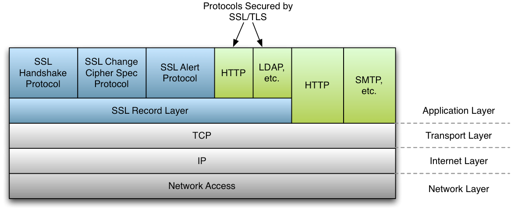

# SSL/TLS Overview

## General Architecture

The wolfSSL (formerly CyaSSL) embedded SSL library implements SSL 3.0, TLS 1.0, TLS 1.1, TLS 1.2, and TLS 1.3 protocols. TLS 1.3 is currently the most secure and up to date version of the standard. wolfSSL does not support SSL 2.0 due to the fact that it has been insecure for several years.

The TLS protocol in wolfSSL is implemented as defined in [RFC 5246 (https://tools.ietf.org/html/rfc5246).](https://tools.ietf.org/html/rfc5246) Two record layer protocols exist within SSL - the message layer and the handshake layer. Handshake messages are used to negotiate a common cipher suite, create secrets, and enable a secure connection. The message layer encapsulates the handshake layer while also supporting alert processing and application data transfer.

A general diagram of how the SSL protocol fits into existing protocols can be seen in **Figure 1**. SSL sits in between the Transport and Application layers of the OSI model, where any number of protocols (including TCP/IP, Bluetooth, etc.) may act as the transport medium.  Application protocols are layered on top of SSL (such as HTTP, FTP, and SMTP).

## SSL Handshake

The SSL handshake involves several steps, some of which are optional depending on what options the SSL client and server have been configured with.  Below, in **Figure 2**, you will find a simplified diagram of the SSL handshake process.

## Differences between SSL and TLS Protocol Versions

SSL (Secure Sockets Layer) and TLS (Transport Security Layer) are both cryptographic protocols which provide secure communication over networks. These two protocols (and the several versions of each) are in widespread use today in applications ranging from web browsing to e-mail to instant messaging and VoIP. Each protocol, and the underlying versions of each, are slightly different from the other.

Below you will find both an explanation of, and the major differences between the different SSL and TLS protocol versions. For specific details about each protocol, please reference the RFC specification mentioned.

### SSL 3.0

This protocol was released in 1996 but began with the creation of SSL 1.0 developed by Netscape. Version 1.0 wasn't released, and version 2.0 had a number of security flaws, thus leading to the release of SSL 3.0. Some major improvements of SSL 3.0 over SSL 2.0 are:

* Separation of the transport of data from the message layer
* Use of a full 128 bits of keying material even when using the Export cipher
* Ability of the client and server to send chains of certificates, thus allowing organizations to use certificate hierarchy which is more than two certificates deep.
* Implementing a generalized key exchange protocol, allowing Diffie-Hellman and Fortezza key exchanges as well as non-RSA certificates.
* Allowing for record compression and decompression
* Ability to fall back to SSL 2.0 when a 2.0 client is encountered

### TLS 1.0

This protocol was first defined in RFC 2246 in January of 1999. This was an upgrade from SSL 3.0 and the differences were not dramatic, but they are significant enough that SSL 3.0 and TLS 1.0 don't interoperate. Some of the major differences between SSL 3.0 and TLS 1.0 are:

* Key derivation functions are different
* MACs are different - SSL 3.0 uses a modification of an early HMAC while TLS 1.0 uses HMAC.
* The Finished messages are different
* TLS has more alerts
* TLS requires DSS/DH support

### TLS 1.1

This protocol was defined in RFC 4346 in April of 2006, and is an update to TLS 1.0.  The major changes are:

* The Implicit Initialization Vector (IV) is replaced with an explicit IV to protect against Cipher block chaining (CBC) attacks.
* Handling of padded errors is changed to use the `bad_record_ma`c alert rather than the `decryption_failed` alert to protect against CBC attacks.
* IANA registries are defined for protocol parameters
* Premature closes no longer cause a session to be non-resumable.

### TLS 1.2

This protocol was defined in RFC 5246 in August of 2008.  Based on TLS 1.1, TLS 1.2 contains improved flexibility. The major differences include:

* The MD5/SHA-1 combination in the pseudorandom function (PRF) was replaced with cipher-suite-specified PRFs.
* The MD5/SHA-1 combination in the digitally-signed element was replaced with a single hash.  Signed elements include a field explicitly specifying the hash algorithm used.
* There was substantial cleanup to the client's and server's ability to specify which hash and signature algorithms they will accept.
* Addition of support for authenticated encryption with additional data modes.
* TLS Extensions definition and AES Cipher Suites were merged in.
* Tighter checking of EncryptedPreMasterSecret version numbers.
* Many of the requirements were tightened
* `Verify_data` length depends on the cipher suite
* Description of Bleichenbacher/Dlima attack defenses cleaned up.

### TLS 1.3

This protocol was defined in RFC 8446 in August of 2018. TLS 1.3 contains improved security and speed. The major differences include:

* The list of supported symmetric algorithms has been pruned of all legacy algorithms. The remaining algorithms all use Authenticated Encryption with Associated Data (AEAD) algorithms.
* A zero-RTT (0-RTT) mode was added, saving a round-trip at connection setup for some application data at the cost of certain security properties.
* All handshake messages after the ServerHello are now encrypted.
* Key derivation functions have been re-designed, with the HMAC-based Extract-and-Expand Key Derivation Function (HKDF) being used as a primitive.
* The handshake state machine has been restructured to be more consistent and remove superfluous messages.
* ECC is now in the base spec  and includes new signature algorithms. Point format negotiation has been removed in favor of single point format for each curve.
* Compression, custom DHE groups, and DSA have been removed, RSA padding now uses PSS.
* TLS 1.2 version negotiation verification mechanism was deprecated in favor of a version list in an extension.
* Session resumption with and without server-side state and the PSK-based ciphersuites of earlier versions of TLS have been replaced by a single new PSK exchange.
